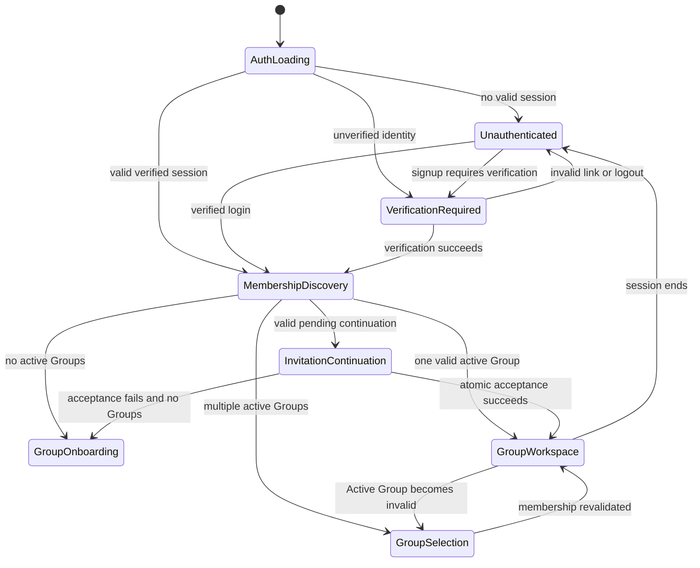
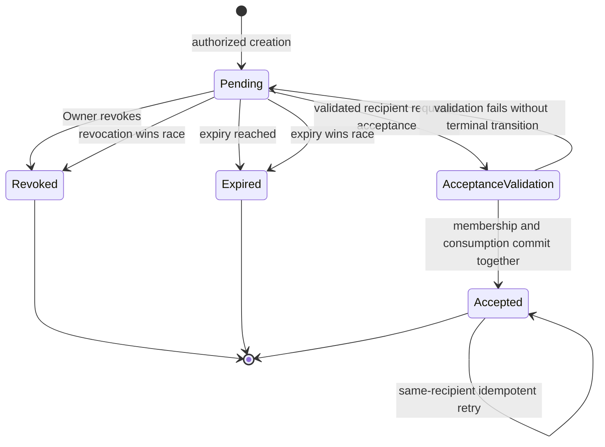

# Authentication, Group, and Invitation Flows

| Field | Value |
|---|---|
| Status | Accepted |
| Document type | Architecture flow contract |
| Scope | Phase 4 Authentication, post-login routing, Group, Group Member, ownership, configuration, archival, and Invitation lifecycles |
| Current-state baseline | [V1 Codebase Feature and Flow Report](../v1-codebase-feature-and-flow-report.md) |
| Related ADRs | [ADR-0001: One Group Represents One Trip and Is the Tenant Boundary](decisions/ADR-0001-group-is-trip-tenant.md) (Accepted); [ADR-0002: Supabase Auth Is the Authoritative Identity Provider](decisions/ADR-0002-supabase-auth-is-authoritative.md) (Accepted); [ADR-0003: Commercial Membership Is Deferred](decisions/ADR-0003-commercial-membership-deferred.md) (Accepted); [ADR-0004: `group_members.id` Is the Stable Participant Identity](decisions/ADR-0004-group-member-id-is-participant-identity.md) (Accepted); [ADR-0005: Finance Payers and Shares Use Normalized Tables](decisions/ADR-0005-normalized-finance-payers-and-shares.md) (Accepted); [ADR-0006: Timezone, Currency, Destination, and Dates Are Group Configuration](decisions/ADR-0006-group-configuration.md) (Accepted); [ADR-0007: Invitations Are Single-Use and Accepted Atomically Server-Side](decisions/ADR-0007-single-use-atomic-invitation-acceptance.md) (Accepted) |
| Last reviewed | 2026-07-24 |

> This Phase 4 document and ADR-0007 are Accepted architecture authority. They
> define logical flow contracts and do not authorize implementation.

## 1. Purpose, authority, and boundary

Phase 4 defines the logical contracts for user Authentication, authenticated
routing, Group creation and selection, Invitations, Group Member and ownership
lifecycle, Group configuration changes, account lifecycle, and Group archival.
It specifies trusted-operation boundaries and the required normal, invalid,
stale, unauthorized, partial-failure, retry, and concurrent outcomes.

The following Accepted boundaries remain authoritative:

- Supabase Auth is the sole Authentication and session authority.
- `group_members.id` remains the stable Participant identity.
- One Group remains exactly one Trip workspace and the Tenant boundary.
- Active Group remains navigation and presentation state, never Authorization.
- Owner and Member are the only Member roles.
- Group membership, ownership, and Invitations remain unrelated to paid
  membership, Subscriptions, payments, or Entitlements.

This document defines logical flow contracts. It defines no SQL, RLS policy,
physical schema, API endpoint, transaction mechanism, database function, token
storage format, Supabase configuration, migration, test implementation, or
deployment configuration. Phase 5 owns enforcement architecture. Phase 6 owns
Legacy Participant claiming and v1 migration. Phase 7 owns implementation
sequencing.

## 2. Current-state baseline

Everything in this section is a **Current state** fact from the
[frozen v1 report](../v1-codebase-feature-and-flow-report.md), not a target
capability.

- V1 presents five hardcoded, unauthenticated personas: Partha, Astitva,
  Vaibhav, Suryansh, and Bittu.
- The visitor selects any persona into React memory and may switch immediately
  without credentials or proof.
- There is no login, signup, email verification, password recovery, session
  restoration, authenticated logout, or durable selected-user session.
- The legacy `users` table is unused by the frontend. Its plaintext PINs are
  unused and have no relationship to Supabase Auth.
- There is no Group, Group Member relationship, Invitation, Owner relationship,
  or Active Group authorization concept.
- All feature rows occupy one globally shared dataset with no Group or Trip
  ownership key.
- Event, Expense, and Settlement queries and realtime subscriptions are global;
  Todo filtering is only by the selected persona name.
- Current RLS policies permit unconditional access rather than enforcing user
  or Tenant isolation.
- Scanned travel documents use one public Storage bucket and public URLs.
- Events, Expenses, Settlements, and Todos use display-name strings or
  name-keyed structures as identity.
- Persona filtering is client behaviour, not Authentication or Authorization.

V1 therefore has no authenticated flow, secure Invitation flow, Tenant
isolation, authenticated ownership, or server-verified membership behaviour to
preserve as an existing flow.

## 3. Actors and trust boundaries

| Actor or component | Responsibility | Limitation and trust boundary |
|---|---|---|
| Unauthenticated browser | May render public entry, initiate permitted Auth flows, retain a safe Invitation continuation, and present generic errors. | Has no Auth User, Group, Member role, or group-owned data authority. Browser state and token possession are untrusted. |
| Authenticated Auth User | Identity established by a validated Supabase Auth session. May request operations and discover active Group relationships. | Authentication alone grants no Group access. Client-supplied identity attributes cannot override the validated session. |
| Unverified Auth User | A Supabase identity or session whose required identity attribute has not been verified, if current Supabase configuration permits such a state. | May complete verification or recovery flows but cannot create a Group, accept an Invitation, or acquire Group authority. |
| Profile | Holds global application presentation information associated with the Auth User. | Stores no password, validates no session, grants no Group access, and is not Participant identity. |
| Active Group Member | A currently authorized Auth User-to-Group relationship with a stable Participant identity and active lifecycle state. | Authority applies only to its Group and only to operations allowed for its Member role. |
| Owner | An active Group Member with the Owner role in one Group. | Has no global or cross-Group authority and is subject to last-Owner and archived-Group rules. |
| Ordinary Member | An active Group Member with the Member role in one Group. | Cannot self-promote, change ownership, remove other Group Members, or perform Owner-only lifecycle operations. |
| Supabase Auth | Authoritative source for credentials, Auth User identity, verification, recovery, and session lifecycle. | Does not create Group membership or infer Member roles. |
| Application database | Retains Profiles, Groups, configuration, Group Member relationships, Invitation state, audit evidence, and group-owned domain relationships. | Is not a second credential or session authority. Phase 5 defines enforcement. |
| Trusted server-side operation | Performs multi-step or privileged domain changes after independently validating actor, Group, role, target, lifecycle, and inputs. | Service-role capability is not automatically Authorization. Request-body actor, role, and Group claims remain untrusted. |
| Invitation | Group-scoped, recipient-bound intent that may establish or reactivate an ordinary Member relationship after successful acceptance. | Is not Authentication, membership, or authority before atomic acceptance completes. |
| Invitation secret/token | Opaque proof that the browser possesses a particular Invitation continuation. | Possession alone neither authenticates the recipient nor grants membership. |
| Active Group client state | Remembers the workspace the UI intends to display. | Cannot prove membership, role, resource ownership, or permission. |

Client-supplied Auth User IDs, emails, roles, Group IDs, Group Member IDs,
Active Group values, redirect destinations, and Invitation state are untrusted.
UI visibility does not prove permission. Every trusted boundary and denial
outcome in this document must be enforced by the Phase 5 security architecture.
This phase does not define the complete operation/role matrix.

## 4. Authentication lifecycle

### 4.1 Application boot and session restoration

1. The application enters an explicit Authentication-loading state before
   choosing an unauthenticated or authenticated route.
2. Supabase Auth, not Profile or application-domain data, determines whether a
   valid session can be restored.
3. A restored session supplies the Auth User identity. The application then
   evaluates required verification state and post-authentication routing.
4. A missing, invalid, revoked, or expired session leads to the unauthenticated
   entry flow. It never falls back to a persona or legacy `users` record.
5. A transient restoration error yields a bounded retry or explicit error
   state; it must not temporarily expose cached group-owned content as
   authorized.

### 4.2 Email/password signup and verification

1. The browser submits email/password intent to Supabase Auth.
2. Supabase Auth owns credential validation, account creation, verification
   delivery, verification links, and account proof.
3. Application Profile creation or completion may follow the authoritative Auth
   result, but Profile data never validates credentials or Group access.
4. If signup yields an unverified Auth User or session, that identity remains
   restricted to verification, recovery, safe logout, and non-authorizing
   continuation behaviour.
5. An unverified Auth User cannot create a Group, accept an Invitation, activate
   a Group Member relationship, or exercise a role.
6. Verification succeeds only through a valid Supabase Auth verification
   result. An invalid, expired, malformed, or reused link shows a safe failure
   and a permitted recovery/resend route without granting authority.

### 4.3 Login, refresh, expiry, and logout

- Login credentials are validated only by Supabase Auth.
- Invalid or expired credentials yield an Authentication failure without
  revealing unnecessary account details and without consulting legacy PINs.
- Successful login proceeds through verification checks and deterministic
  post-authentication routing.
- Session refresh is owned by Supabase Auth. A refresh failure or terminal
  expiry returns the application to an unauthenticated state and clears
  sensitive in-memory workspace data.
- Logout ends the local Supabase session, clears Active Group and pending
  sensitive UI state, and returns to the unauthenticated entry. It does not
  remove Profile or Group Member relationships.
- A concurrent membership removal or Group archival may invalidate the
  currently displayed workspace even while the Auth session remains valid; the
  application must recover through membership-aware routing rather than
  treating logout as the only invalidation path.

### 4.4 Password recovery and reset

1. The browser requests recovery through Supabase Auth.
2. Responses avoid unnecessary account-enumeration detail.
3. Recovery links and reset sessions are validated by Supabase Auth.
4. Password reset completion changes credential material without changing Auth
   User or Participant identity.
5. Invalid, expired, malformed, or reused recovery links produce no session or
   Group authority and offer a safe restart path.
6. Profile and Group Member records never store, compare, or validate
   passwords.

### 4.5 Email and account-attribute changes

- Supabase Auth governs changes to Authentication-bearing account attributes
  and any required reauthentication or verification.
- Password, verified email, and Profile presentation changes do not replace the
  Auth User or any stable `group_members.id`.
- A pending Invitation remains bound to its intended verified recipient. An
  email change does not silently rebind an Invitation; acceptance must evaluate
  the current verified identity against the recorded intended recipient.
- Failed or incomplete attribute changes leave existing identity and Group
  authority unchanged unless Supabase Auth has independently invalidated the
  session.

### 4.6 Account deletion preparation

- Account deletion is a lifecycle process, not an immediate client-side action.
- The application must first enumerate affected active Group Member and Owner
  relationships through trusted, authorized data.
- A last active Owner cannot delete the Auth account while any affected Group
  remains active. Ownership must first be transferred or the Group must enter
  an approved lifecycle outcome.
- Deletion preparation must identify consequences without reassigning
  historical Participant references.
- Exact deletion, retention, anonymization, Auth-provider operations, migration,
  and rollback mechanics remain later work.

### 4.7 Safe Auth redirects and Invitation continuation

- Redirect destinations are application-controlled, allowlisted, and validated;
  arbitrary external or client-supplied destinations are rejected.
- A pending Invitation may survive signup, verification, login, or recovery
  only through a safe, time-bounded, non-authoritative continuation mechanism.
- The continuation may identify which acceptance flow to resume but cannot
  assert the actor, recipient match, role, Group membership, or Invitation
  validity.
- The trusted acceptance operation revalidates every condition after the Auth
  redirect.
- Google OAuth and other identity providers remain Deferred under
  [DEF-003](../product/deferred-scope-register.md#def-003--google-oauth-and-additional-identity-providers).
  MFA, social login, and account linking are not introduced.

## 5. Post-authentication routing

After Supabase Auth establishes a valid, sufficiently verified Auth User, the
application derives navigation choices from current active Group Member
relationships. Cached navigation is never authoritative.

| Authenticated state | Deterministic routing outcome |
|---|---|
| No active Group memberships and no pending Invitation continuation | Show Group creation/onboarding and any permitted non-authorizing account setup. Do not load group-owned data. |
| Exactly one active Group membership | Select that Group for navigation unless it is archived or otherwise unavailable; independently validate membership on every Group load. |
| Multiple active Group memberships | Show Group selection or use a still-valid remembered selection after revalidation. Never infer cross-Group authority. |
| Valid pending Invitation continuation | Resume safe Invitation inspection and acceptance after Auth and verification checks. Do not preselect membership before acceptance succeeds. |
| Stale or unauthorized stored Active Group | Clear or replace the stored value and route to authorized selection/onboarding. Return no data from the stale Group. |
| Only inactive or removed memberships | Show onboarding, re-invitation guidance, or an inactive-state explanation without group-owned access. |
| Archived remembered Group | Clear it as an ordinary writable Active Group and route to another active Group, selection, or an archive-aware view if later authorized. |
| Membership removed during an existing session | Stop Group loading and ordinary writes, clear/replace Active Group, and reroute without ending unrelated memberships or the global Auth session. |

Every Group load independently establishes current membership and Group
lifecycle. A missing or invalid Active Group leads to selection or onboarding,
never broader or fallback access.

## 6. Group creation

Group creation is one trusted, all-or-nothing logical operation.

### Preconditions

- The actor is derived from a valid, verified Supabase Auth session.
- The request supplies valid Trip name, destination, start and end dates, IANA
  timezone, ISO accounting currency, and approved currency-display context.
- Client-supplied actor IDs and Owner roles are ignored as authority.
- Deferred commercial state is neither required nor created.

### Required outcome

The trusted operation establishes together:

1. one Group representing one Trip workspace;
2. its validated Group configuration;
3. the creator's stable Group Member identity;
4. the creator as an active Owner; and
5. creation and actor provenance sufficient for later audit.

There is no valid intermediate result with an orphan Group, configuration
without its Group, Owner membership without its Group, or active Group without
an active Owner. Any failure returns no created Group authority and exposes a
safe retry path. Repeating one logical request must not create duplicate Groups
or duplicate Owner relationships. The exact atomicity and idempotency
mechanisms remain later work.

## 7. Group discovery and selection

- Group discovery derives from the current Auth User's currently active Group
  Member relationships.
- Zero memberships route to onboarding; one may route directly after
  revalidation; multiple produce an explicit selection experience.
- Explicit switching changes only navigation state. Each target Group is
  independently revalidated.
- Bookmarked and deep-linked Group routes are treated as requested identifiers,
  not access grants. Unauthorized, inactive, missing, or archived targets return
  a safe unavailable result and a valid alternative route.
- Stale Active Group values are cleared or replaced with a currently authorized
  selection.
- Removal, inactivity, archival, Auth expiry, and logout clear or replace an
  invalid Active Group.
- Active Group may be retained for convenience only when it remains safe to do
  so; it cannot be used as stored Authorization evidence.

Changing a URL, local storage, client store, query parameter, request body, or
cached Group identifier never grants Group access.

## 8. Invitation lifecycle

### 8.1 States

An Invitation has exactly one current logical state:

- **Pending:** Eligible for inspection and possible acceptance while every
  recipient, expiry, Group, and lifecycle condition remains valid.
- **Accepted:** Successfully consumed by the atomic acceptance operation.
- **Revoked:** Invalidated by a currently authorized Owner before acceptance.
- **Expired:** No longer eligible because its expiry has passed.

Accepted, Revoked, and Expired are terminal for that Invitation. Replacement
uses a new Invitation and secret; terminal records are not reset or reused.

### 8.2 Creation

- Only a currently authorized Owner may request creation for that Owner's
  active Group.
- Each Invitation belongs to one Group and names one intended recipient through
  a server-validated recipient binding.
- The recipient binding identifies a known Auth User when already established
  or an intended email that must later match the verified email of the
  accepting Supabase Auth identity.
- The invited role is ordinary Member. Invitation creation cannot confer Owner.
- An email entered by the client is invitation intent, not proof of recipient
  identity. The trusted operation normalizes and records the intended binding
  without treating the requesting client as the recipient.
- Invitations expire and receive auditable creator, creation, intended
  recipient, and lifecycle provenance without logging the secret.
- Manual sharing is the in-scope delivery method. Automatic email delivery
  remains Deferred under
  [DEF-006](../product/deferred-scope-register.md#def-006--automatic-invitation-email-delivery).

If the intended recipient is already an active Group Member, creation returns a
safe no-op/conflict rather than creating another membership path. A duplicate
currently valid Pending Invitation for the same Group and intended recipient is
reused for administrative handling or rejected safely rather than silently
creating an unbounded set; exact deduplication mechanics remain later work.

An Invitation validly created by an Owner remains a Group Invitation if that
inviter later loses Owner status. Current Owners may revoke it, and acceptance
still revalidates the Group, recipient, membership, and Group lifecycle. The
former inviter's status is not used as current acceptance authority.

### 8.3 Safe inspection

- Inspection validates the opaque secret and current Invitation state without
  granting membership.
- Before validated Authentication and recipient match, the response discloses
  only the minimum safe context needed to continue and uses generic failures
  where detail could reveal Group or recipient information.
- After Authentication, the browser still cannot assert Invitation state,
  recipient, Group, or role.
- Invalid, malformed, expired, revoked, and already-used secrets never reveal
  another recipient's membership or sensitive Group details.

### 8.4 Expiration and revocation

- Expiration makes acceptance ineligible once the trusted time boundary is
  reached.
- A current Owner may revoke a Pending Invitation through a trusted,
  Group-authorized operation.
- Revocation is a terminal no-authority outcome and is auditable.
- Revoking or expiring an Invitation does not remove an independently existing
  Group Member relationship.
- Replacing an Invitation creates a new secret; no terminal secret is rotated
  back into use.

### 8.5 Existing Group Member cases

- **Already active:** Acceptance does not create or change membership and
  returns a safe conflict/no-op only to the validated intended recipient.
- **Inactive prior relationship for the same Auth User and Group:** Acceptance
  may reactivate the same `group_members.id` as ordinary Member when every
  lifecycle and authorization condition permits.
- **Conflicting identity or relationship:** Acceptance fails without changing
  Invitation or membership authority.
- **Unclaimed Legacy Participant:** Invitation acceptance never claims, merges,
  attaches, or rewrites it. Claiming remains Phase 6 work.

## 9. Atomic Invitation acceptance

As required by Accepted
[ADR-0007](decisions/ADR-0007-single-use-atomic-invitation-acceptance.md), one
trusted server-side acceptance operation must:

1. establish the current Auth User from the validated Supabase Auth session;
2. require the relevant verified identity attribute;
3. resolve the Invitation without trusting client-supplied actor, recipient,
   Group, state, or role data;
4. confirm that the Invitation belongs to exactly one Group;
5. confirm that it is Pending, unexpired, unrevoked, and unused;
6. confirm that the authenticated recipient matches the intended recipient;
7. confirm that the Group lifecycle permits acceptance;
8. confirm that no conflicting active Group Member relationship exists;
9. create a new ordinary Member relationship or, where permitted, reactivate
   the same prior Group Member identity;
10. preserve `group_members.id` during reactivation;
11. mark the Invitation Accepted and record acceptance provenance;
12. commit membership creation/reactivation and Invitation consumption
    together; and
13. return no Group membership authority if any step fails.

### Concurrency and retry contract

- Two concurrent acceptance attempts cannot create two Group Member
  relationships.
- One Invitation cannot create membership for two Auth Users.
- Acceptance racing with revocation or expiry yields exactly one valid terminal
  outcome; the losing operation grants no authority.
- Retrying a completed request cannot mint another membership, role, or
  Invitation.
- A safe idempotent response may identify an already-completed acceptance only
  to the same validated recipient.
- Partial Group Member creation, partial reactivation, partial Invitation
  consumption, or an Invitation marked Accepted without its matching
  membership outcome is prohibited.
- An operation interrupted before the atomic outcome is known may be retried
  safely; the result is either the one completed acceptance for that recipient
  or a no-authority failure.

The exact transaction, lock, constraint, token hash, API, database function,
service mechanism, and retry key remain later-phase work.

## 10. Invitation-secret handling boundary

At the logical level:

- secrets are high-entropy, unguessable, and opaque;
- each secret has single-use semantics and an expiration;
- plaintext secrets do not appear in logs, analytics, audit records, realtime
  payloads, or ordinary database reads;
- a secret is not a Group identifier, Auth session, Group membership, or Member
  role;
- browser and Auth-redirect handling minimize unintended persistence and
  disclosure;
- generic invalid-token responses are used where detailed responses could
  reveal recipient or Group information;
- a terminal, exposed, or revoked secret is replaced with a new Invitation and
  secret rather than reused; and
- no client response exposes server-side secret-verification material.

Phase 5 owns enforcement, persistence/access controls, enumeration resistance,
abuse controls, and rate-limit requirements. Phase 7 owns the concrete
implementation mechanism.

## 11. Membership lifecycle

| Lifecycle event | Logical contract |
|---|---|
| Active ordinary Member | Has current Group authority limited to ordinary Member operations in that Group. |
| Active Owner | Has Owner-level authority in that Group, subject to current lifecycle and last-Owner rules. |
| Inactive or removed Group Member | Has no future Group authority. Stable Participant identity and historical references remain intact. |
| Voluntary departure | An ordinary Member may leave through a trusted self-scoped operation. An Owner must first satisfy ownership continuity. |
| Owner-initiated removal | A current Owner may remove an ordinary Member through a trusted same-Group operation. Ordinary Members cannot remove others. |
| Re-invitation/reactivation | The intended same Auth User may be reactivated through a valid Invitation or later approved lifecycle path, reusing the existing `group_members.id`. |
| Account or presentation change | Does not replace Auth User or Participant identity and does not rewrite history. |
| Unclaimed Legacy Participant | Remains non-authorizing and cannot be activated by Invitation acceptance or display-name matching. |

Removal or inactivity ends future reads, writes, roles, Invitation acceptance as
that Group Member, and ordinary Group selection. Historical Event, document,
Expense, Settlement, Todo, and audit references remain resolvable. Physical
deletion of referenced Participant identity is prohibited.

An active ordinary Member cannot create Owner authority, self-promote, remove
another Group Member, or alter ownership. Membership in one Group grants
nothing in another. No lifecycle state carries payment, Subscription, trial,
billing, or Entitlement meaning.

## 12. Ownership continuity

An active Group has one or more active Owners and must have at least one at all
times.

### Ownership flows

- **Initial Owner:** Group creation atomically establishes the creator as an
  active Owner.
- **Promotion:** A currently authorized Owner may promote an active ordinary
  Member in the same Group. A Member cannot promote self or another Member.
- **Demotion:** A currently authorized Owner may demote an Owner only when at
  least one other active Owner remains through the complete outcome.
- **Effective transfer:** A trusted operation establishes the successor as an
  active Owner before or atomically with demoting, deactivating, or allowing
  departure of the prior Owner. Ownership is never momentarily absent.
- **Owner departure:** An Owner may leave only after another active Owner
  exists and the departure remains authorized at completion.
- **Owner removal:** A currently authorized Owner may remove another Owner only
  when ownership continuity remains valid. Self-removal follows the same
  protection.
- **Concurrent changes:** Competing promotions, demotions, removals, transfers,
  account-deletion preparations, and archival actions must serialize to valid
  outcomes that never leave zero active Owners.

The last active Owner cannot leave, be demoted, be removed, or delete the Auth
account while the Group remains active. Ownership in one Group grants no global
or cross-Group authority. Exact constraints, enforcement, and operation
permissions belong to Phase 5 and implementation planning.

## 13. Group configuration lifecycle

Only a currently authorized Owner may request a Group configuration change.
Every change independently validates:

- Trip name;
- destination;
- start and end dates and their ordering;
- IANA timezone;
- ISO accounting currency; and
- approved currency-display context.

Configuration effects are:

- presentation changes do not change Auth User, Group Member, or Participant
  identity;
- date changes do not rewrite historical audit facts;
- timezone changes do not silently reinterpret already-persisted instants;
- accounting-currency changes do not silently reinterpret existing Expenses,
  payer contributions, shares, Settlements, balances, or FX evidence;
- once accounting history exists, an ordinary configuration edit cannot replace
  the accounting currency;
- any later accounting-currency transition requires a separately reviewed
  conversion/migration procedure; and
- configuration changes grant no authority and do not change the Group Tenant
  or record ownership boundary.

A validation, authorization, stale-state, or downstream-safety failure leaves
the previous effective configuration intact. This document does not prescribe
physical versioning or migration commands.

## 14. Group archival and restoration

Archival is an Owner-controlled, trusted lifecycle action requiring explicit
confirmation.

- Archival keeps all records in the same Group and transfers none to another
  Group.
- Participant identity and historical references remain intact.
- An archived Group cannot be selected as an ordinary writable Active Group.
- Existing sessions and cached Active Group values recover to another active
  Group, selection, or a safe archive-aware state.
- Pending Invitations cannot be accepted while the Group is archived.
- Ordinary Group writes are unavailable while archived.
- Restoration, when the product exposes it, requires a trusted
  Owner-authorized operation and revalidates ownership continuity.
- Archival and restoration cannot leave the Group without an active Owner.
- A race between archival and Invitation acceptance, membership change,
  configuration change, or ordinary write yields one lifecycle-consistent
  outcome; an operation losing the race creates no partial authority or write.

Permanent deletion, retention periods, anonymization, and physical purge
mechanics are not authorized here and must be resolved before implementation if
required.

## 15. Account lifecycle and historical integrity

- Password, verified email, and Profile changes do not replace the Auth User or
  Participant identity.
- Logout ends the local session but does not remove Group Member relationships.
- Account deletion cannot bypass last-Owner protection.
- Ownership must be transferred or the Group must reach an approved lifecycle
  outcome before a last Owner account can be deleted.
- Membership inactivity may stop access without deleting historical references.
- Auth account deletion must not reassign historical activity to another user.
- Re-invitation of the same Auth User and Group reuses the stable Participant
  identity when lifecycle rules permit.
- Exact Auth deletion, retention, anonymization, detached-history, migration,
  and rollback mechanics remain later work.

## 16. Normal and failure-flow table

This table is the Phase 4 flow contract, not the complete Phase 5 permission
matrix.

| Flow | Authenticated actor requirement | Group relationship requirement | Trusted operation boundary | Success result | Failure result | Concurrency/retry expectation | Later-phase enforcement owner |
|---|---|---|---|---|---|---|---|
| Application boot/session restoration | None initially; Supabase determines session | None until session established | Supabase Auth session restoration | Auth state becomes verified, unverified, or unauthenticated | Explicit loading/error/unauthenticated state; no cached authority | Duplicate boot callbacks converge on one current Auth state | Phase 5 session/JWT handling |
| Signup | Unauthenticated browser | None | Supabase Auth credential and verification flow | Auth User created under provider rules; restricted until verified | Safe Auth error; no Profile or Group authority inferred | Retry does not create competing application identity | Phase 5 Auth boundary; Phase 7 implementation |
| Email verification | Valid Auth verification context | None | Supabase Auth verification | Required identity attribute becomes verified | Invalid/expired/reused link grants nothing | Repeated success is harmless; invalid replay grants nothing | Phase 5 Auth boundary |
| Login | Unauthenticated browser | None | Supabase Auth credential validation | Valid session and post-auth routing | Generic invalid/expired credential result | Concurrent sessions follow provider policy; application grants no extra Group authority | Phase 5 session/JWT handling |
| Session refresh/expiry | Existing Supabase session | None by itself | Supabase Auth refresh | Continued authoritative Auth User session | Clear sensitive workspace state and reroute when terminal | Concurrent refresh outcomes converge on current provider state | Phase 5 session/JWT handling |
| Logout | Current local session if present | None | Supabase Auth session termination plus local state clearing | Session and Active Group cleared | Local safe signed-out state even if non-authority cleanup must retry | Repeat is idempotent | Phase 5 session boundary; Phase 7 implementation |
| Password recovery/reset | Recovery context validated by Supabase | None | Supabase Auth recovery/reset | Credential changed without identity change | Invalid/expired/reused link grants no session or authority | Replays cannot repeat authority or change Participant identity | Phase 5 Auth boundary |
| Email/account-attribute change | Valid Auth session and provider-required proof | Existing memberships unaffected by request alone | Supabase Auth attribute lifecycle | Attribute updated/verified; identity stable | Existing identity remains or provider session is safely invalidated | Concurrent changes resolve through provider authority | Phase 5 Auth boundary |
| Auth account deletion preparation | Verified Auth User | All active memberships and Owner roles enumerated | Trusted lifecycle assessment | Safe plan when no last-Owner violation remains | Blocked with actionable ownership requirements | Races with ownership changes require revalidation at completion | Phase 5 owner/account rules; Phase 6 migration/retention |
| Safe Auth redirect and pending Invitation continuation | Returning Auth User; validated session and required verified identity are established before acceptance | None; the continuation is non-authoritative and grants no Group relationship or role | Redirect destinations are application-controlled, allowlisted, and validated; every Invitation condition is revalidated after Authentication | An approved destination safely resumes Invitation inspection or acceptance without granting authority before atomic acceptance | Malformed, stale, or unapproved redirects or continuations are rejected safely with no Group authority | Retries revalidate every Invitation condition and cannot bypass single-use acceptance | Phase 5 enforcement; Phase 7 concrete mechanism |
| Post-auth route with zero Groups | Verified Auth User | No active Group Member relationship | Membership-aware discovery | Onboarding or valid Invitation continuation | No group-owned data | Refresh remains zero until relationship changes | Phase 5 membership enforcement |
| Post-auth route with one/many Groups | Verified Auth User | One or more active relationships | Membership-aware discovery and each Group load | Direct route or selection among authorized Groups | Stale targets cleared; no fallback access | Membership changes invalidate stale navigation | Phase 5 RLS/authorization |
| Group creation | Verified Auth User | None required for new Group | Trusted all-or-nothing creation | Group, configuration, stable Member identity, and active Owner created together | No orphan or partial authority | Safe retry cannot duplicate one logical creation | Phase 5 trusted-operation controls; Phase 7 mechanism |
| Group discovery/switch/deep link | Verified Auth User | Active relationship to each displayed target | Server/database membership validation | Authorized Group selected for navigation | Missing/inactive/archived/unauthorized target rejected | Stale cache cleared; retry revalidates | Phase 5 RLS and routing authorization |
| Invitation creation | Verified Auth User | Active Owner in owning active Group | Trusted Owner-authorized creation | One Pending, expiring, recipient-bound ordinary-Member Invitation | No Invitation/secret on unauthorized or invalid input | Duplicate/concurrent creation yields one administratively valid outcome | Phase 5 operation matrix, token controls |
| Invitation inspection | None for minimal continuation; verified Auth required for recipient-specific result | None before acceptance | Trusted secret/state inspection | Minimal safe state or authenticated recipient continuation | Generic invalid/malformed/revoked/expired/used result | Repeat grants no authority | Phase 5 enumeration and secret controls |
| Invitation revocation | Verified Auth User | Active Owner in owning Group | Trusted Owner-authorized terminal transition | Pending becomes Revoked with audit provenance | No change if unauthorized or terminal | Revocation race has one terminal winner | Phase 5 operation matrix and concurrency controls |
| Invitation expiry | No client actor authority | None | Trusted time/state evaluation | Pending becomes or is treated as Expired | No authority created | Acceptance race yields one terminal outcome | Phase 5 state/concurrency enforcement |
| Invitation acceptance | Verified Auth User with required verified recipient attribute | No conflicting active membership; same prior inactive relationship may reactivate | One trusted atomic server-side operation | Ordinary Member created/reactivated and Invitation Accepted together | No membership authority and no partial consumption | Single-use, idempotent for same recipient, race-safe | Phase 5 transaction/security design; ADR-0007 |
| Invitation replay/recipient mismatch | Verified identity if presenting acceptance | Must not derive a relationship | Trusted acceptance validation | Same recipient may receive safe already-completed result only | No new authority; generic mismatch/invalid result | Replays and competing recipients cannot mint authority | Phase 5 token and concurrency controls |
| Voluntary Member departure | Verified Auth User | Active ordinary Member, or Owner with continuity already satisfied | Trusted self-scoped lifecycle operation | Relationship inactive; history retained; Active Group recovered | No change when last-Owner or stale-state rule fails | Concurrent role change revalidated | Phase 5 operation matrix/last-Owner enforcement |
| Owner-initiated Member removal | Verified Auth User | Active Owner and active target in same Group | Trusted Owner-authorized lifecycle operation | Target inactive; history retained | No change if unauthorized, cross-Group, stale, or protected Owner | Repeat is no-op; concurrent changes preserve invariants | Phase 5 operation matrix |
| Re-invitation/reactivation | Verified intended recipient | Existing inactive same Auth User/Group relationship | Atomic Invitation acceptance or later approved trusted path | Existing `group_members.id` active as ordinary Member | No new ID or authority on mismatch/failure | Concurrent attempts produce one active relationship | Phase 5 identity/state enforcement |
| Promote Member to Owner | Verified Auth User | Initiator active Owner; target active ordinary Member in same Group | Trusted ownership operation | Target becomes active Owner | No change on self-promotion, unauthorized, stale, or cross-Group request | Repeats converge; concurrent role changes stay valid | Phase 5 complete operation/role matrix |
| Demote/remove/leave as Owner | Verified Auth User | Current Owner and at least one other active Owner at completion | Trusted ownership-continuity operation | Valid new role/inactive state with Owner continuity | Last-Owner action denied | Concurrent operations cannot reach zero Owners | Phase 5 constraints and concurrency enforcement |
| Effective ownership transfer | Verified current Owner | Active same-Group successor | Trusted continuity-preserving operation | Successor Owner established before/with prior Owner change | No partial transfer or zero-Owner state | Safe retry observes one valid outcome | Phase 5 constraints; Phase 7 mechanism |
| Group configuration edit | Verified Auth User | Active Owner in active Group | Trusted Owner-authorized validation | Valid configuration becomes effective without identity/ownership change | Previous configuration retained | Stale/concurrent edits require explicit conflict handling | Phase 5 operation matrix; Phase 7 mechanism |
| Accounting-currency edit with history | Verified Auth User | Active Owner | Trusted history-safety validation | No ordinary edit; later reviewed transition required | Existing accounting context unchanged | Retries remain blocked absent approved procedure | Phase 6 conversion planning; Phase 5 denial |
| Group archival | Verified Auth User | Active Owner; ownership continuity valid | Trusted confirmed lifecycle operation | Group archived; ordinary writes and acceptance disabled | No partial archival or ownership loss | Races produce one lifecycle-consistent result | Phase 5 archived-state enforcement |
| Group restoration | Verified Auth User | Authorized active Owner identity retained | Trusted lifecycle operation | Group active with valid ownership continuity | Remains archived on invalid/unauthorized request | Safe retry converges; concurrent changes revalidated | Phase 5 operation matrix |

## 17. State diagrams

### 17.1 Authentication and post-login routing

### 17.2 Invitation lifecycle and atomic acceptance

### 17.3 Group Member and Owner lifecycle

```mermaid
stateDiagram-v2
    [*] --> UnclaimedLegacy: migration-only history
    [*] --> ActiveOwner: atomic Group creation
    [*] --> ActiveMember: atomic Invitation acceptance
    UnclaimedLegacy --> ActiveMember: Phase 6 verified claim and activation
    ActiveMember --> ActiveOwner: authorized promotion
    ActiveOwner --> ActiveMember: authorized demotion with another Owner
    ActiveMember --> Inactive: departure or Owner removal
    ActiveOwner --> Inactive: continuity-preserving departure or removal
    Inactive --> ActiveMember: valid reactivation preserving Participant ID
    ActiveOwner --> ActiveOwner: ownership retained through concurrent validation
    Inactive --> [*]: authority ended; history retained
```

The Legacy Participant transition shown above is owned by Phase 6 and is not an
Invitation acceptance path.

## 18. Security handoff to Phase 5

Phase 4 supplies these exact security inputs:

- authenticated actor derivation only from a validated Supabase Auth session;
- required verified-email or verified-recipient-attribute preconditions;
- Owner and ordinary Member flow preconditions;
- Invitation state, Group, expiry, revocation, use, and recipient validation;
- atomic Invitation acceptance and reactivation requirements;
- last-Owner protection and ownership-continuity outcomes;
- inactive Group Member denial behaviour;
- archived Group write and Invitation-acceptance denial behaviour;
- Active Group as non-authoritative navigation;
- trusted-operation boundaries for creation, Invitation, membership, ownership,
  configuration, archival, and account lifecycle;
- required denial, replay, stale-state, retry, and concurrent outcomes; and
- historical Participant preservation after access ends.

Phase 5 must define and enforce, without being preempted by this document:

- JWT claim handling and session-to-actor derivation details;
- RLS expressions;
- the complete operation/role matrix;
- service-role confinement and validation;
- Storage policies;
- realtime Authorization and filtering;
- Invitation-secret persistence and lookup design;
- enumeration resistance, rate limits, and abuse prevention;
- database constraints, transaction/functions, and privileged-operation
  mechanisms; and
- security-test implementation.

## 19. Migration and parity handoff

- V1 has no Authentication, Groups, Group Member relationships, ownership, or
  Invitations to preserve as existing flows.
- Persona selection and switching must not survive as Authentication.
- Legacy plaintext PINs must not become Supabase Auth credentials.
- Legacy Participant claiming remains Phase 6 work.
- Display names cannot prove account ownership.
- The migrated Bali Group requires a controlled Owner/bootstrap and Legacy
  Participant claiming plan.
- Invitation acceptance cannot claim, merge, or silently attach legacy history.
- Exact migration, bootstrap, Auth User attachment, compatibility, validation,
  rollback, and parity steps remain Phase 6.

## 20. Deferred-scope check

Phase 4 introduces none of the following:

- paid plans, trials, or paywalls
  ([DEF-001](../product/deferred-scope-register.md#def-001--paid-plans-subscriptions-trials-and-paywalls));
- premium Entitlements
  ([DEF-002](../product/deferred-scope-register.md#def-002--premium-feature-entitlements));
- Google OAuth or additional Auth providers
  ([DEF-003](../product/deferred-scope-register.md#def-003--google-oauth-and-additional-identity-providers));
- permanent friend Groups containing many Trips
  ([DEF-004](../product/deferred-scope-register.md#def-004--permanent-friend-groups-containing-multiple-trips));
- worldwide destination guides
  ([DEF-005](../product/deferred-scope-register.md#def-005--worldwide-destination-price-guides));
- automatic Invitation email delivery
  ([DEF-006](../product/deferred-scope-register.md#def-006--automatic-invitation-email-delivery));
- roles beyond Owner and Member
  ([DEF-007](../product/deferred-scope-register.md#def-007--roles-beyond-owner-and-member));
- private or secret events
  ([DEF-008](../product/deferred-scope-register.md#def-008--private-or-secret-events));
- payment processing
  ([DEF-009](../product/deferred-scope-register.md#def-009--payment-processing));
- wallets, custody, or stored monetary balances
  ([DEF-010](../product/deferred-scope-register.md#def-010--wallets-custody-or-stored-monetary-balances));
- organization administration
  ([DEF-011](../product/deferred-scope-register.md#def-011--advanced-organization-administration)); or
- automatic/global travel-content generation
  ([DEF-012](../product/deferred-scope-register.md#def-012--automatic-or-global-travel-content-generation)).

Manual Invitation sharing is the in-scope delivery boundary. The
[deferred-scope register](../product/deferred-scope-register.md) remains
authoritative.

## 21. Consolidated flow invariants

1. Supabase Auth is the sole Authentication and session authority.
2. Authentication alone grants no Group access.
3. Every active Group authority comes from a current active Group Member
   relationship.
4. Active Group is never Authorization.
5. Group creation atomically creates its initial active Owner relationship.
6. Every active Group has at least one active Owner.
7. Invitation possession alone grants no membership.
8. Invitations are single-use, expiring, recipient-bound, and Group-scoped.
9. Invitation acceptance and membership creation/reactivation are atomic.
10. Acceptance failure creates no partial authority.
11. Participant references remain stable through removal, reactivation, and
    presentation changes.
12. Cross-Group relationships and authority are prohibited.
13. Legacy Participants cannot authenticate or authorize.
14. Group configuration changes cannot silently reinterpret historical
    identity, schedule, or finance.
15. Archived Groups accept no Invitations or ordinary writes.
16. Group membership, ownership, Invitations, and roles carry no commercial
    meaning.

## 22. Phase 4 acceptance checklist

- [x] The complete Authentication lifecycle covers loading, restoration,
  signup, verification, login, refresh, expiry, logout, recovery, reset,
  account changes, deletion preparation, invalid links, and safe redirects.
- [x] Post-authentication routing has deterministic zero-, one-, multi-Group,
  Invitation, stale, inactive, archived, and removed-membership outcomes.
- [x] Group creation establishes Group, configuration, and initial Owner
  atomically with safe retry behaviour.
- [x] Active Group is navigation only and never Authorization.
- [x] Invitation Pending, Accepted, Revoked, and Expired states and transitions
  are complete.
- [x] Invitation recipient binding requires validated Auth identity and the
  relevant verified attribute.
- [x] Invitation acceptance is single-use, atomic, and server-side.
- [x] Replay, idempotency, revocation/expiry races, duplicate requests, and
  concurrent acceptance outcomes are defined.
- [x] Membership removal, departure, inactivity, and reactivation outcomes are
  defined.
- [x] Historical Participant identity is preserved across lifecycle changes.
- [x] Ownership continuity, promotion, demotion, transfer, departure, removal,
  concurrency, and last-Owner protection are defined.
- [x] Group configuration change validation and historical consequences are
  defined.
- [x] Archival, restoration, Active Group recovery, write denial, and
  Invitation denial are defined.
- [x] Account lifecycle preserves identity/history and cannot bypass
  last-Owner protection.
- [x] The normal/failure-flow table covers Auth, routing, Group, Invitation,
  membership, ownership, configuration, and archival flows.
- [x] Phase 5 receives explicit enforcement inputs without an RLS policy or
  complete permission matrix being defined here.
- [x] Legacy Participant claiming remains delegated to Phase 6.
- [x] Every existing deferred-scope item remains excluded.
- [x] No SQL, RLS policy, migration, implementation artifact, Phase 5 document,
  or Phase 5 ADR is introduced.
- [x] ADR-0007 is reviewed and Accepted before Phase 4 may be Accepted.
