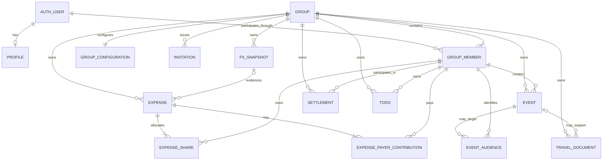

# Domain and Data Model

| Field | Value |
|---|---|
| Status | Accepted |
| Document type | Domain and data model |
| Scope | Phase 3 logical entities, ownership, relationships, configuration, finance normalization, and data invariants |
| Current-state baseline | [V1 Codebase Feature and Flow Report](../v1-codebase-feature-and-flow-report.md) |
| Related ADRs | [ADR-0001: One Group Represents One Trip and Is the Tenant Boundary](decisions/ADR-0001-group-is-trip-tenant.md) (Accepted); [ADR-0002: Supabase Auth Is the Authoritative Identity Provider](decisions/ADR-0002-supabase-auth-is-authoritative.md) (Accepted); [ADR-0003: Commercial Membership Is Deferred](decisions/ADR-0003-commercial-membership-deferred.md) (Accepted); [ADR-0004: `group_members.id` Is the Stable Participant Identity](decisions/ADR-0004-group-member-id-is-participant-identity.md) (Accepted); [ADR-0005: Finance Payers and Shares Use Normalized Tables](decisions/ADR-0005-normalized-finance-payers-and-shares.md) (Accepted); [ADR-0006: Timezone, Currency, Destination, and Dates Are Group Configuration](decisions/ADR-0006-group-configuration.md) (Accepted) |
| Last reviewed | 2026-07-24 |

> This document and its three Phase 3 ADRs were Accepted after product and
> architecture review on 2026-07-24. Acceptance does not authorize
> implementation.

## 1. Purpose and authority

Phase 3 defines the logical domain and data boundaries required by later flow,
security, migration, Feature parity, and implementation work. It proposes:

- `group_members.id` as the stable Participant identity inside a Group;
- normalized Expense payer-contribution and share relationships;
- Trip name, destination, dates, IANA timezone, ISO accounting currency, and
  necessary currency-display context as Group configuration;
- an explicit separation between global and group-owned concepts;
- cross-Group referential invariants; and
- a migration-compatible identity state for unclaimed Legacy Participants
  without treating display names as identity.

The Accepted Phase 2 architecture remains authoritative: one Group is one Trip
workspace and the Tenant boundary, and Supabase Auth supplies authenticated
global identity. This document describes a logical model, not a physical
schema. Entity names express responsibilities and relationships; they do not
prescribe table names, columns, keys, indexes, SQL types, constraints, or
storage layout.

Phase 4 owns application and identity flows. Phase 5 owns RLS, authorization
matrices, Storage and realtime enforcement, and privileged-operation rules.
Phase 6 owns migration mechanics, Legacy Participant claiming, Feature parity,
and rollback. Phase 7 owns implementation sequencing. Nothing in this Accepted
document or its Accepted ADRs authorizes implementation.

## 2. Current-state mapping

Everything in this section is a **Current state** fact drawn from the
[frozen v1 report](../v1-codebase-feature-and-flow-report.md). It is not a
description of the target model.

| V1 concept or behaviour | Current-state fact | Target-domain concern created by it |
|---|---|---|
| Hardcoded personas and unused `users` | The frontend has five selectable personas in code. The `users` table is unused by the frontend, has plaintext PIN values, and is unrelated to Supabase Auth. | Existing people need stable group-scoped identities and a controlled account-claiming path; neither personas nor the legacy table can be authentication authority. |
| Events and `for_users` | Events are global records. `for_users` stores display-name arrays, and client filtering decides which selected persona sees an event. | Events require Group ownership, stable actor/audience references, and a later parity decision. V1 filtering is not secure private-event authorization. |
| Scan metadata and public Storage | Scan uploads to a public bucket and stores document metadata on created events. Object paths are flat and public URLs are persisted. | Document metadata and files require Group ownership, provenance, and later Storage authorization. A path or public URL cannot prove access. |
| Expenses and payer fields | Expenses store `paid_by` as a name, `paid_by_splits` as JSON, `split_among` as a name array, and `custom_splits` as JSON. | Payer contributions and shares require normalized Participant relationships with exact, reconciling amounts. |
| Split modes | Equal splitting is the current visible UI path; custom, percent, and weighted-share calculation branches exist in code. | The logical model must represent persisted results without claiming latent calculation branches as current user-visible parity. |
| Settlements | `from_user`, `to_user`, and `recorded_by` store display-name strings. The current Paid flow writes the active persona to `recorded_by`. These values are mutable legacy identity, including the captured recorder identity. | Settlement parties and recorder require stable Group-scoped identities; records remain accounting events, not payments. |
| Todos | Todos use `user_name`; the client filters by the selected persona. | Todos require Group ownership and stable Participant association. Name filtering is neither privacy nor authorization. |
| Exchange rates and accounting conversion | `exchange_rates` is unused. The converter fetches a live reference rate, while expense accounting uses a static 188.68 IDR/INR conversion. | Persisted accounting conversions need explicit Group currency context and immutable FX evidence sufficient for reproduction. |
| Creator/participant references | Event creators and feature participants are display names or arbitrary strings. | Mutable presentation values must be separated from stable identity and audit references. |
| Global queries, realtime, and ownership | Event, Expense, and Settlement reads and realtime subscriptions are global; Todos are only name-filtered. Records have no Group or Trip key. | Every group-owned record needs one Group context, and later security must prevent cross-Group access. |

V1 does not have Authentication, Groups, Invitations, secure private events, or
Tenant isolation. This document does not infer those capabilities from stale
README or handoff claims.

## 3. Domain inventory

“Global” means not owned by one Group; it does not mean publicly readable.
“Group-scoped” means the concept belongs to exactly one Group Tenant context.

| Concept | Purpose and logical identity | Ownership scope | Important relationships and lifecycle authority | Must not be confused with |
|---|---|---|---|---|
| Auth User reference | References the Supabase Auth identity without copying credential authority. Identity originates from Supabase Auth. | Global | May have one Profile and many Group Member relationships. Supabase Auth controls authentication lifecycle. | Profile, Participant, Group access, a client-supplied user ID, or application credentials |
| Profile | Holds genuinely global presentation information associated with an Auth User. | Global | Associated with an Auth User; application profile rules govern presentation updates. It grants no Group relationship. | Auth credentials, Group Member, Participant, or authorization |
| Group | Represents exactly one Trip workspace and the Tenant boundary. | Its own Tenant root | Owns configuration, membership relationships, Invitations, events, documents, finance, Todos, FX evidence, and group-owned service access. Group lifecycle rules belong to later phases. | A permanent friend circle containing many Trips or a paid plan |
| Group configuration | Supplies the Trip's user-facing name, destination, date range, IANA timezone, ISO accounting currency, and approved currency-display context. | One Group | Exactly one effective configuration context per Group. Group-authorized lifecycle operations govern changes. | A global constant, Profile preference, destination guide, or separate Tenant |
| Group Member | Relates one Auth User to one Group in normal target operation and carries group-scoped role and lifecycle state. Its stable identity is `group_members.id`. | One Group | Belongs to one Group; normally references one Auth User. May be Owner or Member. Phase 4 defines invitation, activation, removal, and ownership flows. | Paid membership, Subscription, Entitlement, Profile, or global privilege |
| Participant | The role played by a Group Member when group-owned records identify a person. Its technical identity is the related `group_members.id`. | One Group | Referenced by Event, document, Expense, Settlement, Todo, and audit relationships. Presentation is resolved through related domain data, not used as identity. | A separate credential identity, Auth User ID, Profile ID, display name, email, or arbitrary string |
| Legacy Participant representation | Preserves a v1 persona and historical references before a proven Auth User claim. It retains a stable Group-scoped Participant identity but grants no login or Group access while unclaimed. | Migrated Bali Group only | A controlled migration state associated with the future Group Member identity. Phase 6 defines backfill and claiming; a successful claim attaches the proven Auth User without replacing the Participant identity. | Authentication, automatic display-name matching, an active Group membership, or general new-Group onboarding |
| Invitation relationship | Represents a Group-scoped intent to invite an Auth User or invitee and, later, establish a Group Member relationship. | One Group | Relates to one Group and later acceptance lifecycle. Phase 4 decides states, actors, token handling, and atomic acceptance. | A Group Member before acceptance, an email-delivery system, or authorization by itself |
| Event | Represents an itinerary item scheduled and interpreted in the Group timezone. | One Group | Has stable creator/actor provenance; may have audience links and associated travel-document metadata. Group-authorized actions govern lifecycle. | A global itinerary item or proof that an audience filter is secure |
| Event audience relationship | If retained by Phase 6 parity review, associates an Event with stable Participants for presentation or later-defined visibility semantics. | Same Group as Event | Event and Participant must share a Group. Its security meaning is deferred to Phases 5 and 6. | V1 name arrays, secure private events, or a cross-Group sharing mechanism |
| Travel-document metadata | Describes a scanned or uploaded travel document, its Storage reference, provenance, and optional Event association. | One Group | May relate to an Event in the same Group. Group-authorized document operations govern metadata lifecycle; Storage access enforcement is defined in Phase 5. | The stored object itself, a public URL, or authorization |
| Expense | Represents one group-owned expense and its original and accounting monetary context. | One Group | Has one or more payer contributions, one or more shares, creator provenance, and immutable FX evidence when conversion is required. Group-authorized finance operations govern lifecycle. | A payment, stored balance, payer identity string, or Subscription charge |
| Expense payer contribution | Records how much one Participant paid toward an Expense. | Same Group as Expense | Belongs to one Expense and one Participant; all contributions reconcile to the Expense accounting amount. Its lifecycle is controlled with its parent Expense. | `paid_by`, name-keyed JSON, a settlement, or payment processing |
| Expense share | Records the exact amount allocated to one Participant for an Expense after the selected split calculation. | Same Group as Expense | Belongs to one Expense and one Participant; all shares reconcile to the Expense accounting amount. Its lifecycle is controlled with its parent Expense. | `split_among`, custom JSON, an unpersisted percentage, or paid status |
| Settlement | Records a non-custodial accounting transfer declared between two Participants. | One Group | Payer, receiver, and recording Participant all belong to the Settlement's Group. Group-authorized finance operations govern lifecycle. | Payment processing, custody, a wallet transfer, or an Expense payer row |
| Todo | Represents a Participant-associated checklist item in one Trip workspace. | One Group | Belongs to one Group and a stable Participant; lifecycle permissions remain later flow/security work. | A globally private list or a display-name filter |
| FX Snapshot | Immutable evidence for a persisted accounting conversion, including the currencies, exact rate context, source/provenance, and effective observation context necessary to reproduce it. | One Group when used by Group accounting | Supports Expense conversion from Original currency into Group accounting currency. It is created with the conversion context and retained immutably while referenced by history. | A mutable live converter quote, a global Group setting, or a payment rate |

The Legacy Participant representation is a narrowly scoped migration and
lifecycle compatibility state. The Accepted Phase 2 boundary remains intact:
in steady-state target operation, an active Group Member is the access
relationship between an Auth User and a Group. An unclaimed legacy state is not
an active Auth User-to-Group access relationship. It grants no Group access,
role, membership authority, or Authentication and cannot satisfy an
authorization check. Only later verified Auth User attachment and lifecycle
activation can establish access, while claiming preserves the stable
Participant ID. This refinement preserves historical identity; it does not
create a competing identity or credential authority.

## 4. Relationship and cardinality model

The diagram is logical. It intentionally omits fields, physical keys, SQL
types, and enforcement mechanics.

| Relationship | Cardinality and invariant |
|---|---|
| Auth User to Profile | An Auth User may have at most one application Profile; a Profile belongs to exactly one Auth User. Profile existence grants no Group access. |
| Auth User to Group Members | One Auth User may have zero or many Group Member identities, at most one active identity in a given Group under the current target. Each normal active Group Member relates to one Auth User. |
| Group to Group Members | A Group has one or more Group Members and requires a valid ownership model. Each Group Member belongs to exactly one Group. |
| Group to configuration | A Group has exactly one effective configuration context. Configuration belongs to exactly one Group. Versioning mechanics, if required for audit, remain a later physical-model concern. |
| Group to Invitations | A Group may have zero or many Invitations. An Invitation belongs to one Group and is not a Group Member until the Phase 4 acceptance operation succeeds. |
| Group to owned records | A Group may own many Events, documents, Expenses, Settlements, Todos, and FX Snapshots. Every such record belongs to exactly one Group. |
| Group Member to Participant references | Each Participant reference resolves to one `group_members.id`. A Group Member may be referenced by many group-owned records, always inside that same Group. |
| Event to audience | An Event may have zero or many audience relationships if Phase 6 retains the capability. Each relationship targets one same-Group Participant. Absence and visibility semantics remain later decisions. |
| Event to documents | An Event may have zero or many associated document metadata records; a document may be unassociated or associated with an Event in the same Group. |
| Expense to payer contributions | Each Expense has one or more payer-contribution records. Each contribution belongs to exactly one Expense and one same-Group Participant. |
| Expense to shares | Each Expense has one or more share records. Each share belongs to exactly one Expense and one same-Group Participant. |
| FX Snapshot to Expense | An Expense that converts Original currency to accounting currency uses immutable FX evidence. One snapshot may evidence one or more conversions only when its recorded context is applicable to each; exact physical association is a later design detail. |
| Settlement parties | Each Settlement identifies exactly one payer, one receiver, and one recording Participant, all in the same Group. One Participant may appear in many Settlements in any of those roles. |
| Todo to Participant | Each Todo is associated with one Participant in its Group. A Participant may have many Todos. |

## 5. Participant identity

As required by
[ADR-0004](decisions/ADR-0004-group-member-id-is-participant-identity.md),
`group_members.id` is the stable Participant identity used by group-owned
records.

- Auth User IDs, Profile IDs, display names, emails, and arbitrary strings must
  not replace Participant identity.
- A Participant reference and the referenced Group Member must belong to the
  same Group as the owning record.
- Presentation data can change without rewriting historical Participant
  references.
- One Auth User has distinct Participant identities in different Groups.
- Group membership remains unrelated to payment, Subscription, trial, or
  Entitlement state.

### 5.1 Legacy and lifecycle cases

| Case | Required logical behaviour |
|---|---|
| Unclaimed Legacy Participant | Preserve a stable Group-scoped identity and original migration provenance. This is not an active Auth User-to-Group access relationship, grants no Group access, role, membership authority, or Authentication, and cannot satisfy authorization checks. |
| Later account claiming | Phase 6 must establish proof independent of display name and handle collisions. Only verified Auth User attachment plus lifecycle activation can establish access; claiming preserves rather than replaces the stable Participant identity. |
| Duplicate display names | Permitted. Records remain distinguishable by stable Participant identity. UI disambiguation is presentation work, not identity proof. |
| Display-name or Profile change | Historical references continue to identify the same Participant. Presentation resolves to current or intentionally snapshotted display data according to later audit requirements. |
| Member removal or inactivity | Access and role activity may cease, but referenced Participant identity and historical records remain valid. Removal must not rewrite records to names or another user. |
| Auth account change or deletion | Authentication lifecycle does not erase Group history. Phase 4 defines account/member lifecycle; Phase 6 defines migrated compatibility. |

Display-name matching cannot prove ownership because names are mutable,
non-unique, client-visible, and were freely selectable in v1. Detailed claiming
and backfill flows remain Phase 6 work.

## 6. Group ownership invariants

Every group-owned record has exactly one Group ownership context. That context
is durable domain ownership, not a value inferred from the current UI.

1. A Group Member or Participant reference must resolve inside the owning
   record's Group.
2. An Event and each creator, audience Participant, and associated document
   must share one Group.
3. Travel-document metadata, its optional Event association, and its
   group-owned Storage object must share one Group context.
4. An Expense, each payer contribution, each share, its creator, and its FX
   evidence must share one Group.
5. A Settlement, payer, receiver, and recorder must share one Group.
6. A Todo and its Participant must share one Group.
7. A persisted Group-accounting FX Snapshot cannot be used as evidence for a
   different Group without an explicit future architecture rule.
8. No record may gain, change, or validate ownership from Active Group, a URL,
   query parameter, request body, local storage, Zustand, cached selection, a
   Storage path, or a realtime channel.
9. Moving a record between Groups is not an ordinary update. If ever required,
   it needs an explicit later lifecycle and audit rule.

Exact technical constraints and authorization enforcement belong to Phases 5
and 7.

## 7. Group configuration

As required by
[ADR-0006](decisions/ADR-0006-group-configuration.md), each Group owns the
configuration that defines its Trip context:

- user-facing Trip name;
- destination;
- inclusive or otherwise explicitly interpreted start and end dates;
- an IANA timezone used as the canonical schedule interpretation;
- an ISO 4217 accounting currency used by the Group ledger; and
- any approved currency-display context needed to show Original and accounting
  values without changing accounting authority.

Date ordering, valid identifiers, and configuration-change effects are logical
invariants; their physical representation and operation permissions remain
later work. Group timezone governs schedule interpretation. Group accounting
currency governs persisted ledger totals and reconciliation. Original currency
and immutable conversion evidence remain attached to finance history rather
than being overwritten when configuration changes.

For the migrated Bali Group, Phase 6 must preserve the known Bali destination,
22–27 May 2026 Trip dates, WITA trip-time meaning through a validated IANA
timezone mapping, and IDR accounting context used by v1 expenses. It must also
resolve the existing user-facing title and the effects of v1's IST storage and
INR/IDR display assumptions. New Groups receive their own configuration rather
than Bali constants.

This model does not create worldwide destination guides. Existing Bali-specific
guide or price information may be retained only for the migrated Bali Group.
Automatic content for other destinations remains Deferred under
[DEF-005](../product/deferred-scope-register.md#def-005--worldwide-destination-price-guides)
and
[DEF-012](../product/deferred-scope-register.md#def-012--automatic-or-global-travel-content-generation).

## 8. Event and document model

Events are Group-owned itinerary records:

- schedule values are interpreted using the Group's IANA timezone;
- authenticated creator or actor provenance uses a stable same-Group
  Participant reference when a Participant initiated the change;
- Event lifecycle never derives authority from an Active Group or display name;
- an optional audience relationship, if retained, uses stable same-Group
  Participant references; and
- display and countdown behaviour must later be validated against the Group
  dates and timezone.

Travel-document metadata is also Group-owned:

- metadata may optionally associate with an Event in the same Group;
- Storage object references locate content but do not authorize access;
- scanned-data provenance distinguishes uploaded source, extracted values,
  transformation/confirmation, and the stable actor where applicable;
- a scan-created Event and its supporting document metadata retain a traceable
  same-Group relationship; and
- Phase 5 defines object namespace, signed access, RLS/policy alignment, and
  service-role validation.

The meaning and parity treatment of v1 `for_users` remains a Phase 6 question.
Current client-side filtering must not be described as secure private-event
functionality. Private or secret events remain Deferred under
[DEF-008](../product/deferred-scope-register.md#def-008--private-or-secret-events).

## 9. Normalized finance model

As required by
[ADR-0005](decisions/ADR-0005-normalized-finance-payers-and-shares.md), finance
uses explicit logical relationships rather than authoritative names or JSON.

### 9.1 Logical records and monetary context

- **Expense:** owns description/category context, exact Original amount and
  Original currency, exact accounting amount in the Group's accounting
  currency, creation provenance, split-method provenance where useful, and
  immutable FX evidence when conversion occurred.
- **Expense payer contribution:** associates one same-Group Participant with an
  exact amount paid toward the Expense.
- **Expense share:** associates one same-Group Participant with an exact final
  accounting amount allocated to that Participant.
- **FX Snapshot:** preserves the exact conversion evidence and rounding context
  needed to reproduce persisted accounting conversion.
- **Settlement:** records an exact non-custodial accounting amount between
  same-Group payer and receiver Participants and identifies the recording
  Participant.

### 9.2 Mandatory finance rules

1. Every Expense has one or more payer-contribution records.
2. Every Expense has one or more share records.
3. Every payer, share Participant, creator, and referenced FX evidence belongs
   to the Expense's Group.
4. Payer contributions sum exactly to the Expense accounting amount.
5. Expense shares sum exactly to the Expense accounting amount.
6. Stored monetary and rate values use exact-decimal semantics; binary
   floating-point values are not authoritative stored accounting values.
7. Currency-specific precision, conversion precision, and rounding are explicit
   and deterministic. Any indivisible remainder is allocated by a documented
   deterministic rule, and persisted final rows still reconcile exactly.
8. Original amount and currency are preserved alongside the accounting result.
   A later rate change must not rewrite historical accounting silently.
9. A converted accounting amount can be reproduced from immutable FX evidence,
   recorded precision, and rounding context.
10. Names, name-keyed maps, `paid_by`, `paid_by_splits`, `split_among`, and
    custom split JSON are not authoritative target identity or ledger
    relationships.

Single-payer Expenses use one payer contribution; multi-payer Expenses use
several. Equal splitting is representable through equal final share rows plus
deterministic remainder handling. Custom-amount, percent, and weighted-share
methods can also be represented by final exact share rows, but v1's latent
calculation branches are not thereby declared user-visible parity. Phase 6
decides which modes must be preserved and how their legacy inputs migrate.

Settlements remain ledger records. They do not transfer funds, hold balances,
settle through a provider, create wallets, or process payments. Billing,
Subscriptions, paywalls, custody, and stored monetary value remain excluded by
[ADR-0003](decisions/ADR-0003-commercial-membership-deferred.md) and the
[deferred-scope register](../product/deferred-scope-register.md).

## 10. Todo model

Each Todo belongs to exactly one Group and is associated with one stable
Participant identity in that Group. Title, completion state, lifecycle
timestamps, and actor provenance are logical Todo concerns; physical fields and
operation permissions remain later work.

V1's `user_name` filtering is a migration input, not target identity, privacy,
or authorization. Phase 5 must independently enforce access, and Phase 6 must
validate the preserved Todo behaviour for claimed and unclaimed legacy data.

## 11. Identity, audit, and historical integrity

Group-owned history needs stable actor and lifecycle provenance without turning
presentation fields into identity.

- When a Participant initiates an operation, logical `created by`, `updated
  by`, or `recorded by` relationships reference the same-Group Participant.
- A trusted automated operation records explicit system provenance and, when
  applicable, the initiating Participant; it must not invent a display-name
  actor.
- Creation and modification times are durable audit context. Domain-effective
  times such as Event schedule, Expense occurrence, Settlement recording, or FX
  observation remain distinct concepts.
- Archival or inactivity preserves historical identity and relationships.
  Physical deletion must not orphan or silently reassign history.
- Presentation changes do not rewrite Participant identity. Where historical
  presentation snapshots are later required, they supplement rather than
  replace stable references.
- A Member becoming inactive stops future authority according to Phase 4 and
  Phase 5 rules, while past Event, finance, Settlement, Todo, and audit
  references continue to resolve.

Detailed owner transfer, Member removal, account deletion, Group archival, and
record-retention flows remain Phase 4 work. Their enforcement and audit tests
remain Phase 5 and Phase 6 work.

## 12. Data invariants

Later documents and implementation must preserve these logical invariants:

1. One Group equals one Trip workspace.
2. Every group-owned record belongs to exactly one Group.
3. Cross-Group Participant, Event, document, Expense, Settlement, Todo, FX, and
   audit relationships are prohibited.
4. Auth User and Profile are not Participant identity.
5. Display names, emails, and arbitrary strings are never identity.
6. `group_members.id` is the Participant identity inside group-owned records.
7. One Auth User may have distinct Participant identities in different Groups.
8. Group configuration replaces global Trip, destination, date, timezone, and
   accounting-currency hardcoding.
9. Every Expense has at least one payer contribution and one share.
10. Payer and share totals reconcile exactly to the Expense accounting amount.
11. Stored accounting arithmetic and rates use exact-decimal semantics and
    deterministic rounding, not binary floating point.
12. Persisted accounting conversions are reproducible from immutable FX
    evidence.
13. Settlements record accounting and neither transfer nor hold funds.
14. Storage paths, realtime channels, and Active Group do not alter record
    ownership or grant authority.
15. Commercial scope and a permanent friend-group-to-many-Trips hierarchy
    remain excluded.

## 13. Current-to-target mapping

This table supplies migration concerns, not migration commands.

| V1 table or field pattern | Target logical concept | Migration concern | Later-phase owner |
|---|---|---|---|
| Hardcoded five-person `users` constant | Legacy Participant representation and eventual Group Member | Create stable same-Group identities; preserve persona history; never auto-claim by name. | Phase 6 migration/claiming |
| Unused `users` table and plaintext PIN | No target credential authority; optional migration evidence only if validated | Do not migrate PINs as credentials or infer Auth Users. | Phase 6 migration; Phase 5 security review |
| Global Events with no Group key | Group-owned Event | Associate every retained Event with the one migrated Bali Group and validate completeness. | Phase 6 migration/parity |
| Event `created_by` display name | Stable Participant actor reference | Map only through controlled Legacy Participant mapping; preserve unresolved provenance explicitly. | Phase 6 migration |
| Event `for_users` name array | Optional Event audience relationships, subject to parity decision | Resolve duplicate/unknown names without claiming secure privacy; decide retained semantics. | Phase 6 parity; Phase 5 security if retained |
| Event document metadata and public URL/path | Group-owned travel-document metadata and Storage reference | Associate metadata and object with Bali Group; preserve provenance; replace public-path assumptions later. | Phase 5 security; Phase 6 migration |
| Expense `paid_by` | One normalized payer contribution | Map name to controlled Legacy Participant identity and reconcile exact amount. | Phase 6 migration |
| Expense `paid_by_splits` JSON | Multiple normalized payer contributions | Parse, validate participants and totals, retain exceptions for review. | Phase 6 migration/parity |
| Expense `split_among` name array | Normalized Expense shares | Derive and persist exact final shares using verified v1 behaviour and deterministic remainder rules. | Phase 6 migration/parity |
| Expense `custom_splits` JSON and split mode | Normalized final shares plus method provenance where required | Distinguish stored legacy data and latent calculation paths from current user-visible parity. | Phase 6 parity |
| Expense `amount`, `currency`, `amount_idr` | Original amount/currency plus Group accounting amount/currency | Preserve exact source and accounting values; validate static-rate results and rounding. | Phase 6 migration/parity |
| Static 188.68 IDR/INR accounting conversion | Immutable FX evidence for migrated accounting history | Record reproducible legacy conversion provenance without treating the live converter rate as accounting evidence. | Phase 6 migration |
| Unused `exchange_rates` records | No automatic authority; candidate evidence only after validation | Determine whether any row is relevant; do not infer usage absent evidence. | Phase 6 migration |
| Settlement `from_user`, `to_user`, `recorded_by`, and amount | Group-owned Settlement with payer, receiver, and recorder Participant references | Map all three display-name identities through the controlled Legacy Participant mapping. The current Paid flow captures the active persona in `recorded_by`; unresolved or malformed stored values require exception handling only if actual data verification discovers them. | Phase 6 migration/parity |
| Todo `user_name` | Group-owned Todo associated with Participant | Map names through controlled legacy mapping; do not treat name filtering as authorization. | Phase 6 migration; Phase 5 security |
| Global queries and realtime subscriptions | Group-owned queries and authorized realtime scope | Preserve collaboration while eliminating cross-Group streams. | Phase 5 security; Phase 6 parity |
| Public flat Storage namespace | Group-owned object context | Establish ownership and migrate references without treating paths as access grants. | Phase 5 security; Phase 6 migration |
| Bali/DPS, fixed dates, IST/WITA, INR/IDR constants | Group configuration and migrated Bali values | Validate destination, date, timezone, title, accounting currency, and display mappings. | Phase 6 migration/parity |

## 14. Later-phase handoff

| Later phase | Phase 3 supplies | Intentionally delegated decisions |
|---|---|---|
| Phase 4 — Authentication, Group, and Invitation flows | Stable Auth User/Profile/Group Member separation; Participant identity; Group configuration and entity lifecycles requiring actors | Login and session flows, Group creation/selection, Invitation states and atomic acceptance, owner transfer, Member removal/inactivity, account change, archival, and failure behaviour |
| Phase 5 — Security architecture | One-Group ownership invariant; same-Group references; stable actors; service boundaries for records, Storage, and realtime | RLS and policy expressions, operation/role matrix, JWT use, service-role validation, Storage namespace/access, realtime filtering, and security tests |
| Phase 6 — Migration and Feature parity | Current-to-target mapping; Legacy Participant compatibility; finance reconciliation; configuration mapping; audit expectations | Physical backfill, claiming proof, duplicate-name resolution, rate reconstruction, `for_users` parity, latent split modes, data exceptions, rollback, and parity cases |
| Phase 7 — Implementation roadmap | Logical dependencies, invariants, and review gates | Physical schema/migration sequence, delivery slices, rollout ownership, test ordering, and deployment gates |

The following are intentionally delegated details rather than unresolved Phase 3
boundaries: physical identifiers and constraints; exact column shapes;
Invitation token/state design; role permissions; Member removal and ownership
transfer flows; RLS and service policies; Storage paths; realtime filters;
Legacy Participant claiming proof; exact migration transforms; user-visible
parity decisions for `for_users` and latent split modes; and implementation
sequencing.

## 15. Phase 3 acceptance checklist

- [x] The logical inventory covers every required global and Group-scoped
  concept.
- [x] Global Auth User/Profile concerns are separated from group-owned domain
  concerns.
- [x] `group_members.id` is Accepted as stable Participant identity.
- [x] Unclaimed Legacy Participants can preserve history without granting
  authentication or access.
- [x] Cross-Group referential invariants cover Participants, Events,
  documents, finance, Settlements, Todos, FX, and audit relationships.
- [x] Expense payer contributions and shares are Accepted as normalized
  relationships.
- [x] Trip name, destination, dates, IANA timezone, ISO accounting currency,
  and currency-display context are defined as Group configuration.
- [x] Exact-decimal finance, deterministic rounding, reconciliation, and
  reproducible FX evidence are required.
- [x] Current v1 patterns map to target logical concepts and later-phase owners.
- [x] No SQL, migration, RLS policy, detailed application flow, or
  implementation artifact is introduced.
- [x] ADR-0004, ADR-0005, and ADR-0006 are reviewed and Accepted before Phase 4
  may be Accepted.
