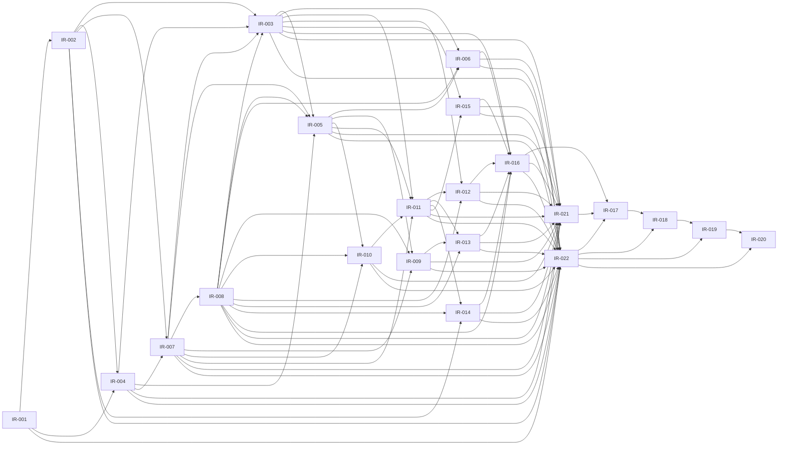

# Phase 7 Implementation Roadmap

| Field | Value |
|---|---|
| Phase | 7 — Implementation sequencing |
| Status | Accepted |
| Authority | Sequencing of Accepted Phase 2–6 decisions |
| Scope | Dependency-aware implementation, evidence, rehearsal, cutover, recovery, and release sequencing |
| Current-state baseline | [V1 Codebase Feature and Flow Report](../v1-codebase-feature-and-flow-report.md) |
| Phase 6 base commit | `ad8d7ddfdb62d1b4c139767f64aea8dc23272738` |
| Implementation status | Not started by this document |
| Production migration status | Not authorized |
| Documentation lock | Complete — Phase 7 Accepted |
| ADR status | No Phase 7 ADR created unless separately authorized |
| Related documents | [Architecture README](README.md); [Migration Plan](v1-migration-plan.md); [Feature Parity Test Contract](feature-parity-test-contract.md); [Deferred-Scope Register](../product/deferred-scope-register.md) |
| Related ADRs | [ADR-0001](decisions/ADR-0001-group-is-trip-tenant.md) through [ADR-0008](decisions/ADR-0008-group-scoped-authorization-with-rls-and-trusted-operations.md) are Accepted |
| Last reviewed | 2026-07-24 |

> This Accepted Phase 7 roadmap is the locked implementation-sequencing input.
> It grants no authority to change code, schema, policies, production data,
> infrastructure, or deployment configuration. Acceptance does not mean that
> implementation, migration, security, test, rehearsal, or deployed evidence
> has passed; those remain separate execution gates.

## 1. Purpose and boundaries

Phase 7 owns dependency order, implementation boundaries, evidence, approvals,
and stop conditions for the Accepted package. It does not own implementation
execution, production migration, deployment, cutover, test results, or a new
architecture decision. Roadmap acceptance locks a sequence; it is not
implementation completion. Implementation evidence validates repository work,
migration evidence validates transforms/rehearsals, and deployed evidence
validates an authorized environment. Accepted architecture cannot be weakened
silently for convenience; a repository conflict is a blocking input.

### Authority and precedence

1. The [frozen v1 report](../v1-codebase-feature-and-flow-report.md) for verified current behaviour only.
2. Accepted ADRs.
3. Accepted Phase 2–6 architecture documents.
4. Accepted migration and parity decisions.
5. [Deferred-Scope Register](../product/deferred-scope-register.md).
6. This roadmap, for sequencing only.
7. Implementation artifacts after Phase 7 acceptance.

## 2. Accepted-input inventory

| Source | Status | Controlling concerns | Phase 7 impact / workstreams | Verification obligation | Pending execution input |
|---|---|---|---|---|---|
| [Frozen report](../v1-codebase-feature-and-flow-report.md) | Existing/Frozen | Verified v1 behaviour and limitations | Baseline, parity, migration | Evidence anchors/classification | Deployed-data inventory |
| [Glossary](glossary.md) | Accepted governance | Canonical terms | All workstreams | Terminology review | None |
| [Architecture README](README.md) | Accepted governance | Package precedence and lock | IR-001, IR-022 | Final-lock review | None |
| [Target Architecture](multi-tenant-target-architecture.md) | Accepted | Tenant, Auth, identity, scope | IR-002–IR-011 | Two-Group ownership evidence | Environment topology |
| [Domain and Data Model](domain-and-data-model.md) | Accepted | Records, invariants, finance, configuration | IR-002–IR-003, IR-012–IR-016 | Schema/reconciliation evidence | Source shapes |
| [Auth, Group, Invitation Flows](auth-groups-and-invitations.md) | Accepted | Auth, lifecycle, atomic flows | IR-003–IR-006 | Lifecycle/race/audit evidence | Owner/identity inputs |
| [Security Model](security-model.md) | Accepted | RLS, trusted boundaries, Storage, realtime | IR-007–IR-010, IR-021 | Matrix-driven security evidence | Security review |
| [Migration Plan](v1-migration-plan.md) | Accepted | S01–S19, M01–M18, recovery | IR-016–IR-020 | Manifest/rehearsal evidence | Inventory/window/recovery |
| [Parity Contract](feature-parity-test-contract.md) | Accepted | FP, UI, TC, IPE decisions | IR-011–IR-015, IR-021 | Pending Phase 7 evidence | Test capability |
| [Deferred Register](../product/deferred-scope-register.md) | Accepted governance | DEF exclusions | Every workstream | Scope review | None |
| ADR-0001 | Accepted | Group is the Trip Tenant | IR-002 onward | Parent-derived ownership evidence | None |
| ADR-0002 | Accepted | Supabase Auth authority | IR-004 onward | Session-derived actor denial | Auth environment |
| ADR-0003 | Accepted | Commercial scope excluded | Every workstream | DEF review | None |
| ADR-0004 | Accepted | Stable `group_members.id` Participant | IR-002, IR-005–IR-006 | Stable-ID lifecycle evidence | Adjudications |
| ADR-0005 | Accepted | Normalized finance | IR-014, IR-016 | Exact finance reconciliation | Finance exceptions |
| ADR-0006 | Accepted | Group configuration | IR-003, IR-012, IR-015–IR-016 | Time/currency/destination evidence | Configuration input |
| ADR-0007 | Accepted | Atomic single-use Invitations | IR-005, IR-008 | Replay/race/secret evidence | Recipient verification input |
| ADR-0008 | Accepted | RLS and narrow trusted operations | IR-007–IR-010, IR-021 | Matrix/rollback/two-Group evidence | Security approval |

## 3. Current implementation baseline

Repository inspection identifies a React 18/Vite/TypeScript client with
Tailwind and `@supabase/supabase-js`. `App.tsx` holds one of five hardcoded
personas in client memory and routes Trip, Scan, Split, FX, and Todo tabs.
Hooks issue global `events`, `expenses`, `settlements`, and name-filtered Todo
queries and broad realtime subscriptions. Supabase Auth, Groups, Profiles,
membership, Invitations, lifecycle, Tenant routing, and Active Group are absent.

Legacy SQL uses display-name references, permissive policies, public flat
`tickets` Storage, and name-keyed Todos. The reachable parser function uses
elevated capability, public Storage, and client-supplied identity/audience
values. Finance uses scalar/array/JSON names, a static 188.68 accounting
conversion, legacy Astitva→Partha routing, and separate live FX. Existing Vite
and TypeScript build scripts exist; tests, lint, CI, deployment specification,
and production facts are absent or unknown. These are repository facts, not
deployed facts or target authority.

| Baseline class | State | Roadmap treatment |
|---|---|---|
| Implemented and observed | UI tabs, global queries/realtime, migrations, parser, build | Preserve verified product behaviour only through safe adaptation |
| Present but incomplete | Supabase client, PWA dependency, finance/document code | Re-evaluate; presence is not acceptance evidence |
| Legacy/insecure | Personas, PIN rows, global access, public Storage, permissive policies | Replace/contain; never authority |
| Absent | Auth/Tenant/RLS matrix/private Storage/secure realtime/tests/CI | Implement only after Phase 7 acceptance |
| Unknown | Production rows, objects, policies, topology, backups, retention | Blocking input where affected |
| Deferred | Commercial, providers, private Events, payments, organizations, global guides, dormant AI | Excluded under DEF-001–DEF-012 |

## 4. Implementation principles

- Derive Tenant ownership from authoritative parent relationships, never client
  Group IDs, Active Group, persona, display name, PIN, Profile, or unclaimed identity.
- Use Supabase Auth, stable Participants, explicit lifecycle, Owner/Member only,
  deny-by-default access, private Storage, authorized realtime, and confined service role.
- Make bootstrap, Invitation, lifecycle, claiming, finance, and documents atomic,
  retry-safe, idempotent, auditable, and fail closed.
- Preserve deterministic finance, configured accounting currency, historical FX
  evidence, live-FX separation, and Group-confined destination content.
- Advance only on evidence; retain one authority per migration stage; recover
  without public/global/cross-Tenant access; deliver minimal reversible increments.

## 5. Dependency model and critical path

The graph is acyclic: every edge moves from foundation, to contracts/Auth/RLS,
to the trusted-operation boundary, to authoritative lifecycle/security/product
work, to transforms/evidence, to rehearsal/release. Critical path: IR-001 →
IR-002 → IR-004 → IR-007 → IR-008 → IR-003 → IR-005 → IR-006 → IR-011 →
IR-012/IR-013/IR-014/IR-015 → IR-016 and IR-021 → IR-017 → IR-018 →
separately authorized IR-019 → IR-020. IR-009 and IR-010 may proceed in
parallel after IR-008 and IR-005; product lanes may proceed in parallel only
after their explicit graph dependencies. No feature may bypass Tenant, identity,
authorization, audit, trusted-operation, or evidence gates.

### Dependency edge register and cycle rule

The Mermaid diagram and this edge register have the identical **84 unique
edges**: IR-001→IR-002/IR-004/IR-022; IR-002→IR-003/IR-004/IR-007/IR-014/IR-022; IR-003→IR-005/IR-006/IR-011/IR-012/IR-015/IR-016/IR-021/IR-022; IR-004→IR-003/IR-005/IR-007/IR-021/IR-022; IR-005→IR-006/IR-009/IR-010/IR-011/IR-021/IR-022; IR-006→IR-016/IR-021/IR-022; IR-007→IR-003/IR-005/IR-008/IR-009/IR-010/IR-011/IR-021/IR-022; IR-008→IR-003/IR-005/IR-006/IR-009/IR-010/IR-012/IR-013/IR-014/IR-016/IR-021/IR-022; IR-009→IR-013/IR-021/IR-022; IR-010→IR-011/IR-021/IR-022; IR-011→IR-012/IR-013/IR-014/IR-015/IR-021/IR-022; IR-012→IR-016/IR-021/IR-022; IR-013→IR-016/IR-021/IR-022; IR-014→IR-016/IR-021/IR-022; IR-015→IR-016/IR-021/IR-022; IR-016→IR-017/IR-021/IR-022; IR-017→IR-018; IR-018→IR-019; IR-019→IR-020; IR-021→IR-017; IR-022→IR-017/IR-018/IR-019/IR-020. IR-022 is completed from IR-001–IR-016 gate
inputs and does not depend on IR-021; IR-021 evidence is recorded in the
already-created ledger and joins IR-016 and IR-022 at IR-017. The complete
graph is topologically validated before gate acceptance; duplicate declarations
and back-edges are rejected.

## 6. Implementation waves

| Wave | Objective / entry gate | Included work and parallel lane | Exit evidence / containment | Approval / downstream |
|---|---|---|---|---|
| W1 Foundation | Phase 7 Accepted; environment boundary known | IR-001–IR-002; static traceability may parallelize | Isolated fixture/schema capability; no target authority on failure | Architecture/security; W2 |
| W2 Auth and security authority | W1 ownership model passes | IR-004, IR-007, IR-008; Auth precedes RLS and RLS precedes trusted operations | Auth, matrix, rollback, secret, and two-Group evidence; no authoritative atomic operation yet | Security/architecture; W3 |
| W3 Authoritative lifecycle and exposure | W2 trusted boundary passes | IR-003, IR-005, IR-006, IR-009, IR-010; Storage/realtime parallel only after IR-008 and lifecycle | Atomic bootstrap/lifecycle/claim and private/realtime evidence; no partial authority | Product/data/security; W4 |
| W4 Group-scoped product | W3 scoped foundations pass | IR-011–IR-015; Events, finance, FX lanes parallel by explicit edges | FP/UI/TC implementation evidence; disable incomplete path | Product/security; W5 |
| W5 Migration capability and evidence | W3–W4 required records/operations complete | IR-016, IR-021, IR-022 gate evidence | Transform/reconciliation/traceability evidence; quarantine failure | Data/security/release; W6 |
| W6 Rehearsal/readiness | W5 evidence, gate ledger, and execution inputs supplied | IR-017–IR-018; monitoring planning parallel | Representative recovery/freeze/delta evidence; no cutover on failure | Release/security; W7 |
| W7 Authorized release | Separate authorization and all gates | IR-019–IR-020 | Deployed reconciliation/monitoring/retention evidence | Final release authority |

## 7. Work-item catalogue

All work items are **Planned**. “Areas” names likely repository areas, not
authorization to edit them. Each row supplies status, wave/workstream, objective,
Accepted sources, dependencies, areas, boundary, evidence, migration/parity/
security traceability, failure/recovery, release status, parallel class, review,
and definition of done.

| ID / title | Status, wave, workstream | Objective / sources / dependencies / areas / prohibited shortcut | Evidence, gate, failure/recovery | Traceability / release / parallel / review / done |
|---|---|---|---|---|
| IR-001 Evidence foundation | Planned; W1; developer evidence | Reproducible setup, isolated fixtures, contract/type checks, CI capability, audit-safe logs; README/Security/Parity; no assumed framework or production data | Capability/evidence-retention record; stop W1 on gap | TC-001–019; blocking; parallel seed; architecture/security; evidence plan reviewable |
| IR-002 Tenant data foundation | Planned; W1; data/Tenant | Group ownership, Profiles, configuration, stable members, audit; ADR-0001/004/005/006; legacy schema; no client ownership/name identity | Invariant/two-Group evidence; no target authority on failure | M01–18/TC-002/009/019; blocking; serial; data/security; parent paths proven |
| IR-003 Atomic Group bootstrap | Planned; W3; lifecycle | One Group, mandatory configuration, creator stable Member, active Owner, audit; flows/S04–S07; no ownerless/unconfigured step or persona Owner | Atomic/retry/concurrency evidence; failure creates none | S04–S07/TC-002; blocking; serial; product/data/security; complete result proven |
| IR-004 Auth, Profile, session | Planned; W2; identity | Auth entry/verification/recovery/session/privacy; ADR-0002; client auth boundary; no PIN/persona/Profile authority | Session/privacy denial evidence; remove incomplete route | FP-001/TC-001/003/IPE-AUTH; blocking; serial before IR-007; security/product; session actor only |
| IR-005 Membership, Invitation, Owner | Planned; W3; lifecycle | Active/inactive, single-use Invitation, Owner continuity, archive; ADR-0007; no automatic claim/Owner invite/secret disclosure | Replay/race/last-Owner/archive evidence; atomic denial | TC-004–008/S12; blocking; serial; product/security; Owner/Member only |
| IR-006 Legacy Participant claiming | Planned; W3; migration identity | Atomic attach plus ordinary-Member activation, stable ID; Migration §7/S12; no name/PIN/Profile/Invitation proof or Owner promotion | Positive/conflict/concurrent/idempotent evidence; remain unclaimed on failure | M01/M02/S06/S12/TC-018; blocking; serial; product/data/security; non-secret audit |
| IR-007 RLS and ownership | Planned; W2; security | Deny-by-default direct/indirect paths/lifecycle checks; ADR-0008; policy areas; no permissive interval/Active Group predicate | Matrix/object substitution/two-Group evidence; inaccessible until pass | All TC/security areas; blocking; serial; security; all protected paths deny by default |
| IR-008 Trusted operations | Planned; W2; security | Narrow atomic bootstrap/Invitation/Owner/finance/document boundaries; no browser service role/broad proxy | Injected failure/retry/race/audit evidence; preserve safe state | S05/S09/S10/S12/S18; blocking; serial; security/architecture; no partial authority |
| IR-009 Private Storage | Planned; W3; document security | Group private objects/metadata/read/removal; no public URL/path authority | Private/denial/orphan evidence; quarantine partial output | M06/M17/FP-007/008/TC-014/IPE-STORAGE; blocking; parallel IR-010; security; no public target object |
| IR-010 Authorized realtime | Planned; W3; realtime security | Current-authorized Group subscription/reconnect/removal; no broad channel/stale delivery | Two-Group/removal/archive/reconnect evidence | M16/FP-009/015/019/TC-015; blocking; parallel IR-009; security; no global delivery |
| IR-011 Active Group/data access | Planned; W4; application boundary | Authorized navigation/presentation and scoped hooks; no client Group trust/global query | Scoped read/write/error evidence; safe unavailable state | FP-001–004/009/019/TC-003/019; blocking; serial; product/security; reads scoped |
| IR-012 Events, audiences, Todos | Planned; W4; product parity | Event/time/audience presentation and Participant Todos; no private Events/name authority/inactive writes | Lifecycle/time/archive/realtime/cross-Group evidence | M03–05/M15; FP-002–006/019; UI-03–08/14; blocking; parallel finance/FX; product/security; audience non-confidential |
| IR-013 Documents and scan | Planned; W4; document parity | Validated private ingest/extraction/association/reconciliation; no provider parity/public URL/partial authority | File/parse/db/orphan/lifecycle/substitution evidence | M06/M17; FP-007/008; UI-09; IPE-SCAN/STORAGE; blocking; parallel finance; product/security; one reconciled outcome |
| IR-014 Finance and Settlements | Planned; W4; finance | Normalized contribution/share, deterministic order, balances, suggestions, configured currency; no float/name/payment/live-rate shortcut | Exact fixture/reconciliation/atomic evidence | M07–14; FP-009–015; UI-10–12; IPE-SPLIT/SET/FIN; blocking; parallel; finance/data/security; exact history |
| IR-015 FX and destination | Planned; W4; configuration parity | Reference FX/fallback and Group-confined Bali content; no ledger authority/global guide/automatic content | Live/fallback/Bali-v-non-Bali/time evidence | M11–13/M18; FP-016–018; UI-13; IPE-FX/TIME; blocking; parallel; product; Bali IDR not generalized |
| IR-016 Migration transforms/manifests | Planned; W5; migration | Replay-safe M01–18 maps, inventory, exceptions, private objects; no production execution/invented mapping/silent repair | Count/checksum/reconciliation evidence; quarantine/retry | S01–15/M01–18; blocking; serial; data/security; each retained item mapped/excepted |
| IR-017 Representative rehearsal/recovery | Planned; W6; assurance | Isolated representative full rehearsal only after execution authorization; no production authority | S01–13/18 recovery and parity/security evidence; block cutover | S01–13/S18; blocking; serial; architecture/security/release; failure retained |
| IR-018 Secured cutover preparation | Planned; W6; release | Freeze/delta/stale-client/observability/approval preparation; no unsafe dual authority | Freeze/delta/rollback plan; production remains unauthorized | S14/S15/S18; blocking; serial; release/security/product; approved readiness only |
| IR-019 Separately authorized cutover | Planned; W7; release | S16 only with external authorization; no implicit authorization | Authorized smoke/isolation/document/realtime/Auth evidence; secured recovery if failed | S16; blocking; serial; final release; safe outcome recorded |
| IR-020 Monitoring and containment | Planned; W7; operations | S17–19 reconciliation, monitoring, secure legacy containment/retirement; no re-enable permissive source | Incident/reconciliation/retention evidence | S17–19; blocking; serial; operations/security/data; rollback never insecure |
| IR-021 Integrated parity/security evidence | Planned; W5; verification | Pending FP/UI/TC/IPE/security catalogue; no UI-only security proof/waiver | Full traceable results; failed evidence blocks gate | FP-001–020/UI-01–14/TC-001–019/IPE all; blocking; parallel after dependencies; product/security/architecture; all accounted |
| IR-022 Release governance and lock evidence | Planned; W1–W7; governance | Approvals, conflicts, retention, final lock, DEF review; no undocumented scope/claim of pass | Gate ledger/review records; hold affected work | DEF-001–012/all gates; blocking; parallel; architecture/release; no decision gap |

### Per-item required-field register

Each record below supplies an identifiable value for every catalogue field;
`Sec` names Security Model verification areas, and `Refs` names the applicable
Accepted source references.

| IR item | Explicit implementation record |
|---|---|
| Record IR-001 | ID: IR-001. Status: Planned. Wave/workstream: W1/evidence. Objective: reproducible capability. Sources: README, Security, Parity. Dependencies: none. Areas: tooling/fixtures. Boundary: no implementation authority. Prohibited: assume a framework. Tests/evidence: setup, type/contract, retained logs. Refs/Sec: TC-001–019/all areas. Failure: stop W1. Recovery: correct capability gap. Blocking: yes. Class: parallel seed. Review: architecture/security. Done: capability plan approved. |
| Record IR-002 | ID: IR-002. Status: Planned. Wave/workstream: W1/data-Tenant. Objective: target ownership/configuration model. Sources: ADR-0001/004/005/006, domain. Dependencies: IR-001. Areas: schema/migrations. Boundary: contracts before authority. Prohibited: client ownership/name identity. Tests/evidence: invariant/two-Group. Refs/Sec: M01–18, TC-002/009/019; ownership. Failure: no target authority. Recovery: revert isolated increment. Blocking: yes. Class: serial. Review: data/security. Done: parent paths proven. |
| Record IR-003 | ID: IR-003. Status: Planned. Wave/workstream: W3/bootstrap. Objective: atomic Group/config/creator/Owner/audit. Sources: flows, S04–S07. Dependencies: IR-002, IR-004, IR-007, IR-008. Areas: trusted lifecycle. Boundary: server-side operation only. Prohibited: ownerless/unconfigured/client authority. Tests/evidence: atomic/retry/race. Refs/Sec: S04–07, TC-002; trusted rollback. Failure: none commit. Recovery: idempotent retry. Blocking: yes. Class: serial. Review: product/data/security. Done: complete result proven. |
| Record IR-004 | ID: IR-004. Status: Planned. Wave/workstream: W2/Auth. Objective: Auth/Profile/session. Sources: ADR-0002, flows. Dependencies: IR-001, IR-002. Areas: client/Auth. Boundary: session authority only. Prohibited: PIN/persona/Profile authority. Tests/evidence: session/privacy denial. Refs/Sec: FP-001, TC-001/003, IPE-AUTH; Auth/profile. Failure: disable incomplete route. Recovery: safe sign-out. Blocking: yes. Class: serial before RLS. Review: security/product. Done: session actor only. |
| Record IR-005 | ID: IR-005. Status: Planned. Wave/workstream: W3/lifecycle. Objective: membership, Invitation, Owner, archive. Sources: ADR-0007, flows. Dependencies: IR-003, IR-004, IR-007, IR-008. Areas: trusted lifecycle. Boundary: trusted operations. Prohibited: auto-claim/Owner invite/secret disclosure. Tests/evidence: replay/race/last-Owner. Refs/Sec: TC-004–008, S12; Invitation/lifecycle. Failure: atomic denial. Recovery: retry safe result. Blocking: yes. Class: serial. Review: product/security. Done: Owner/Member only. |
| Record IR-006 | ID: IR-006. Status: Planned. Wave/workstream: W3/claiming. Objective: atomic attach/ordinary activation. Sources: Migration §7/S12, ADR-0004. Dependencies: IR-003, IR-005, IR-008. Areas: trusted claim boundary. Boundary: approved proof only. Prohibited: name/PIN/Profile/Invitation proof or Owner promotion. Tests/evidence: conflict/concurrency/idempotency. Refs/Sec: M01/02, S06/S12, TC-018; lifecycle. Failure: unclaimed/non-authorizing. Recovery: reviewed retry. Blocking: yes. Class: serial. Review: product/data/security. Done: stable ID/audit preserved. |
| Record IR-007 | ID: IR-007. Status: Planned. Wave/workstream: W2/RLS. Objective: deny-by-default ownership. Sources: ADR-0008, Security. Dependencies: IR-002, IR-004. Areas: policy/schema. Boundary: server authorization. Prohibited: permissive interval/Active Group predicate. Tests/evidence: matrix/substitution/two-Group. Refs/Sec: TC-011/016/019; RLS areas. Failure: inaccessible target. Recovery: correct/retest. Blocking: yes. Class: serial. Review: security. Done: protected paths deny by default. |
| Record IR-008 | ID: IR-008. Status: Planned. Wave/workstream: W2/trusted operations. Objective: narrow atomic boundary. Sources: Security §10. Dependencies: IR-007. Areas: server functions. Boundary: all authoritative atomic changes. Prohibited: browser service role/broad proxy. Tests/evidence: injected failure/race/audit. Refs/Sec: S05/09/10/12/18, TC-012/013; trusted rollback. Failure: prior state remains safe. Recovery: idempotent retry. Blocking: yes. Class: serial. Review: security/architecture. Done: no partial authority. |
| Record IR-009 | ID: IR-009. Status: Planned. Wave/workstream: W3/Storage. Objective: private objects/metadata. Sources: Security §13. Dependencies: IR-005, IR-007, IR-008. Areas: Storage/documents. Boundary: current authorization. Prohibited: public URL/path authority. Tests/evidence: private/denial/orphan. Refs/Sec: M06/17, FP-007/008, TC-014, IPE-STORAGE; Storage. Failure: quarantine. Recovery: reconciliation. Blocking: yes. Class: parallel with IR-010. Review: security. Done: no public object. |
| Record IR-010 | ID: IR-010. Status: Planned. Wave/workstream: W3/realtime. Objective: current-authorized delivery. Sources: Security §14. Dependencies: IR-005, IR-007, IR-008. Areas: subscriptions. Boundary: read authorization. Prohibited: broad/stale channel. Tests/evidence: removal/archive/reconnect. Refs/Sec: M16, TC-015; realtime. Failure: stop delivery. Recovery: reauthorize/resubscribe. Blocking: yes. Class: parallel with IR-009. Review: security. Done: no global delivery. |
| Record IR-011 | ID: IR-011. Status: Planned. Wave/workstream: W4/application. Objective: scoped Active Group access and visual shell. Sources: target architecture/parity. Dependencies: IR-003, IR-005, IR-007, IR-010. Areas: App/hooks/UI. Boundary: navigation not authority. Prohibited: client Group trust/global query. Tests/evidence: scoped error/read. Refs/Sec: FP-001–004/009/019, UI-01/02/03, TC-003/019; RLS/realtime. Failure: safe unavailable. Recovery: disable route. Blocking: yes. Class: serial. Review: product/security. Done: reads scoped. |
| Record IR-012 | ID: IR-012. Status: Planned. Wave/workstream: W4/Events-Todos. Objective: Events/audiences/Todos. Sources: domain/parity. Dependencies: IR-003, IR-008, IR-011. Areas: tabs/components. Boundary: audience presentation. Prohibited: private Events/name authority. Tests/evidence: lifecycle/time/archive. Refs/Sec: M03–05/M15, FP-002–006/019, UI-04–08/14, IPE-EVENT/ERR; lifecycle. Failure: safe mutation failure. Recovery: no partial write. Blocking: yes. Class: parallel product lane. Review: product/security. Done: non-confidential audience semantics. |
| Record IR-013 | ID: IR-013. Status: Planned. Wave/workstream: W4/documents. Objective: scan/association/reconciliation. Sources: Security/parity. Dependencies: IR-008, IR-009, IR-011. Areas: Scan/function/docs. Boundary: trusted reconciliation. Prohibited: public URL/provider parity/partial authority. Tests/evidence: parse/db/orphan. Refs/Sec: M06/M17, FP-007/008, UI-09, IPE-SCAN/STORAGE; Storage. Failure: quarantine. Recovery: reconcile. Blocking: yes. Class: parallel product lane. Review: product/security. Done: client audience override retains presentation semantics. |
| Record IR-014 | ID: IR-014. Status: Planned. Wave/workstream: W4/finance. Objective: normalized deterministic ledger. Sources: ADR-0005/006, parity. Dependencies: IR-002, IR-008, IR-011. Areas: finance modules. Boundary: trusted atomic writes. Prohibited: float/name/payment/live-rate shortcut. Tests/evidence: exact fixtures/reconciliation. Refs/Sec: M07–14, FP-009–015, UI-10–12, IPE-SPLIT/SET/FIN; finance. Failure: whole unit fails. Recovery: replay-safe retry. Blocking: yes. Class: parallel product lane. Review: finance/data/security. Done: exact history preserved. |
| Record IR-015 | ID: IR-015. Status: Planned. Wave/workstream: W4/FX-content. Objective: reference FX and Bali scope. Sources: ADR-0006/parity. Dependencies: IR-003, IR-011. Areas: FX/content. Boundary: configuration derived. Prohibited: ledger/global/automatic content authority. Tests/evidence: live/fallback/non-Bali/time. Refs/Sec: M11–13/M18, FP-016–018, UI-13, IPE-FX/TIME; configuration. Failure: safe fallback. Recovery: no ledger mutation. Blocking: yes. Class: parallel product lane. Review: product. Done: Bali-only scope proven. |
| Record IR-016 | ID: IR-016. Status: Planned. Wave/workstream: W5/migration. Objective: replay-safe transforms/manifests. Sources: Migration. Dependencies: IR-003, IR-006, IR-008, IR-012, IR-013, IR-014, IR-015. Areas: migration capability. Boundary: isolated until authorized. Prohibited: production run/invention/silent repair. Tests/evidence: count/checksum/exception. Refs/Sec: S01–15/M01–18; all security paths. Failure: quarantine. Recovery: source-map retry. Blocking: yes. Class: serial. Review: data/security. Done: retained item mapped/excepted. |
| Record IR-017 | ID: IR-017. Status: Planned. Wave/workstream: W6/rehearsal. Objective: representative secured rehearsal. Sources: Migration. Dependencies: IR-016, IR-021, IR-022. Areas: isolated environment. Boundary: separately authorized rehearsal only. Prohibited: production authority. Tests/evidence: S01–13/18 recovery. Refs/Sec: all pending evidence; release gates. Failure: block cutover. Recovery: secured correction. Blocking: yes. Class: serial. Review: architecture/security/release. Done: recovery evidence retained. |
| Record IR-018 | ID: IR-018. Status: Planned. Wave/workstream: W6/readiness. Objective: freeze/delta/stale-client plan. Sources: Migration. Dependencies: IR-017, IR-022. Areas: release process. Boundary: preparation only. Prohibited: unsafe dual authority. Tests/evidence: freeze/delta/rollback plan. Refs/Sec: S14/15/18; release gates. Failure: remain secured source. Recovery: forward/rollback decision. Blocking: yes. Class: serial. Review: release/security/product. Done: readiness approved. |
| Record IR-019 | ID: IR-019. Status: Planned. Wave/workstream: W7/cutover. Objective: S16 under separate authority. Sources: Migration/security. Dependencies: IR-018, IR-022. Areas: runtime. Boundary: authorized release only. Prohibited: implied authority. Tests/evidence: smoke/isolation/document/realtime/Auth. Refs/Sec: S16; all critical gates. Failure: secured recovery. Recovery: approved decision. Blocking: yes. Class: serial. Review: final release. Done: safe outcome recorded. |
| Record IR-020 | ID: IR-020. Status: Planned. Wave/workstream: W7/operations. Objective: monitor/reconcile/contain legacy. Sources: Migration. Dependencies: IR-019, IR-022. Areas: operations. Boundary: retention approved. Prohibited: permissive source re-enable. Tests/evidence: incidents/reconciliation. Refs/Sec: S17–19; release gates. Failure: contain. Recovery: secured forward recovery. Blocking: yes. Class: serial. Review: operations/security/data. Done: retirement disposition recorded. |
| Record IR-021 | ID: IR-021. Status: Planned. Wave/workstream: W5/verification. Objective: execute integrated evidence after implementation. Sources: Parity/Security. Dependencies: IR-003, IR-004, IR-005, IR-006, IR-007, IR-008, IR-009, IR-010, IR-011, IR-012, IR-013, IR-014, IR-015, IR-016. Areas: test/evidence. Boundary: evidence only, not feature ownership. Prohibited: UI-only security proof/waiver. Tests/evidence: FP/UI/TC/IPE reports. Refs/Sec: FP-001–020/UI-01–14/TC-001–019/IPE; all areas. Failure: block consuming gate. Recovery: correct owner item/retest. Blocking: yes. Class: joins completed lanes. Review: product/security/architecture. Done: all pending evidence accounted. |
| Record IR-022 | ID: IR-022. Status: Planned. Wave/workstream: W1–W7/gate evidence. Objective: maintain approvals/conflicts/retention/release ledger. Sources: README/DEF/migration. Dependencies: IR-001, IR-002, IR-003, IR-004, IR-005, IR-006, IR-007, IR-008, IR-009, IR-010, IR-011, IR-012, IR-013, IR-014, IR-015, IR-016. Areas: evidence governance. Boundary: maintains post-acceptance gate evidence. Prohibited: postpone documentation lock or claim a pass. Tests/evidence: approval/gate records. Refs/Sec: DEF-001–012/all release gates; audit. Failure: hold affected gate. Recovery: supply record. Blocking: yes. Class: parallel governance. Review: architecture/release. Done: evidence ledger current. |

## 8. Foundation and developer-evidence workstream

IR-001 establishes reproducible local setup, environment separation,
migration-safe isolated fixtures, schema/type and contract checks, audit-safe
logs, secret exclusion, rollback evidence, CI gate capability, deployed-smoke
capability, and retained evidence. Existing Vite and TypeScript tooling may be
reused where adequate. The repository has no test, lint, CI, deployment, or
environment specification proving these capabilities; selecting a missing
framework or dependency is a later implementation input, not a decision here.

## 9. Data and Tenant workstream

IR-002 through IR-006 sequence Users/Profiles, one Group per Trip Tenant,
mandatory Group configuration, stable Group Members/Participants, Owner and
Member roles only, Invitations, lifecycle, archival/restoration, last-Owner
continuity, Legacy Participants/claims, Events/audiences, Todos, normalized
finance, private document metadata/objects, and audit/provenance. Every
Group-owned record uses its Accepted parent path. S05 remains atomic: Group,
configuration, stable creator membership, active Owner, and audit provenance
commit together or not at all.

## 10. Security implementation workstream

IR-007–IR-010 sequence deny-by-default RLS and cross-Tenant/object-substitution
denial; inactive/removed/archive behaviour; trusted-operation rollback;
last-Owner, Invitation, and claim races; service-role confinement; Profile
privacy; Invitation-secret protection; private Storage; current-authorization
realtime/reconnect/removal; generic failures; abuse resistance; audit/provenance;
and two-Group adversarial fixtures. No wave permits anonymous, public, global,
browser-service-role, or cross-Tenant access during migration or cutover.

## 11. Product and parity workstreams

IR-011–IR-015 retain all 20 FP rows and 14 UI groups through safe adaptations:
Auth/session and Group selection replace persona authentication; Event audiences
remain presentation/assignment, not private Events; manual and scan-derived
Events, Todos, documents, finance, FX, Bali content, realtime, and recognizable
mobile interaction follow authority foundations. The Accepted corrections remain:
no impersonation, safer failures, private reconciled documents, exact non-equal
shares, general settlement suggestions, FX recalculation, and configuration time.

## 12. Migration and cutover workstream

IR-016–IR-020 consume S01–S19: immutable inventory, rehearsal, secured target,
bootstrap, Participants/configuration, operational/finance/object transforms,
scoped query/realtime, claims, validation, freeze/delta, separately authorized
cutover, monitoring, recovery, and containment. Production execution needs
separate authority, actual inventory, approved Owner/adjudications, maintenance
decision, and recovery capability. Recovery never restores personas, PIN
authority, public Storage, permissive RLS, global queries, or global realtime.

## 13. Deterministic finance implementation order

IR-014 establishes immutable stable Participant identity order, then exact
contribution/final-share persistence, configured accounting currency,
original/accounting amounts, static legacy-rate evidence, Settlement limits,
atomic writes, reconciliation, and suggestions. It uses the Accepted fixtures:
100 IDR across `P-01`, `P-02`, `P-03` yields 34/33/33. With Settlement inputs
`P-01=-60`, `P-02=-40`, `P-03=+50`, `P-04=+50`, transfers are exactly
`P-01→P-03:50`, `P-01→P-04:10`, `P-02→P-04:40`. The non-Bali fixture records a
12.34 USD Settlement in that Group's configured accounting currency and reaches
exact configured-currency zero. Bali-only below-one-IDR compatibility never
becomes a non-Bali tolerance or Settlement-currency rule. Live FX is reference
conversion, never ledger authority.

## 14. Document and scan implementation order

IR-013 follows private Storage and trusted boundaries: validate file types,
private upload, derived uploader provenance, non-authoritative extraction,
field validation, Event/document/audience association, accepted client
audience-override presentation semantics, parse/database failure,
object/metadata orphan reconciliation, authorized list/view/download/removal,
inactive/archive/cross-Group denial, and legacy public-object migration. An AI
provider/model identifier is not a parity requirement. Client audience overrides
never create private or secret Events: active same-Group Members retain Accepted
database-read authority.

## 15. Testing and evidence roadmap

| Evidence category | Prerequisite / fixture | Expected outcome and retained artifact | Reviewer / consuming gate |
|---|---|---|---|
| Static/document traceability | Accepted package and source inventory | Requirement-to-IR reference report | Architecture; W1/W5 |
| Deterministic calculations | Canonical isolated Participant/finance fixtures | Exact shares, balances, suggestions, FX-separation report | Finance/data; W4/W5 |
| Database/RLS security | Two unrelated Groups and lifecycle variants | Positive/negative matrix and substitution results | Security; W3/W5 |
| Trusted-operation concurrency | Controlled failure/race fixtures | Atomicity, retry, last-Owner, Invitation, claim artifacts | Security/architecture; W3/W5 |
| Storage/realtime | Private objects; lifecycle/reconnect contexts | Current-authorization/no-leak evidence | Security; W3/W5 |
| Application/E2E/visual | Authorized Member/Participant fixtures | FP/UI flow, safe-error, interaction review | Product; W4/W5 |
| Migration/rehearsal | Reviewed manifest, isolated representative evidence | Mapping/checksum/reconciliation/recovery artifacts | Data/security/release; W5/W6 |
| Deployed smoke/post-cutover | Separately authorized secured environment | Auth, isolation, document, realtime, monitoring evidence | Release/security; W7 |

Repository presence is not execution or deployed evidence. Every artifact
records prerequisite, fixture, expected outcome, reviewer, consuming gate, and
retention location without secrets or unnecessary personal data.

## 16. Complete traceability

### Accepted requirement anchors and reverse IR mapping

| Accepted source anchor | Owning IR/wave | Pending implementation, migration, or deployed evidence | Consuming release gate |
|---|---|---|---|
| [Frozen identity/app entry](../v1-codebase-feature-and-flow-report.md#3-current-identity-and-app-entry-flow) | IR-004/W2, IR-011/W4 | Auth/session and no-impersonation evidence | Identity and FP-001 gate |
| [Frozen data visibility](../v1-codebase-feature-and-flow-report.md#61-data-loading-and-visibility) | IR-011–IR-013/W4 | Group scope, audience, document evidence | Cross-Tenant and FP gate |
| [Frozen split algorithms](../v1-codebase-feature-and-flow-report.md#87-supported-split-algorithms) | IR-014/W4 | Exact finance fixtures and reconciliation | Finance/IPE gate |
| [Frozen converter](../v1-codebase-feature-and-flow-report.md#91-converter) | IR-015/W4 | Live/fallback versus accounting evidence | FX/IPE gate |
| [Target Tenant boundary](multi-tenant-target-architecture.md#4-tenant-boundary) | IR-002, IR-007/W1–W2 | Parent-path/two-Group evidence | Tenant gate |
| [Domain invariants](domain-and-data-model.md#12-data-invariants) | IR-002, IR-014, IR-016/W1–W5 | Schema, finance, transform evidence | Data/migration gate |
| [Group creation](auth-groups-and-invitations.md#6-group-creation) | IR-003/W3 | Atomic bootstrap evidence | Bootstrap gate |
| [Membership lifecycle](auth-groups-and-invitations.md#11-membership-lifecycle) | IR-005, IR-006/W3 | Lifecycle and claim-concurrency evidence | Lifecycle gate |
| [Logical RLS contracts](security-model.md#9-logical-rls-policy-contracts) | IR-007/W2 | Matrix and substitution evidence | Security gate |
| [Trusted-operation boundary](security-model.md#10-trusted-operation-boundary) | IR-008/W2 | Atomic rollback/race evidence | Trusted-operation gate |
| [Migration stages](v1-migration-plan.md#53-ordered-stage-contract) | IR-016–IR-020/W5–W7 | Rehearsal, delta, cutover, monitoring evidence | Migration/release gate |
| [Parity classifications](feature-parity-test-contract.md#2-parity-classification) | IR-011–IR-015, IR-021/W4–W5 | FP/UI/TC/IPE implementation evidence | Parity gate |

Every IR record in Section 7 names its controlling sources, security/evidence,
and done gate; this table supplies the reverse Accepted-anchor path. ADR-0001
through ADR-0008 remain individually mapped in Section 2 and per-item sources.

### Migration stages and transformation rows

| Accepted reference | IR implementation / pending evidence |
|---|---|
| S01 | IR-016 inventory manifest; IR-017 review |
| S02 | IR-017 representative rehearsal |
| S03 | IR-007–IR-010 security boundary evidence |
| S04 | IR-003 prepared request/approval evidence |
| S05 | IR-003 atomic bootstrap evidence |
| S06 | IR-006 stable Legacy Participant evidence |
| S07 | IR-003/IR-015 configuration/Bali-content evidence |
| S08 | IR-012/IR-016 operational-backfill evidence |
| S09 | IR-014/IR-016 finance-reconciliation evidence |
| S10 | IR-009/IR-013/IR-016 private-object evidence |
| S11 | IR-010/IR-011 scoped query/realtime evidence |
| S12 | IR-006 claim-and-activation evidence |
| S13 | IR-021 parity/security validation |
| S14 | IR-018 controlled-freeze evidence |
| S15 | IR-016/IR-018 final-delta evidence |
| S16 | IR-019 authorized-cutover evidence |
| S17 | IR-020 monitoring/reconciliation evidence |
| S18 | IR-017/IR-018/IR-020 secured-recovery evidence |
| S19 | IR-020 containment/retirement evidence |
| M01 | IR-006/IR-016 identity map |
| M02 | IR-004/IR-016 no-PIN disposition |
| M03 | IR-012/IR-016 Group Event mapping |
| M04 | IR-006/IR-016 creator provenance |
| M05 | IR-012/IR-016 audience mapping |
| M06 | IR-009/IR-013/IR-016 document mapping |
| M07 | IR-014/IR-016 payer mapping |
| M08 | IR-014/IR-016 contribution mapping |
| M09 | IR-014/IR-016 Participant-share mapping |
| M10 | IR-014/IR-016 non-equal-share mapping |
| M11 | IR-014/IR-016 amount/currency/accounting mapping |
| M12 | IR-014/IR-016 legacy-rate evidence |
| M13 | IR-015/IR-016 unused-rate disposition |
| M14 | IR-014/IR-016 Settlement mapping |
| M15 | IR-012/IR-016 Todo mapping |
| M16 | IR-010/IR-011 query/realtime replacement |
| M17 | IR-009/IR-013 public-Storage replacement |
| M18 | IR-003/IR-012/IR-015 configuration mapping |

### Parity, UI, target-only, and intentional-exception references

| References | IR implementation / pending Phase 7 evidence |
|---|---|
| FP-001 | IR-004/IR-011 Auth replacing personas |
| FP-002 | IR-011/IR-012 audience itinerary presentation |
| FP-003 | IR-012 configuration-derived crew status |
| FP-004 | IR-012 configuration/time countdown |
| FP-005 | IR-012 manual Event lifecycle |
| FP-006 | IR-012 Maps-link presentation |
| FP-007 | IR-013 scan/parse/reconciliation |
| FP-008 | IR-009/IR-013 private document lifecycle |
| FP-009 | IR-011/IR-014 shared scoped Expenses |
| FP-010 | IR-014 normalized multi-payer contributions |
| FP-011 | IR-014 deterministic equal shares |
| FP-012 | IR-014 exact retained non-equal history |
| FP-013 | IR-014 balances and totals |
| FP-014 | IR-014 deterministic settle-up |
| FP-015 | IR-014 configured-currency Settlement |
| FP-016 | IR-015 reference converter |
| FP-017 | IR-015 live refresh/fallback |
| FP-018 | IR-015 Bali-only guide |
| FP-019 | IR-012 Participant Todo lifecycle |
| FP-020 | IR-022 dormant-AI exclusion evidence |
| UI-01 | IR-011 application-shell implementation; IR-021 visual evidence |
| UI-02 | IR-011 Participant hero implementation without impersonation; IR-021 evidence |
| UI-03 | IR-011 primary-section switching |
| UI-04 | IR-012 itinerary filtering |
| UI-05 | IR-012 timeline status |
| UI-06 | IR-012 expandable notes/Maps |
| UI-07 | IR-012 dual-timezone display |
| UI-08 | IR-012 crew/countdown interaction |
| UI-09 | IR-013 manual/scan-derived creation |
| UI-10 | IR-014 shared finance/realtime |
| UI-11 | IR-014 payer/equal split interaction |
| UI-12 | IR-014 accounting/settle-up presentation |
| UI-13 | IR-015 bidirectional FX/content |
| UI-14 | IR-012 personal Todo interaction |
| TC-001 | IR-004 Auth conformance evidence |
| TC-002 | IR-003 bootstrap conformance evidence |
| TC-003 | IR-011 Active Group conformance evidence |
| TC-004 | IR-005 Invitation creation evidence |
| TC-005 | IR-005 Invitation inspection evidence |
| TC-006 | IR-005 Invitation revocation evidence |
| TC-007 | IR-005 Invitation acceptance evidence |
| TC-008 | IR-005 lifecycle/Owner/archive evidence |
| TC-009 | IR-003/IR-012/IR-015 configuration evidence |
| TC-010 | IR-014 finance conformance evidence |
| TC-011 | IR-007 deny-by-default evidence |
| TC-012 | IR-008 trusted rollback evidence |
| TC-013 | IR-008 service-role evidence |
| TC-014 | IR-009 private Storage evidence |
| TC-015 | IR-010 authorized realtime evidence |
| TC-016 | IR-007 Profile privacy evidence |
| TC-017 | IR-007 abuse-resistance and audit enforcement; IR-022 gate-record evidence |
| TC-018 | IR-006 claim evidence |
| TC-019 | IR-007/IR-011 two-Group isolation evidence |
| IPE-AUTH-001 | IR-004/IR-011; release-blocking Auth/denial evidence |
| IPE-EVENT-001 | IR-012; release-blocking audience/non-confidentiality evidence |
| IPE-ERR-001 | IR-012/IR-021; release-blocking safe-error evidence |
| IPE-SCAN-001 | IR-013; release-blocking partial-upload evidence |
| IPE-STORAGE-001 | IR-009/IR-013; release-blocking private-removal evidence |
| IPE-SPLIT-001 | IR-014; release-blocking exact-history evidence |
| IPE-SET-001 | IR-014; release-blocking general-suggestion evidence |
| IPE-FX-001 | IR-015; release-blocking recalculation evidence |
| IPE-FIN-001 | IR-014; release-blocking currency-change evidence |
| IPE-TIME-001 | IR-012/IR-015; release-blocking configuration/time evidence |

All seven parity classifications remain exactly as Accepted. Every FP/UI/TC/IPE
entry needs implementation evidence before its consuming release gate; no
existing module implies completion.

| Accepted parity classification | Implementation owner / pending evidence |
|---|---|
| Preserve | IR-011–IR-015; FP/UI evidence in IR-021 |
| Preserve with target-safe adaptation | IR-004–IR-015; security and parity evidence in IR-021 |
| Intentional parity exception | Owning IR-004/012–015; IPE evidence in IR-021 and release gate |
| Data-preservation only | IR-014/IR-016; reconciliation evidence in IR-021/017 |
| Not a v1 parity feature | IR-022 exclusion evidence; no feature implementation |
| Deferred | Owning DEF map and IR-022 scope evidence; no implementation |
| Target-only conformance | IR-002–IR-010; TC/security evidence in IR-021 |

## 17. Release gates

Release is blocked by a missing or cyclic dependency; missing Accepted
requirement; retained data without Tenant; unresolved identity used as authority;
incomplete Auth/membership/Owner lifecycle; possible ownerless or partial
bootstrap; cross-Tenant success; public document authority; global unauthorized
realtime; PIN or Invitation-secret authority; service-role exposure; partial
trusted operation; finance/document mismatch; unreconciled retry; incomplete
intentional-exception evidence; unsafe rollback/recovery; incomplete delta;
stale client reaching insecure authority; incomplete post-cutover reconciliation;
or a Deferred feature. IR-022 maintains the gate ledger; IR-019 still requires
separate production authority.

## 18. Rollout, compatibility, and recovery

Implementation increments preserve one authoritative system per migration stage.
Any conceptual exposure or compatibility control must fail closed and never
create dual authority or a public/global interval. Source write-freeze,
secured-target readiness, final delta, stale-client containment, observability,
reconciliation windows, and retirement follow S14–S19. Where rollback would
restore insecurity, forward recovery is required. Recovery keeps documents
private, audit evidence intact, and writes reconciled.

## 19. Execution inputs, approvals, and risks

| Missing input | Needed by / blocks | Approval and acceptable evidence | Safe default / parallel work |
|---|---|---|---|
| Environment topology and deployment access | IR-001, IR-017–019 | Operations/security; reviewed environment inventory | No deployment; local/document work continues |
| Deployed schema, RLS, Auth, row/object inventory | IR-016 onward | Data/security; timestamped safe manifest | No source mutation; target work continues |
| Initial Owner Auth identity/verification | IR-003/S05 | Product/security; reviewed execution manifest | No authoritative Group; preparation only |
| Participant adjudications/duplicates | IR-006/016 | Product/data/security/architecture; non-secret record | Keep unclaimed; other work continues |
| Finance/document discrepancies | IR-014/016/017 | Data/finance/security; exception disposition | Quarantine affected unit |
| Maintenance window/writers/stale-client plan | IR-018–019 | Release/security/product; approved plan | No cutover; rehearsal may continue |
| Backup/recovery/retention capability | IR-017–020 | Operations/data/security; tested capability record | No destructive retirement |
| Operational approvers/security ownership | Any release gate | Product/architecture/security/release categories | Hold only affected gate |
| Test/framework capability selection | IR-001 before executable evidence; blocks IR-021 | Architecture/security/product; selection record comparing deterministic calculation, database/RLS, Storage, realtime, concurrency, E2E, CI and isolated-fixture capability | Use existing tooling for documentation/static checks only; unrelated contract/data work may continue |

No actual identifier, credential, secret, personal datum, or production content
belongs in this roadmap or its evidence ledger.

## 20. Deferred-scope compliance

IR-022 checks [DEF-001 through DEF-012](../product/deferred-scope-register.md):
no paid plans, Entitlements, extra providers, permanent friend Groups, roles
beyond Owner/Member, automatic Invitation email, private/secret Events, payments,
wallets, organization administration, worldwide guides, automatic/global content,
or dormant AI delivery. Sequencing changes no register status or decision.

| Deferred boundary | Consuming IR work | Required scope evidence |
|---|---|---|
| DEF-001 | IR-022 | No paid plan, subscription, trial, or paywall |
| DEF-002 | IR-022 | No premium Entitlement authority |
| DEF-003 | IR-004 | No Google OAuth or additional provider |
| DEF-004 | IR-002, IR-011 | One Group remains one Trip, not a friend container |
| DEF-005 | IR-015 | Bali content is not a worldwide guide |
| DEF-006 | IR-005 | No automatic Invitation delivery |
| DEF-007 | IR-005 | Only Owner and Member roles |
| DEF-008 | IR-012 | Audience presentation does not create private Events |
| DEF-009 | IR-014 | Settlement is not payment processing |
| DEF-010 | IR-014 | No wallet, custody, or stored balance |
| DEF-011 | IR-002, IR-011 | No organization administration |
| DEF-012 | IR-015, IR-022 | No automatic/global content or dormant-AI delivery |

## 21. Definition of implementation-ready

Phase 7 acceptance completes the final documentation lock before implementation
begins. IR-022 then maintains implementation and release-gate evidence; it does
not defer that initial lock until after implementation. The first implementation
task may begin only after no architecture contradiction remains, the critical
path and initial slice are approved, repository/environment prerequisites and
verification capabilities are known, rollback and approval boundaries are
identified, and deferred-scope review passes. This Accepted roadmap by itself
satisfies none of those execution conditions.

## 22. Phase 7 acceptance checklist

- [x] Accepted-input completeness is verified.
- [x] Source precedence is explicit and preserved.
- [x] Repository baseline statements are repository-verifiable and accurate.
- [x] Roadmap acceptance is distinct from implementation and execution evidence.
- [x] The dependency graph is complete and readable.
- [x] The critical path is explicit and acyclic.
- [x] Parallel work boundaries are safe and explicit.
- [x] Every work item has evidence, gate, recovery, and traceability fields.
- [x] Target data-model sequencing preserves Tenant ownership.
- [x] Auth and Profile sequencing preserves Supabase Auth authority.
- [x] Group, membership, Owner, Invitation, and claiming sequencing is complete.
- [x] RLS and cross-Tenant security sequencing is complete.
- [x] Storage, realtime, secret, and service-role security sequencing is complete.
- [x] Event and audience sequencing preserves non-private semantics.
- [x] Todo sequencing preserves Participant ownership.
- [x] Document and scan sequencing preserves private reconciliation.
- [x] Finance and FX sequencing preserves deterministic separation.
- [x] Destination-content sequencing preserves Group-confined scope.
- [x] All M, FP, UI, TC, and exception references are traceable.
- [x] Test and evidence planning covers every consuming release gate.
- [x] Migration, rehearsal, cutover, and recovery sequencing is complete.
- [x] Release gates and execution inputs are explicit.
- [x] Deferred-scope compliance is preserved.
- [x] No implementation, production operation, ADR, or commit was performed.
