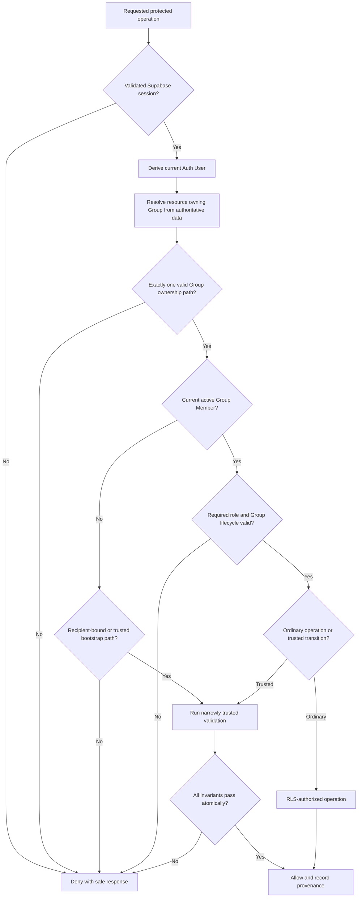

# Security Model

| Field | Value |
|---|---|
| Status | Accepted |
| Document type | Security architecture and authorization contract |
| Scope | Phase 5 authenticated actor derivation, Group-scoped authorization, RLS policy contracts, trusted operations, Storage, realtime, audit, abuse resistance, and security verification |
| Current-state baseline | [V1 Codebase Feature and Flow Report](../v1-codebase-feature-and-flow-report.md) |
| Related ADRs | [ADR-0001: One Group Represents One Trip and Is the Tenant Boundary](decisions/ADR-0001-group-is-trip-tenant.md) (Accepted); [ADR-0002: Supabase Auth Is the Authoritative Identity Provider](decisions/ADR-0002-supabase-auth-is-authoritative.md) (Accepted); [ADR-0003: Commercial Membership Is Deferred](decisions/ADR-0003-commercial-membership-deferred.md) (Accepted); [ADR-0004: `group_members.id` Is the Stable Participant Identity](decisions/ADR-0004-group-member-id-is-participant-identity.md) (Accepted); [ADR-0005: Finance Payers and Shares Use Normalized Tables](decisions/ADR-0005-normalized-finance-payers-and-shares.md) (Accepted); [ADR-0006: Timezone, Currency, Destination, and Dates Are Group Configuration](decisions/ADR-0006-group-configuration.md) (Accepted); [ADR-0007: Invitations Are Single-Use and Accepted Atomically Server-Side](decisions/ADR-0007-single-use-atomic-invitation-acceptance.md) (Accepted); [ADR-0008: Group-Scoped Authorization Is Enforced by RLS and Narrowly Trusted Operations](decisions/ADR-0008-group-scoped-authorization-with-rls-and-trusted-operations.md) (Accepted) |
| Last reviewed | 2026-07-24 |

> This Phase 5 document and ADR-0008 are Accepted architecture inputs. This
> document remains non-executable and is not itself implementation.

## 1. Purpose, authority, and boundary

Phase 5 defines the logical authorization and security-enforcement contract for
the target multi-user application. It specifies how authenticated actors,
current Group relationships, resource ownership, lifecycle state, RLS,
narrowly trusted operations, Storage, realtime, and audit controls combine to
protect one Group Tenant from every other Group.

The following Accepted decisions remain authoritative:

- one Group is exactly one Trip workspace and the Tenant boundary;
- Supabase Auth is the sole Authentication and session authority;
- `group_members.id` is the stable Participant identity;
- Owner and Member are the only Member roles;
- Active Group is navigation state and never Authorization;
- Invitation acceptance is recipient-bound, single-use, and atomic; and
- Group membership has no Subscription, payment, paid-membership, or
  Entitlement meaning.

This document defines non-executable policy predicates, operation permissions,
trusted-operation boundaries, denial outcomes, and verification requirements.
It defines no executable SQL, RLS policy code, physical schema, migration,
database function, constraint, index, API endpoint, application implementation,
Supabase configuration, deployment configuration, or security-test code.
Phase 6 owns migration and Feature parity. Phase 7 owns implementation
sequencing and concrete mechanisms.

## 2. Current-state security baseline

Everything in this section is a **Current state** fact from the
[frozen v1 report](../v1-codebase-feature-and-flow-report.md), not target
security.

- V1 exposes five hardcoded, unauthenticated personas that any visitor can
  select or switch in client memory.
- The legacy `users` records are unused by the frontend. Their plaintext PINs
  are unused and have no relationship to Supabase Auth.
- There is no Supabase Authentication, login, verified session, Group, Group
  Member relationship, Invitation, Owner relationship, or authoritative Active
  Group.
- Events, Expenses, Settlements, and Todos use display-name strings,
  name arrays, or name-keyed JSON as identity.
- Persona and Todo filtering occur in the client or by mutable name. They are
  not Authorization.
- Operational records occupy one globally shared dataset. Event, Expense, and
  Settlement queries are global; Todo queries are only name-filtered.
- Event, Expense, Settlement, and Todo changes are delivered through global or
  name-filtered realtime subscriptions without Tenant isolation.
- RLS is enabled on several operational tables, but the policies use
  unconditional access predicates and apply broadly, including to anonymous
  access.
- The scanned-document Storage bucket is public. Public reads and insufficiently
  scoped writes are not tied to Group membership.
- The scan Edge Function uses service-role capability, accepts requests from
  any origin, and performs Storage/database work without an authenticated Group
  authority model.
- There is no trusted actor derivation and no server-enforced Owner or Member
  permission model.

V1 therefore has no secure Authentication, Authorization, Invitation,
ownership, private Storage, or Tenant boundary to preserve. Feature parity
cannot preserve permissive global access as target security.

## 3. Accepted security inputs

Phase 5 applies the following Accepted inputs without redefining them:

| Accepted source | Security input |
|---|---|
| [Multi-Tenant Target Architecture](multi-tenant-target-architecture.md) and [ADR-0001](decisions/ADR-0001-group-is-trip-tenant.md) | Group is the single Tenant and ownership boundary; Group/Trip is not a two-layer Tenant; cross-Group access is prohibited. |
| [ADR-0002](decisions/ADR-0002-supabase-auth-is-authoritative.md) | Supabase Auth supplies the sole Auth User and session identity. Profile, Group Member, display names, and legacy records are not Authentication. |
| [Domain and Data Model](domain-and-data-model.md) and [ADR-0004](decisions/ADR-0004-group-member-id-is-participant-identity.md) | Auth User, Profile, Group Member, Participant, and Legacy Participant are distinct. Current access requires an active Auth User-to-Group relationship; retained Participant history alone grants nothing. |
| [ADR-0005](decisions/ADR-0005-normalized-finance-payers-and-shares.md) | Expense payers and shares are same-Group normalized relationships with exact reconciliation; Settlement parties and recorder are stable Participants. |
| [ADR-0006](decisions/ADR-0006-group-configuration.md) | Trip name, destination, dates, IANA timezone, accounting currency, and approved display context are Group-owned configuration. |
| [Authentication, Group, and Invitation Flows](auth-groups-and-invitations.md) | Active/inactive membership, Group creation, ownership continuity, last-Owner protection, configuration changes, archival, account lifecycle, and failure/concurrency outcomes are flow contracts. |
| [ADR-0007](decisions/ADR-0007-single-use-atomic-invitation-acceptance.md) | Invitations are Group-scoped, recipient-bound, expiring, and single-use; acceptance validates the recipient and creates/reactivates membership atomically. |
| [ADR-0003](decisions/ADR-0003-commercial-membership-deferred.md) | Group membership and roles carry no commercial authority and in-scope access cannot depend on paid state. |

Legacy Participant claiming remains Phase 6 work. Invitation acceptance cannot
claim legacy history, and security rules cannot use display-name equality as
claiming evidence.

## 4. Security principles and threat model

### 4.1 Principles

1. **Deny by default.** Absence of a documented allow rule means denial.
2. **Authenticate before authorizing.** Supabase Auth establishes the actor;
   it does not grant Group access.
3. **Derive the actor.** The current Auth User comes from the validated
   session, never request data.
4. **Use current state.** Membership, role, Group lifecycle, Invitation state,
   and resource ownership are evaluated from authoritative database state for
   each operation.
5. **Enforce at the data boundary.** Group-scoped RLS is the primary ordinary
   database authorization boundary.
6. **Minimize elevated privilege.** RLS bypass is confined to named trusted
   operations or controlled jobs.
7. **Treat clients as untrusted.** URLs, local storage, Active Group, payloads,
   identifiers, filenames, channels, and UI state express intent only.
8. **Fail closed and atomically.** Validation, stale state, concurrency, or
   downstream failure creates no partial authority or cross-Tenant write.
9. **Preserve provenance.** Actor, target, outcome, and time derive from
   trusted context without exposing secrets.
10. **Minimize disclosure.** External errors reveal no unnecessary Group,
    email, Invitation, Profile, document, or user existence.
11. **Authorize every access path.** Reads, writes, subscriptions, object
    access, and trusted operations are independently checked.

### 4.2 Threats addressed

The model must resist:

- Group-ID tampering through URL, local storage, query, Active Group, request
  body, or cached navigation;
- cross-Group object-ID substitution and indirect-child reassignment;
- forged Auth User, Group Member, Owner, role, recorder, creator, payer,
  receiver, or Participant values;
- stale membership, stale Owner status, and stale archived-Group sessions;
- Member self-promotion and unauthorized ownership changes;
- concurrent last-Owner demotion, removal, departure, account deletion, or
  archival;
- Invitation theft, guessing, replay, recipient mismatch, terminal-state
  reuse, and recipient/Group enumeration;
- mass assignment of Group, actor, role, lifecycle, provenance, finance, or
  ownership fields;
- public, guessed-path, or incorrectly scoped document Storage access;
- global or cross-Tenant realtime delivery;
- Profile, Auth attribute, recipient-email, and membership enumeration;
- browser exposure or overbroad use of service-role capability;
- secrets in logs, analytics, audit records, URLs retained beyond their
  continuation purpose, ordinary reads, Storage, or realtime payloads; and
- partial multi-record changes that create membership, ownership, finance, or
  document authority without the corresponding validated outcome.

MFA, organization administration, and additional Auth providers are not added
by this threat model.

## 5. Actor derivation and session boundary

- The current Auth User is derived only from a currently valid Supabase Auth
  session.
- Client-supplied Auth User IDs, email addresses, Profile IDs, Group IDs,
  Group Member IDs, roles, and Active Group values are never actor proof.
- Authentication alone grants no Group access.
- Verified email or another verified recipient attribute is required only
  where the Accepted Invitation flow requires recipient matching.
- Profile fields provide presentation and never authenticate or authorize.
- Legacy `users`, plaintext PINs, personas, display names, and Legacy
  Participants cannot authenticate.
- Logout, terminal session expiry, or revoked session removes authority from
  subsequent requests and subscriptions.
- Each Group operation checks current membership, role, and lifecycle state
  from the application database. A previously authorized client cannot retain
  authority after removal, inactivity, demotion, or archival.
- Group lists or roles cached in JWT/custom claims, if ever present, are
  non-authoritative hints. They cannot replace current database membership,
  role, or Group lifecycle checks.
- A session-derived Auth User is mapped to a Group-scoped Participant only
  through the current Group Member relationship. Submission of a Participant
  ID does not establish that relationship.

## 6. Authorization subjects and states

| Subject or state | Authorization behaviour |
|---|---|
| Unauthenticated visitor | May use public Auth entry and safe, minimal Invitation inspection. Has no Profile, Group, Group data, Storage, or realtime authority. |
| Authenticated but unverified Auth User | May use own Auth/Profile completion and safe verification/recovery flows. Cannot create a Group, accept an Invitation, activate membership, or access group-owned data. |
| Verified Auth User with no Group membership | May manage own permitted Profile data, create a Group through the trusted creation operation, or accept an intended Invitation. Has no existing Group access. |
| Active ordinary Member | May perform the ordinary same-Group operations explicitly allowed by the matrix. Has no Owner or cross-Group authority. |
| Active Owner | May perform ordinary operations and the explicitly allowed Owner operations in that Group, subject to current state and last-Owner rules. |
| Inactive or removed Group Member | Retains stable historical Participant references but has no future Group read, write, Storage, realtime, role, or Invitation-management authority. |
| Unclaimed Legacy Participant | Retains migration history only. Cannot authenticate, authorize, satisfy membership, or receive a role. |
| Intended Invitation recipient | May inspect minimum safe Invitation context and, after validated Authentication and verified recipient match, invoke atomic acceptance. Token possession alone grants nothing. |
| Trusted server-side operation | An execution boundary for one named operation. It is not a human role and has no ambient business authority beyond validated inputs and purpose. |
| Archived Group | Retains ownership and history. Ordinary writes, Invitation acceptance, and ordinary realtime are denied. Explicit archive-aware reads and Owner-authorized restoration follow this document. |
| Restored Group | Returns to active lifecycle only after a trusted Owner-authorized operation validates ownership continuity. Subsequent access again uses current membership and role. |

## 7. Tenant ownership and policy paths

Every protected resource has exactly one ownership path. A direct Group value
is authoritative only as stored domain ownership and still requires
authorization; a client-supplied value is never authority.

| Protected resource | Scope and ownership path | Policy consequence |
|---|---|---|
| Supabase Auth identity and sensitive Auth attributes | Global; controlled by Supabase Auth | Not Group data and not generally discoverable. Self/provider or narrowly trusted account lifecycle only. |
| Profile | Global; associated with one Auth User | Self access plus minimum same-Group presentation projection. Global does not mean public. |
| Group | Tenant root; the row identifies its own Group | Read/list requires a current relationship except trusted creation and safe Invitation context. |
| Group configuration | Directly owned by one Group or inseparable from its Group parent | Same Group authorization; Owner-only mutation; accounting-history restrictions apply. |
| Group Member / Participant | Directly belongs to one Group | Current relationship controls access. Historical Participant ID identifies domain history but proves no current authority. |
| Invitation | Directly belongs to one Group | Owner administration or recipient-bound trusted inspection/acceptance only. Security-sensitive fields are never ordinary roster data. |
| Event | Directly belongs to one Group | Active same-Group access. Audience relationships do not create a private-event security boundary in current scope. |
| Event audience relationship | Group derived from its Event and referenced Participant | Both parent Event and Participant must resolve to the same Group; a supplied Group ID cannot override either parent. |
| Todo | Directly belongs to one Group and references one same-Group Participant | Active same-Group access plus self-Participant predicate for ordinary Todo operations. |
| Expense | Directly belongs to one Group | Active same-Group access; mutation preserves finance integrity and provenance. |
| Expense payer contribution | Group derived from parent Expense; Participant must share it | No independent Tenant identity or free-standing mutation. Parent and Participant determine scope. |
| Expense share | Group derived from parent Expense; Participant must share it | No independent Tenant identity or free-standing mutation. Parent and Participant determine scope. |
| Settlement | Directly belongs to one Group; payer, receiver, and recorder must share it | Active same-Group read; recording requires actor/provenance and finance validation. |
| FX Snapshot | Directly Group-owned when used for Group accounting; references must share that Group | Read follows parent accounting access. Creation is tied to finance mutation; referenced evidence is immutable. |
| Travel-document metadata | Directly belongs to one Group; optional Event must share it | Metadata ownership controls object authorization. Event or path substitution cannot change scope. |
| Stored document object | Group derived from authorized document metadata and controlled object mapping | Bucket, path, filename, URL, or supplied Group ID grants nothing. Database and object ownership must agree. |
| Audit/provenance record | Direct Group ownership or immutable derivation from its protected parent | Read is minimized; client mutation is denied; audit data cannot grant authority. |

Indirect ownership is resolved through the authoritative parent relationship.
Adding a redundant client-supplied Group value to a child cannot make a
cross-Group child valid. Participant references record who acted or
participated; they never independently establish the caller's current access.

## 8. Complete authorization matrix

### 8.1 Matrix conventions

- **Deny** means no authority and no data disclosure.
- **Allow** means an ordinary RLS-authorized operation after every predicate in
  that row passes.
- **Self** means only the session-derived Auth User or its current Participant.
- **Safe minimum** means a generic, non-authoritative projection returned
  through a protected inspection path.
- **Invoke** means the actor may request the named trusted operation; the
  operation still revalidates every condition.
- **Execute** describes the trusted operation after validation. It is not a
  role grant.

“Authenticated non-member” includes a verified Auth User unless the predicate
explicitly allows only Auth/Profile completion for an unverified identity.
Every unlisted operation is denied.

### 8.2 Authentication and Profile

| Resource or flow | Operation | Unauthenticated visitor | Authenticated non-member | Inactive Group Member | Active Member | Active Owner | Intended Invitation recipient | Trusted operation | Required Group lifecycle | Policy predicate | Denial result | Audit expectation |
|---|---|---|---|---|---|---|---|---|---|---|---|---|
| Profile | Create own | Deny | Self | Self | Self | Self | Self after Auth | Not required | Not applicable | Session Auth User equals Profile subject; no credentials, role, or Group authority fields accepted | Unauthorized or validation-safe failure | Creation actor/time; no Auth secret |
| Profile | Read own | Deny | Self | Self | Self | Self | Self after Auth | Not required | Not applicable | Session Auth User equals Profile subject | Not found/unauthorized without enumeration | Sensitive reads logged only where policy requires |
| Profile | Update own presentation | Deny | Self | Self | Self | Self | Self after Auth | Not required | Not applicable | Session Auth User equals subject; update is limited to approved presentation fields | Unauthorized/validation failure; existing Profile unchanged | Actor, changed-field category, time |
| Profile | Read minimum co-member presentation | Deny | Deny | Deny | Allow | Allow | Deny before membership | Not required | Active, or explicit archive-aware read | Requester and represented Participant have current/historical same-Group relationships; projection excludes email, Auth metadata, and sensitive fields | Safe unavailable result | Group and projection category; avoid logging viewed sensitive values |
| Supabase Auth attributes | Read/change sensitive account data | Provider public Auth flow only | Self through Supabase Auth | Self through Supabase Auth | Self through Supabase Auth | Self through Supabase Auth | Self through Supabase Auth | Provider/trusted lifecycle only | Not applicable | Supabase Auth validates session and required proof; Group role grants no access to another account | Generic provider failure | Provider/account lifecycle event; no credentials or tokens |
| Account deletion | Prepare deletion | Deny | Invoke if verified | Invoke if verified | Invoke | Invoke | Invoke if verified | Execute after ownership assessment | Every affected Group assessed | Actor from session; enumerate own relationships; reject unresolved last-Owner or lifecycle conflicts | Conflict with actionable self-scoped outcome; no deletion | Actor, affected Group references, result/reason |

### 8.3 Groups and configuration

| Resource or flow | Operation | Unauthenticated visitor | Authenticated non-member | Inactive Group Member | Active Member | Active Owner | Intended Invitation recipient | Trusted operation | Required Group lifecycle | Policy predicate | Denial result | Audit expectation |
|---|---|---|---|---|---|---|---|---|---|---|---|---|
| Group | Create with initial Owner | Deny | Invoke if verified | Invoke if verified | Invoke for a separate Group | Invoke for a separate Group | Invoke if verified | Execute atomically | New active Group | Validated actor/configuration; no request-body Owner; Group and initial Owner commit together | No Group or membership created | Actor, request identity, created Group, outcome |
| Group | Discover/list | Deny | Empty authorized result | Empty for inactive-only relationship | Allow own active Groups | Allow own active Groups | No Group from pending Invitation | Not required | Active; archived listed only in explicit archive view | Current active membership for each returned Group | Empty/safe result | Normally no event; repeated anomalous probing may be monitored |
| Group | Read or deep-link | Deny | Deny | Deny | Allow | Allow | Safe minimum only through Invitation inspection | Not required | Active or explicit archive-aware view | Current active same-Group membership; route identifier is intent only | Safe unavailable/not-found-equivalent | Cross-Tenant probes and archived access failures monitored |
| Active Group | Select for navigation | No authority | No authority | No authority | Client may select after authorized read | Client may select after authorized read | No authority before acceptance | Not required | Active | Selection follows successful authorization and never appears in policy predicate | Clear/recover navigation; disclose no target data | No security grant; repeated invalid selection may be monitored |
| Group configuration | Read | Deny | Deny | Deny | Allow | Allow | No pre-acceptance read beyond safe minimum | Not required | Active or explicit archive-aware view | Current active same-Group membership | Safe unavailable | Ordinary read logging optional; sensitive anomalies monitored |
| Group configuration | Update name/destination/dates/timezone/display context | Deny | Deny | Deny | Deny | Invoke | Deny | Execute after validation | Active | Current active Owner; valid values; existing and resulting ownership unchanged; history not reinterpreted | Unauthorized/conflict/validation failure; old configuration retained | Actor, Group, changed categories, old/new references as safe, result |
| Group configuration | Change accounting currency | Deny | Deny | Deny | Deny | Invoke only before accounting history | Deny | Execute history-safety check | Active | Current active Owner and no accounting history; otherwise separately reviewed future transition required | Conflict; accounting context unchanged | Actor, Group, denial/change reason |
| Group | Archive | Deny | Deny | Deny | Deny | Invoke | Deny | Execute atomically | Active | Current active Owner, explicit confirmation, ownership continuity, concurrent operations revalidated | No partial archive; safe conflict | Actor, Group, lifecycle transition, result |
| Group | Restore | Deny | Deny | Deny | Deny | Invoke through archive-aware authority | Deny | Execute atomically | Archived | Retained current Owner identity, validated session, ownership continuity, no cross-Group effect | Remains archived | Actor, Group, lifecycle transition, result |

### 8.4 Group Members and ownership

| Resource or flow | Operation | Unauthenticated visitor | Authenticated non-member | Inactive Group Member | Active Member | Active Owner | Intended Invitation recipient | Trusted operation | Required Group lifecycle | Policy predicate | Denial result | Audit expectation |
|---|---|---|---|---|---|---|---|---|---|---|---|---|
| Group roster | View active roster | Deny | Deny | Deny | Allow | Allow | Deny until accepted | Not required | Active or archive-aware read | Current active same-Group membership; minimum presentation only | Safe unavailable | Avoid exposing Auth/email fields |
| Historical Participants | View inactive/unclaimed presentation needed by history | Deny | Deny | Deny | Allow minimum | Allow minimum | Deny | Not required | Active or archive-aware read | Current active same-Group membership; history requires reference; no Auth attachment disclosure | Safe unavailable | Access anomalies monitored; no claim inference |
| Group Member | Leave as ordinary Member | Deny | Deny | No-op/deny | Invoke Self | Owner path only | Deny | Execute lifecycle change | Active | Actor is current target ordinary Member; preserve Participant history | No state change on stale/conflict | Actor/target Participant, Group, outcome |
| Group Member | Remove ordinary Member | Deny | Deny | Deny | Deny | Invoke | Deny | Execute lifecycle change | Active | Current active Owner and active same-Group ordinary Member target | No state change | Actor/target, reason category, result |
| Group Member | Reactivate | Deny | Deny | Cannot self-activate | Deny | Deny direct reactivation | Invoke only through valid Invitation where applicable | Execute atomically only through the Accepted Invitation path or a future Accepted lifecycle path | Active | Same Auth User/Group relationship proven; stable Participant ID reused; no Owner shortcut and no legacy claim | No authority or new ID | Actor/recipient, Group, preserved Participant, source, result |
| Ownership | Promote Member | Deny | Deny | Deny | Deny | Invoke | Deny | Execute atomically | Active | Initiator current active Owner; target current active same-Group Member; no client role authority | No role change | Actor/target, old/new role, result |
| Ownership | Demote Owner | Deny | Deny | Deny | Deny | Invoke | Deny | Execute atomically | Active | Initiator current active Owner; target same-Group Owner; another active Owner remains at completion | Last-Owner/conflict denial | Actor/target, owner-count invariant result |
| Ownership | Transfer effective ownership | Deny | Deny | Deny | Deny | Invoke | Deny | Execute atomically | Active | Initiator current Owner; successor current active Member/Owner; continuity throughout | No partial transfer | Actor/successor/prior Owner, Group, result |
| Ownership | Remove or depart as Owner | Deny | Deny | Deny | Deny | Invoke | Deny | Execute atomically | Active | Authorized initiator; another active Owner exists at completion; history preserved | Last-Owner/conflict denial | Actor/target, Group, invariant and result |
| Ownership | Last-Owner-sensitive action | Deny | Deny | Deny | Deny | Invoke but must fail if last Owner | Deny | Revalidate and deny or complete safely | Active | At least one other active Owner exists after the complete result | Conflict; zero-Owner state impossible | Denial reason and concurrent outcome |

### 8.5 Invitations

| Resource or flow | Operation | Unauthenticated visitor | Authenticated non-member | Inactive Group Member | Active Member | Active Owner | Intended Invitation recipient | Trusted operation | Required Group lifecycle | Policy predicate | Denial result | Audit expectation |
|---|---|---|---|---|---|---|---|---|---|---|---|---|
| Invitation | Create | Deny | Deny | Deny | Deny | Invoke | Deny | Generate secret and verifier after validation | Active | Current active Owner; one Group; normalized intended recipient; ordinary Member role; valid expiry | No Invitation/secret | Actor, Group, recipient reference minimized, outcome; no secret |
| Invitation | Inspect before Authentication | Safe minimum | Safe minimum | Safe minimum | Safe minimum | Safe minimum | Safe minimum | Validate secret/state without authority | Active for acceptability | Opaque secret resolves safely; response reveals no sensitive Group/recipient state | Generic invalid response | Abuse counters; no plaintext secret |
| Invitation | Inspect after Authentication | Deny beyond generic | Safe minimum only if recipient match | Safe minimum only if recipient match | Safe minimum only if recipient match | Owner uses list path, not token privilege | Safe minimum | Validate session, verified recipient, state | Active for acceptability | Session recipient matches intended verified identity; inspection grants no membership | Generic invalid/mismatch response | Recipient-bound attempt and reason category |
| Invitation | List for Group | Deny | Deny | Deny | Deny | Allow | Deny | Not required for ordinary list | Active or archive-aware administration | Current active Owner; secrets/verifiers excluded | Safe unavailable | Owner, Group, list access category |
| Invitation | Revoke | Deny | Deny | Deny | Deny | Invoke | Deny | Execute terminal transition | Active or archived administrative revocation | Current active Owner; same-Group Pending Invitation; state revalidated | No change/generic conflict | Actor, Invitation reference, Group, result; no secret |
| Invitation | Accept | Deny | Invoke only when verified intended recipient | Invoke only as verified intended recipient, not from inactive authority | Existing active relationship yields safe no-op | Existing active relationship yields safe no-op | Invoke | Execute atomically | Active | Valid session, verified recipient match, Pending/unexpired/unrevoked/unused Invitation, Group active, no conflicting membership | Generic no-authority result; no partial state | Recipient, Group, Invitation reference, outcome/reason; no secret |
| Invitation | Retry accepted Invitation | Deny | Invoke only as same validated recipient | Same | Same-recipient safe result only | Same-recipient safe result only | Invoke | Return idempotent result only after revalidation | Active or terminal result already committed | Same recipient and completed acceptance; no new relationship or role | Generic invalid result to others | Retry classification and original outcome reference |
| Invitation | Inspect expired/revoked/mismatched/used | Generic invalid | Generic invalid | Generic invalid | Generic invalid | Owner may see administrative state through authorized list | Generic invalid except same-recipient safe completion | Validate without disclosure | Any | No token-bearing caller receives sensitive state from terminal/mismatch result | Enumeration-resistant generic response | Internal reason category and abuse signal; no secret |

### 8.6 Operational Group data

| Resource or flow | Operation | Unauthenticated visitor | Authenticated non-member | Inactive Group Member | Active Member | Active Owner | Intended Invitation recipient | Trusted operation | Required Group lifecycle | Policy predicate | Denial result | Audit expectation |
|---|---|---|---|---|---|---|---|---|---|---|---|---|
| Events | Read | Deny | Deny | Deny | Allow | Allow | Deny before acceptance | Not required | Active; archive-aware history may be read explicitly | Current active same-Group membership; audience data is not a secrecy boundary | Safe unavailable | Cross-Tenant attempts monitored |
| Events | Create | Deny | Deny | Deny | Allow | Allow | Deny | Not required unless scan-derived | Active | Current active same-Group membership; creator derived from current Participant; all audience/document refs same Group | No row created | Actor, Group, Event, origin, outcome |
| Events | Update | Deny | Deny | Deny | Allow | Allow | Deny | Not required | Active | Existing Event authorized; resulting Event remains same Group; creator/ownership immutable; refs valid | Existing row unchanged | Actor, Event, changed categories, result |
| Events | Delete | Deny | Deny | Deny | Allow | Allow | Deny | Trusted reconciliation if documents depend on it | Active | Current active same-Group membership; linked document metadata/object handling reaches one safe same-Group outcome and audit provenance is retained | No deletion/partial orphan | Actor, Event, dependent-resource outcome |
| Event audience | Read/mutate | Deny | Deny | Deny | Allow within Event mutation | Allow within Event mutation | Deny | Parent operation where atomic replacement needed | Active | Event and every Participant share one Group; Phase 6 parity semantics; no private-event claim | Parent unchanged | Actor, Event, affected Participant refs, result |
| Todos | Read own | Deny | Deny | Deny | Self | Self | Deny | Not required | Active or explicit archive-aware history | Current Participant equals Todo Participant, Group matches, and archived access uses the archive-aware read path | Safe unavailable | Minimal; cross-Tenant probes monitored |
| Todos | Create | Deny | Deny | Deny | Self | Self | Deny | Not required | Active | Current Participant is target Participant; Group current; provenance derived | No row created | Actor, Group, Todo, outcome |
| Todos | Update | Deny | Deny | Deny | Self | Self | Deny | Not required | Active | Existing and resulting Todo remain same Group/Participant; approved fields only | Existing row unchanged | Actor, Todo, change category |
| Todos | Delete | Deny | Deny | Deny | Self | Self | Deny | Not required | Active | Current Participant owns Todo; accepted Todo lifecycle permits deletion | No deletion | Actor, Todo, outcome |
| Expenses | Read | Deny | Deny | Deny | Allow | Allow | Deny | Not required | Active; archive-aware history may be read explicitly | Current active same-Group membership; payer/share children remain same parent Group | Safe unavailable | Cross-Tenant attempts monitored |
| Expense with payers/shares/FX | Create | Deny | Deny | Deny | Invoke | Invoke | Deny | Execute complete finance mutation | Active | Current active same-Group membership; actor provenance derived; exact totals/currencies/refs validate and commit together | No Expense or child/evidence rows | Actor, Group, finance record refs, reconciliation result |
| Expense with payers/shares/FX | Correct/update | Deny | Deny | Deny | Invoke | Invoke | Deny | Execute complete finance mutation | Active | Existing Expense authorized; resulting same-Group payer/share sets reconcile; ownership/history rules preserved | Entire prior state retained | Actor, Expense, correction category, before/after evidence refs, result |
| Expense | Delete | Deny | Deny | Deny | Deny | Deny absent Accepted lifecycle | Deny | No execution | Any | No Accepted Expense-deletion contract exists; correction/reversal or future explicit lifecycle required | Explicit denial | Denial may be logged; no history removed |
| Expense payer/share rows | Read | Deny | Deny | Deny | Allow through Expense | Allow through Expense | Deny | Not required | Same as parent | Parent Expense read allowed; child parent and Participant resolve to same Group | Safe unavailable | Covered with Expense access |
| Expense payer/share rows | Independent insert/update/delete | Deny | Deny | Deny | Deny direct mutation | Deny direct mutation | Deny | Execute only within complete finance mutation | Active | Parent Expense, complete sibling set, exact reconciliation, and resulting state validated together | No partial child change | Covered by finance operation audit |
| FX Snapshot | Read | Deny | Deny | Deny | Allow with referenced finance history | Allow with referenced finance history | Deny | Not required | Active or archive-aware history | Current active same-Group membership and applicable finance relationship | Safe unavailable | Access with finance history |
| FX Snapshot | Create/update/delete | Deny | Deny | Deny | Deny direct mutation | Deny direct mutation | Deny | Create only with finance conversion; referenced evidence immutable | Active for creation | Valid conversion context and same Group; no mutation/removal while history depends on it | No change | Source/provenance, Group, finance reference, result |
| Settlements | Read | Deny | Deny | Deny | Allow | Allow | Deny | Not required | Active; archive-aware history may be read explicitly | Current active same-Group membership; parties/recorder same Group | Safe unavailable | Cross-Tenant attempts monitored |
| Settlements | Record | Deny | Deny | Deny | Allow when actor is payer/recorder | Allow under same actor rule | Deny | Trusted validation may derive recorder | Active | Current Participant is payer and recorder; receiver same Group; exact amount/currency valid; no payment claim | No record | Actor/payer/receiver, Group, amount context, result |
| Settlements | Update/delete | Deny | Deny | Deny | Deny | Deny absent Accepted correction/reversal lifecycle | Deny | No execution | Any | V1 and Accepted model define no edit/delete; preserve ledger provenance | Explicit denial | Denial may be logged; history retained |
| Documents and metadata | Upload/create | Deny | Deny | Deny | Invoke | Invoke | Deny | Execute validated ingest/reconciliation boundary | Active | Current active same-Group membership; metadata/Event/object scope agree; uploader provenance derived | No authorized metadata; orphan outcome contained/reconciled | Actor, Group, metadata/object refs, scan source, result |
| Documents and metadata | Read/download | Deny | Deny | Deny | Allow | Allow | Deny | Temporary-access issuer if used | Active or explicit archive-aware read | Current active same-Group membership; metadata owns object; temporary grant narrow and current | Safe unavailable; no object URL disclosure | Sensitive document access category, actor, object reference |
| Documents and metadata | Replace | Deny | Deny | Deny | Invoke | Invoke | Deny | Execute validated metadata/object change | Active | Existing and resulting metadata authorized; object remains same Group; no retargeting | Existing object/metadata remain authoritative; partial artifact reconciled | Actor, object/metadata refs, result |
| Documents and metadata | Remove | Deny | Deny | Deny | Invoke | Invoke | Deny | Execute validated removal/reconciliation | Active | Current active same-Group membership; metadata and object removal/reconciliation reaches one safe outcome and retains required audit provenance | Safe failure; no cross-Group effect | Actor, object/metadata refs, result |
| Audit/provenance | Read security-relevant Group audit | Deny | Deny | Deny | Deny unless a domain-specific safe view is approved | Allow minimum Owner view | Deny | Controlled support/compliance job where approved | Active or archive-aware | Current active Owner; projection excludes secrets, credentials, and unrelated personal data | Safe unavailable | Audit access itself audited |
| Audit/provenance | Insert/update/delete directly | Deny | Deny | Deny | Deny | Deny | Deny | Append outcome within named operation; controlled retention only | Operation-specific | Trusted actor/system provenance and immutable outcome; audit record grants no authority | No fabricated or removed audit evidence | Meta-audit for privileged retention/administration |

## 9. Logical RLS policy contracts

These are policy predicates in prose, not executable policy syntax.

### 9.1 Default and read contract

- Every protected resource starts with no client access.
- An ordinary Group-owned read is allowed only when the validated session Auth
  User currently has an active Group Member relationship to the resource's
  owning Group and the matrix allows that resource/state.
- Owner-only reads additionally require the current relationship to carry the
  Owner role.
- Self-scoped reads require the session-derived current Participant to equal
  the record's Participant relationship.
- Indirect child reads first resolve the authoritative parent and inherit its
  Group. A client-supplied Group value cannot replace the parent path.
- Archived history is readable only through an explicitly documented
  archive-aware path; it is not an ordinary Active Group read.
- Global Profile reads use the distinct self/co-member projection rules, not a
  Group-owned-row shortcut.

### 9.2 Insert contract

An ordinary insert is allowed only when:

1. the actor is derived from a valid session;
2. the matrix permits the operation for the actor's current state and role;
3. the owning Group is established from authoritative current context;
4. the actor has current active membership in that Group;
5. the Group is active;
6. every referenced Participant, parent, Event, document, finance record, and
   FX record resolves to the same Group;
7. actor/creator/recorder provenance is derived or validated against the
   current Participant rather than accepted from the payload; and
8. all domain validation and atomicity requirements succeed.

### 9.3 Existing-row and resulting-row update contract

Every update makes two independent decisions:

- **Existing-row authorization:** the actor must be allowed to access and
  mutate the row as it exists now, using its current owning Group, current
  membership, role, and lifecycle.
- **Resulting-row authorization:** the complete proposed result must still
  belong to the same authorized Group, contain only permitted changes, retain
  immutable identity/ownership/provenance, and satisfy every same-Group and
  domain invariant.

Passing the first decision does not permit moving the row, changing its actor,
role, Participant provenance, parent, or Tenant. Passing only the second cannot
authorize mutation of a row the actor could not access. Mass assignment of
ownership or authority fields fails closed.

### 9.4 Delete contract

- Deletion is denied unless the matrix and Accepted domain lifecycle explicitly
  permit it.
- The actor must authorize against the existing row and current Group state.
- Dependent records, history, document objects, and audit requirements must
  reach one safe outcome.
- Expense and Settlement history has no generic delete permission. Correction,
  reversal, or retention rules require an Accepted contract before use.
- Group Member/Participant identity is not physically deleted where history
  references it.

### 9.5 Cross-cutting contracts

- Parent and child rows cannot resolve to different Groups before or after a
  mutation.
- Group identity, Auth User attachment, role, stable Participant ID, creator,
  recorder, and immutable ownership paths cannot be reassigned by generic
  update.
- Active membership and Owner status come from current database state, not
  stale tokens or cached claims.
- Inactive membership grants no future operational access.
- Archived Groups deny ordinary writes and Invitation acceptance.
- Active Group never appears in an authorization predicate.
- Any cross-Group inconsistency or unresolved ownership path is denied rather
  than repaired from client intent.

## 10. Trusted-operation boundary

Trusted operations are narrow execution boundaries for changes that cannot be
made safely as independent ordinary writes.

| Trusted operation | Actor/identity and current authority | Group lifecycle and invariant checks | Affected logical records | Success / failure / retry / concurrency | Audit and provenance |
|---|---|---|---|---|---|
| Group creation with initial Owner | Validated, verified Auth User; no client actor/role authority | Valid configuration; one new Group; initial active Owner; no orphan or duplicate logical request | Group, configuration, creator Group Member | All commit together or none; retry cannot duplicate; concurrent duplicates converge to one outcome | Initiating Auth User, created Group/Participant, result |
| Invitation creation | Current active Owner from session/database | Active Group; intended recipient binding; ordinary Member role; expiry; duplicate-pending handling | Invitation lifecycle record and secret verifier | Secret/verifier created once; failure exposes no usable secret; retry does not proliferate authority | Owner, Group, recipient reference, result; never plaintext secret |
| Invitation acceptance/reactivation | Validated session plus required verified recipient match | Pending, unexpired, unrevoked, unused Invitation; active Group; no conflicting membership; stable ID reuse | Invitation and Group Member lifecycle/provenance | Membership and consumption commit together or neither; replay/races create no extra authority | Recipient/Group/Invitation/Participant references and result; no secret |
| Membership reactivation outside Invitation, if later approved | Validated actor under an Accepted lifecycle path | Same Auth User and Group; inactive relationship; no Legacy Participant claim; role defaults/authority valid | Existing Group Member lifecycle | Stable ID preserved; all-or-nothing; retries converge | Initiator/source, Participant, Group, result |
| Promotion, demotion, transfer | Current active Owner | Target active same-Group Member/Owner; no self-promotion; ownership continuity | Group Member roles and ownership provenance | Atomic valid role outcome; concurrent changes never create zero Owners | Initiator, targets, prior/resulting roles, invariant result |
| Last-Owner departure/removal | Session-derived target/Owner and any authorized initiator | Another active Owner remains at completion; current state rechecked | Group Member lifecycle and ownership provenance | Valid complete outcome or denial; no partial inactivity; races fail closed | Actor/target, Group, denial/success reason |
| Group archival/restoration | Current active Owner, including retained archive-aware Owner for restore | Explicit confirmation; ownership continuity; Invitation/write races; lifecycle transition valid | Group lifecycle and affected operation gates | One lifecycle-consistent result; retry idempotent; losing concurrent work makes no write | Actor, Group, prior/resulting lifecycle, result |
| Configuration change | Current active Owner | Valid values; existing/resulting Group unchanged; history-safe timezone/date/currency effects; accounting-history restriction | Group configuration and change provenance | Entire valid change or old configuration retained; stale writes conflict | Actor, Group, changed categories, result |
| Account-deletion preparation | Validated Auth User acting for self | Current memberships and ownership enumerated; last-Owner checks for every active Group | Assessment/provenance only; no historical reassignment | Stable plan or blocking conflict; races revalidated before later deletion | Actor, affected Groups/roles, result |
| Expense creation/correction | Current active Member/Owner; current Participant is recorder/creator provenance | Active Group; same-Group Participants; exact payer/share reconciliation; currency/FX integrity; history rules | Expense, payer contributions, shares, FX evidence, provenance | Complete finance state or none; retry/idempotency avoids duplicates; concurrent correction detects stale state | Actor, Group, Expense, reconciliation/FX result |
| Document ingest/replace/removal reconciliation | Current active Member/Owner | Active Group; authorized metadata/Event; object and metadata share Tenant; retention permitted | Document metadata, object reference, optional Event/provenance | No authorized dangling reference or cross-Group object; partial external outcome is quarantined/reconciled without granting access | Actor, Group, metadata/object references, result |

Elevated capability used to execute one row does not authorize another row or
broaden the initiating actor's permissions.

## 11. Service-role and elevated-capability confinement

- Service-role credentials never reach a browser, client bundle, URL, log, or
  user-controlled runtime.
- Possession of service-role or equivalent bypass capability is not business
  Authorization.
- Elevated execution is limited to the named trusted operations above or a
  separately controlled administrative/background job with an explicit
  purpose and target scope.
- User-initiated trusted operations derive the Auth User from the validated
  session and re-evaluate Group, membership, role, target, lifecycle, and
  invariants. Client actor and role values are ignored.
- Bypassing ordinary RLS to complete an invariant does not waive Tenant,
  ownership, recipient, last-Owner, archival, finance, or provenance checks.
- Elevated access is least-privileged, auditable, time- and purpose-bounded
  where the platform permits, and unable to perform unrelated ordinary reads.
- Ordinary browser reads and writes do not routinely pass through a blanket
  service-role proxy and do not bypass RLS.
- Background jobs record a system purpose, selected target set, initiating
  schedule/operator where applicable, and per-Tenant outcome.
- Failure cannot leave partial membership, ownership, Invitation, finance, or
  document authority.

Exact credential storage, deployment, rotation, and runtime isolation remain
implementation work.

## 12. Invitation-secret persistence and protection

- Invitation secrets are high-entropy, opaque, expiring, and single-use.
- Plaintext secrets are never stored as ordinary database values.
- Persisted verification material is a non-reversible cryptographic verifier or
  digest produced with an approved cryptographic primitive.
- Secret verification and safe comparison occur inside the trusted
  Invitation inspection/acceptance boundary.
- Plaintext secrets do not appear in logs, analytics, audit records, realtime
  payloads, ordinary database reads, document Storage, or retained redirect
  state beyond the minimum safe continuation.
- Recipient email and Group details receive only the minimum exposure required
  for safe continuation.
- Pre-Authentication inspection is non-authoritative and returns only safe,
  enumeration-resistant information.
- Invalid, malformed, mismatched, expired, revoked, and used secrets produce
  external responses that do not distinguish sensitive recipient or Group
  existence.
- Rotation occurs by revoking/replacing the Invitation with a new secret;
  terminal secrets are never reused.
- A validated session and verified intended-recipient match remain mandatory;
  digest match alone grants nothing.
- Replay and concurrent requests cannot create additional Group Member
  identities, roles, or authority.

This document selects no token URL format, storage field, exact algorithm,
index, API, or comparison implementation. Phase 7 must select an approved
primitive and concrete mechanism consistent with these requirements.

## 13. Storage security

- Group travel documents are private and not publicly enumerable.
- Upload, read, download issuance, replace, and removal require the same current
  Group authorization defined in the matrix.
- Database metadata and stored objects resolve to the same Group Tenant.
- Bucket name, object path, filename, URL, guessed identifier, or
  client-supplied Group ID is never authority.
- Inactive or removed Group Members lose future object access.
- Archived Groups deny ordinary object mutation; explicit archive-aware reads
  require current retained authorization.
- Temporary access, if used, is issued only after current authorization, is
  narrowly scoped to one permitted object/action, and expires promptly.
- Metadata cannot be changed to retarget an object or Event across Groups.
- Upload/object success with metadata failure, metadata success with object
  failure, and removal failure must expose no broader access. Orphans are
  quarantined or reconciled through a controlled process.
- Invitation secrets and Auth/session tokens never enter document Storage.

Storage policy syntax, buckets, path formats, signed-access mechanisms, and
reconciliation implementation remain later work.

## 14. Realtime authorization

- Receiving a realtime event requires the same current authorization as
  reading the underlying row.
- A broad subscription, guessed channel, publication membership, Group
  identifier, or Active Group grants nothing.
- Realtime publication/configuration does not replace RLS or the underlying
  read policy.
- Payloads contain no Invitation plaintext secret, verifier, unnecessary Auth
  attribute, recipient email, or unrelated Profile data.
- Membership removal/inactivity, role change, Group archival, logout, session
  expiry, and resource lifecycle changes end future delivery when the new state
  no longer authorizes the read.
- Clients revalidate and safely resubscribe after relevant lifecycle changes;
  stale subscriptions and stale Active Group state retain no authority.
- Cross-Tenant delivery is prohibited even when both Groups share
  infrastructure or one Auth User belongs to both.
- Reconnect repeats Authentication and current database Authorization.
- Archived Groups do not receive ordinary live operational streams.

Concrete channel names, filter syntax, publication settings, and client
subscription code remain implementation work.

## 15. Lifecycle-sensitive authorization

| Lifecycle change | Required security effect |
|---|---|
| Member removal or voluntary departure | Future database, Storage, realtime, Invitation-management, and role authority ends immediately against current state; historical Participant references remain. |
| Reactivation | Only an approved trusted path may reactivate the same Auth User/Group relationship; it preserves `group_members.id` and grants only the resulting current role. |
| Owner promotion/demotion | Current Owner authorization and same-Group target are revalidated; Member self-promotion is impossible; current role applies on the next access. |
| Ownership transfer | Successor authority and prior-Owner change complete without any zero-Owner interval. |
| Last-Owner action | Departure, demotion, removal, account deletion, or conflicting archival action fails if no other active Owner remains at completion. |
| Auth email/Profile change | Does not replace Auth User or Participant identity, rebind Invitations automatically, or alter Group authority. |
| Logout/session expiry | Ends request and subscription authority but does not mutate memberships or history. |
| Auth account deletion preparation | Assesses every current ownership relationship and blocks unresolved last-Owner outcomes; no historical activity is reassigned. |
| Group archival | Ordinary writes, Invitation acceptance, ordinary Active Group selection, and ordinary realtime end; data remains in the same Group. |
| Group restoration | Requires trusted current Owner authority and valid ownership continuity before active operations resume. |
| Accounting-currency edit | Owner authority is insufficient once accounting history exists; ordinary change is denied pending a separately reviewed transition. |

Concurrency controls must preserve at least one active Owner for every active
Group. Ending authority never deletes or rewrites historical Participant or
provenance references.

## 16. Failure and disclosure model

| Internal condition | Safe external behaviour | Internal handling |
|---|---|---|
| Unauthenticated | Authentication-required result or redirect only to validated application destination | Record security event where sensitive access was attempted |
| Authenticated but unauthorized | Generic unavailable/forbidden result without revealing target ownership | Retain actor, target category, Group if safely resolved, and reason |
| Missing or cross-Tenant resource | Same safe unavailable/not-found-equivalent response where distinction would leak existence | Distinguish internally for diagnostics and probing detection |
| Inactive membership | Safe unavailable or membership-inactive result only when already safe to disclose | Record stale-authority attempt |
| Insufficient role | Generic forbidden/conflict without exposing hidden state | Record required/current role category |
| Archived Group | Safe archived/unavailable outcome only to a currently authorized archive-aware actor; otherwise generic unavailable | Record lifecycle denial |
| Invalid Invitation or recipient mismatch | Enumeration-resistant generic invalid result | Record normalized reason, recipient match outcome, and abuse signal without secret |
| Conflict, replay, or stale state | Safe conflict/idempotent result only to an actor entitled to know it | Preserve concurrency/replay diagnostics |
| Validation failure | Field-safe validation response that reveals no other Tenant or user data | Retain rejected category and actor |
| Trusted-operation failure | No partial authority; generic failure or safe retry result | Record completed/rolled-back/unknown-safe state and reconciliation need |
| Rate-limited or abuse-suspected activity | Generic retry-later or bounded challenge consistent across account existence | Record control scope and signal without credentials/secrets |

Different internal causes may intentionally share one external response.
Diagnostics remain access-controlled and auditable.

## 17. Audit and provenance security

Security-relevant audit coverage includes:

- Group creation;
- Invitation creation, revocation, acceptance, replay, and failed acceptance;
- membership activation, removal, departure, and reactivation;
- role promotion/demotion and ownership transfer;
- last-Owner denials and concurrency outcomes;
- configuration changes and accounting-currency denials;
- Group archival and restoration;
- sensitive document upload, access issuance, replace, and removal;
- elevated/service-role operations and controlled jobs; and
- account-deletion preparation.

Each event records, at the logical level:

- actor provenance derived from the validated Auth User and current Participant
  where applicable, or explicit system purpose;
- target Group and affected stable Participant/resource references;
- operation, outcome, and normalized reason category;
- trustworthy occurrence timestamp semantics and any distinct domain-effective
  time;
- correlation sufficient to trace one trusted operation and retry; and
- no plaintext Invitation secret, password, session/access/refresh token,
  credential, or fabricated client recorder identity.

Audit records are protected data. They cannot grant Group access, replace
domain provenance, or be directly edited by clients. Physical audit schema,
retention, and export are not defined here; organization audit exports remain
Deferred.

## 18. Enumeration, rate-limit, and abuse boundaries

Protection is required for:

- login, signup, verification, recovery, and reset;
- Invitation inspection, acceptance, creation, revocation, and replay;
- Group creation;
- document upload and temporary download/access issuance;
- repeated unauthorized, cross-Tenant, or object-substitution attempts; and
- ownership, archival, account lifecycle, and other sensitive trusted
  operations.

Implementation must:

- use generic external responses where account, recipient, Invitation, Group,
  Profile, or document existence would otherwise leak;
- apply throttling and abuse monitoring appropriate to the surface;
- consider per-actor, per-secret/verifier, per-destination/recipient, and
  per-network controls where appropriate;
- provide bounded retry/lockout behaviour that does not expose existence;
- prevent attackers from permanently consuming, revoking, or invalidating a
  legitimate Invitation merely by submitting failed guesses; and
- preserve atomicity and safe idempotency under throttling or retry.

No numeric limit is selected here. Thresholds, deployment controls, operational
alerts, and tuning belong to Phase 7.

## 19. Security decision flow

Active Group is intentionally outside this decision flow.

## 20. Security verification plan

Phase 7 must implement this specification as matrix-driven tests. Required
fixtures include two unrelated Groups, an Owner in each Group, ordinary
Members, authenticated non-members, inactive Members, unclaimed Legacy
Participants, valid/invalid/expired/revoked/used Invitations, active and
archived Groups, Profiles with public/private fields, documents, Events, Todos,
Expenses with payer/share children, Settlements, FX evidence, and audit records
in both Tenants.

| Verification area | Required cases and pass condition |
|---|---|
| Positive authorization | Each matrix Allow/Invoke path succeeds only for the documented actor, role, resource, and lifecycle. |
| Unauthenticated denial | Every protected database row, Profile projection, object, subscription, and trusted operation denies an unauthenticated actor except explicit safe Invitation inspection/Auth entry. |
| Cross-Tenant isolation | Owner and Member of Group A cannot read, insert, update, delete, subscribe to, download, or reference any protected Group B resource. Any success fails the test suite. |
| Object-ID substitution | Replacing Event, Todo, Expense, child, Settlement, document, Group Member, Invitation, or audit identifiers with another Group's ID is denied without disclosure. |
| Tenant reassignment | Existing-row and resulting-row tests deny changes to Group, parent, Participant, actor, role, or provenance that would move or relabel ownership. |
| Forged identity/role | Payload Auth User, Profile, Group Member, Owner, creator, recorder, payer, receiver, and role values cannot override session/current state. |
| Member versus Owner | Ordinary Members receive only ordinary operations and cannot list/manage Invitations, change configuration, archive/restore, manage other Members, or alter ownership. |
| Stale membership/role | Removal, inactivity, demotion, logout, session expiry, and archival end subsequent row, object, and realtime authority. |
| Profile privacy | Self access and minimum co-member projection pass; email, Auth metadata, security fields, unrelated Profiles, and enumeration are denied. |
| Finance integrity | Same-Group payer/share refs and exact totals succeed; cross-Group refs, partial child changes, unreconciled totals, binary-floating authority, and immutable FX changes fail. |
| Last-Owner concurrency | Concurrent demote/remove/leave/delete-preparation operations cannot leave an active Group with zero active Owners. |
| Invitation security | Valid recipient acceptance succeeds once; mismatch, expiry, revocation, malformed secret, replay, duplicate request, and acceptance/revocation/expiry races create no additional or partial authority. |
| Secret exclusion | Plaintext Invitation secrets are absent from persisted ordinary values, logs, analytics, audit, Storage, realtime, and ordinary responses. |
| Service-role confinement | Each elevated operation rejects missing/forged actor, wrong Group, wrong role, stale lifecycle, and out-of-purpose targets; browser possession is impossible. |
| Storage | Private object access follows current metadata Group authorization; guessed paths, stale grants, cross-Group metadata retargeting, and inactive Members fail. |
| Realtime | Only rows readable now are delivered; cross-Group subscriptions, broad channels, stale membership, archival, logout, and reconnect cannot leak events. |
| Archived Group | Ordinary writes, Invitation acceptance, Active Group use, document mutation, and ordinary realtime fail; only documented archive-aware reads/restoration pass. |
| Trusted rollback | Injected failures at each logical step leave no partial Group, membership, ownership, Invitation, finance, or authorized document state. |
| Audit/provenance | Required operations record trusted actor/system purpose, Group, targets, outcome, and time; fabricated recorder and secret/token logging fail. |
| Enumeration/abuse | External responses do not distinguish sensitive existence; throttling/retry does not consume a valid Invitation or create authority. |

Tests must exercise direct database access paths, trusted-operation entry,
Storage authorization, and realtime delivery rather than relying only on UI
visibility. Any cross-Tenant access success is a release-blocking failure.

## 21. Phase 6 migration-security handoff

Phase 6 must define and verify:

- controlled bootstrap of one migrated Bali Group;
- explicit initial Owner assignment without a client-selected persona;
- mapping legacy display names to stable Legacy Participant identities;
- verified claiming with proof independent of display-name equality;
- no migration of plaintext legacy PINs into Supabase credentials;
- no automatic Legacy Participant claiming during Invitation acceptance;
- preservation of stable `group_members.id` Participant identities;
- placement of every retained Event, audience, Todo, Expense, payer/share,
  Settlement, FX, document, and provenance record into the correct Group;
- private migration of document objects and metadata;
- replacement of global-query and global-realtime behaviour with authorized
  Group-scoped access;
- RLS and security-control enablement sequencing without an unsafe exposure
  window;
- rollback that does not restore anonymous global RLS or public Storage;
- actual-data reconciliation and controlled exception handling for unresolved
  or malformed Settlement `from_user`, `to_user`, or `recorded_by` values; and
- completed cross-Tenant, Storage, realtime, secret, and trusted-operation
  verification before cutover.

This document does not define migration commands, bootstrap mechanics, claiming
proof, backfill transforms, cutover order, or rollback implementation.

## 22. Deferred-scope compliance

Phase 5 introduces none of the following:

- paid plans, Subscriptions, trials, paywalls, or commercial access checks
  ([DEF-001](../product/deferred-scope-register.md#def-001--paid-plans-subscriptions-trials-and-paywalls));
- premium Entitlements
  ([DEF-002](../product/deferred-scope-register.md#def-002--premium-feature-entitlements));
- Google OAuth or additional Auth providers
  ([DEF-003](../product/deferred-scope-register.md#def-003--google-oauth-and-additional-identity-providers));
- permanent friend Groups containing many Trips
  ([DEF-004](../product/deferred-scope-register.md#def-004--permanent-friend-groups-containing-multiple-trips));
- worldwide destination guides
  ([DEF-005](../product/deferred-scope-register.md#def-005--worldwide-destination-price-guides));
- automatic Invitation email delivery
  ([DEF-006](../product/deferred-scope-register.md#def-006--automatic-invitation-email-delivery));
- roles beyond Owner and Member
  ([DEF-007](../product/deferred-scope-register.md#def-007--roles-beyond-owner-and-member));
- private or secret Events as a new feature
  ([DEF-008](../product/deferred-scope-register.md#def-008--private-or-secret-events));
- payment processing
  ([DEF-009](../product/deferred-scope-register.md#def-009--payment-processing));
- wallets, custody, or stored monetary balances
  ([DEF-010](../product/deferred-scope-register.md#def-010--wallets-custody-or-stored-monetary-balances));
- organization administration
  ([DEF-011](../product/deferred-scope-register.md#def-011--advanced-organization-administration)); or
- automatic/global travel-content generation
  ([DEF-012](../product/deferred-scope-register.md#def-012--automatic-or-global-travel-content-generation)).

This phase defines implementation requirements such as safe cryptography,
throttling, and verification without treating their concrete mechanisms as new
deferred product features.

## 23. Consolidated security invariants

1. Supabase Auth is the sole Authentication and session authority.
2. Authentication alone grants no Group access.
3. Current active Group membership is required for ordinary Group access.
4. Owner authority is Group-scoped and derived from current membership.
5. Active Group is never Authorization.
6. Client-supplied actor, role, Group, Group Member, and provenance values are
   untrusted.
7. Every protected row or object resolves to exactly one authorized Tenant
   boundary.
8. Cross-Group reads, writes, references, Storage access, and realtime delivery
   are denied.
9. Existing-row and resulting-row Authorization are both enforced.
10. Inactive Group Members and Legacy Participants grant no current authority.
11. Historical Participant references survive removal and reactivation.
12. Every active Group retains at least one active Owner.
13. Invitation possession alone does not authenticate or authorize.
14. Invitation acceptance remains recipient-bound, single-use, and atomic.
15. Plaintext Invitation secrets are not persisted or disclosed.
16. Ordinary application access does not bypass RLS.
17. Elevated capability is narrowly confined and is never equivalent to
    Authorization.
18. Storage and realtime enforce the same Tenant boundary as database reads.
19. Archived Groups reject ordinary writes and Invitation acceptance.
20. Security failures create no partial authority.
21. Profiles, Group membership, roles, and Invitations carry no commercial
    meaning.
22. Migration cannot reintroduce persona, PIN, public-Storage, or global-data
    authority.

## 24. Phase 5 acceptance checklist

- [x] Current-state security evidence matches the frozen v1 report.
- [x] Authenticated actor derivation uses only validated Supabase Auth session
  identity.
- [x] The model denies access by default and fails closed.
- [x] The complete operation/role matrix covers Auth, Profile, Group,
  membership, ownership, Invitation, configuration, lifecycle, and every
  Group-owned domain category.
- [x] Direct and indirect Tenant ownership paths are explicit.
- [x] Read, insert, existing/resulting update, and delete policy contracts are
  complete.
- [x] Active Group is absent from Authorization predicates.
- [x] Active and inactive Group Member states have explicit enforcement.
- [x] Owner-only operations and concurrency-safe last-Owner rules are complete.
- [x] The trusted-operation inventory defines actor, invariant, failure,
  retry, concurrency, and audit boundaries.
- [x] Service-role and elevated capability are narrowly confined.
- [x] Invitation-secret persistence permits only protected non-reversible
  verification material.
- [x] Replay, recipient/Group enumeration, and abuse resistance are defined.
- [x] Profile privacy limits co-member visibility and protects Auth attributes.
- [x] Document Storage is private and Group-authorized.
- [x] Realtime delivery matches current underlying read Authorization.
- [x] Archived Group read/write/Invitation/realtime behaviour is explicit.
- [x] Audit and provenance controls exclude fabricated actors and secrets.
- [x] Rate-limit and abuse requirements are defined without fixed thresholds.
- [x] The matrix-driven security verification specification covers all required
  positive, denial, cross-Tenant, lifecycle, concurrency, Storage, realtime,
  and elevated-operation cases.
- [x] Phase 6 receives a complete migration-security handoff.
- [x] Every existing deferred-scope boundary remains excluded.
- [x] No SQL, executable policy, migration, implementation, configuration, or
  test code is introduced.
- [x] ADR-0008 was reviewed and Accepted before this security model was
  Accepted.
