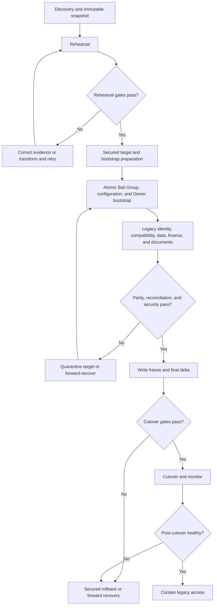

# V1 Migration Plan

| Field | Value |
|---|---|
| Status | Accepted |
| Document type | Migration, compatibility, validation, cutover, and rollback contract |
| Scope | Controlled conversion of the frozen v1 Bali application and retained data into the Accepted multi-tenant target architecture |
| Current-state baseline | [V1 Codebase Feature and Flow Report](../v1-codebase-feature-and-flow-report.md) |
| Related documents | [Multi-Tenant Target Architecture](multi-tenant-target-architecture.md); [Domain and Data Model](domain-and-data-model.md); [Authentication, Group, and Invitation Flows](auth-groups-and-invitations.md); [Security Model](security-model.md); [Feature Parity Test Contract](feature-parity-test-contract.md); [Deferred-Scope Register](../product/deferred-scope-register.md) |
| Related ADRs | [ADR-0001](decisions/ADR-0001-group-is-trip-tenant.md), [ADR-0002](decisions/ADR-0002-supabase-auth-is-authoritative.md), [ADR-0003](decisions/ADR-0003-commercial-membership-deferred.md), [ADR-0004](decisions/ADR-0004-group-member-id-is-participant-identity.md), [ADR-0005](decisions/ADR-0005-normalized-finance-payers-and-shares.md), [ADR-0006](decisions/ADR-0006-group-configuration.md), [ADR-0007](decisions/ADR-0007-single-use-atomic-invitation-acceptance.md), and [ADR-0008](decisions/ADR-0008-group-scoped-authorization-with-rls-and-trusted-operations.md) are Accepted |
| Last reviewed | 2026-07-24 |

> This Accepted Phase 6 document is a locked Phase 7 implementation input. It
> does not itself authorize a production migration or execution without every
> stated gate, approval, and required execution input.

## 1. Purpose, authority, and boundary

This document defines the controlled migration, compatibility, validation,
cutover, and rollback contract from the frozen v1 state to the Accepted target
architecture. It is subordinate to the Accepted ADRs and architecture
documents linked above. The frozen report remains the factual repository
baseline, and the [Feature Parity Test Contract](feature-parity-test-contract.md)
defines the evidence required to preserve or intentionally change observable
behaviour.

The plan defines logical transforms, ordering, evidence, manifests, invariants,
gates, failure outcomes, rollback outcomes, and implementation requirements. It
contains no executable SQL, migration or RLS policy syntax, Storage policy
syntax, Edge Function or application code, deployment commands, credentials,
actual secrets, or production personal data. Physical schemas, concrete
functions, token mechanisms, object paths, deployment mechanics, and executable
tests belong to Phase 7.

## 2. Current-state migration baseline

The following are repository-observed facts from the
[frozen report](../v1-codebase-feature-and-flow-report.md), not assumptions
about a deployed environment:

- v1 offers five hardcoded, unauthenticated personas that any visitor can
  select or switch in client memory.
- There is no Supabase Authentication flow, durable selected-user session,
  Group, Group Member relationship, Invitation, or Owner.
- The unused legacy `users` rows contain plaintext PINs, but the frontend does
  not read them and the PINs authenticate nothing.
- Person identity and references are display names in constants, Events,
  Expenses, Settlements, and Todos.
- One globally shared Bali dataset has no Group or Trip ownership key.
- Queries and most realtime subscriptions are global; Todo subscriptions are
  filtered only by a persona name.
- RLS predicates are permissive and do not enforce Auth User, membership,
  Group, or Trip isolation.
- Document Storage is public and flat, and document URLs are public.
- Events, Expenses, Settlements, and name-keyed Todos are global.
- Event audiences are name arrays in `for_users`.
- Finance represents payer and share data through scalar names, name arrays,
  and name-keyed JSON, while the UI exposes equal splitting.
- The live FX converter and the static 188.68 IDR/INR accounting conversion
  are separate behaviours.
- Bali, DPS, fixed Trip dates, IST/WITA, INR/IDR, title copy, and exactly five
  people are compiled assumptions.
- README, handoff, SQL seed, and frontend seed material conflict about dates,
  persona persistence, offline behaviour, Auth, Todo, and AI.
- AI concierge code is dormant and unreachable; document parsing is the only
  reachable AI-backed flow.
- The repository has no automated tests or CI configuration.
- Failed scans can orphan public objects; Storage deletion failures and many
  read/delete/Todo errors can be hidden; source data can therefore contain
  orphaned or inconsistent states.

Stale prose, unused seed data, unused database rows, dormant code, and latent
calculation branches are not proven production behaviour. Actual deployed row
counts, object contents, policies, grants, Auth state, data shapes, malformed
values, and runtime versions require a reviewed deployed-data inventory. This
plan never substitutes repository expectations for that inventory.

## 3. Migration principles and invariants

1. No v1 persona, display name, PIN, client value, or public URL becomes
   authority.
2. Supabase Auth remains the sole Authentication and session authority.
3. One migrated Bali Group is one Trip workspace and Tenant.
4. Every retained Group-owned row and object resolves to the migrated Bali
   Group.
5. Every retained person reference resolves to one stable Group-scoped
   Participant or an explicit unresolved exception.
6. Stable Participant identity survives later claiming.
7. Claiming never occurs from display-name equality alone.
8. Invitation acceptance never automatically claims legacy history.
9. Plaintext legacy PINs never become credentials, recovery proof, claim proof,
   or migrated secrets.
10. Group membership and role carry no commercial meaning.
11. Finance source values, accounting values, and reproducible FX evidence are
    preserved.
12. Migration does not silently repair, discard, merge, or fabricate source
    data.
13. Unknown or malformed values enter an explicit exception process.
14. Public Storage and anonymous or global access cannot survive cutover.
15. Rollback cannot restore insecure public or cross-Tenant access.
16. Security controls fail closed throughout transition.
17. No cross-Group relationship may be created during backfill.
18. Historical provenance remains distinguishable from authenticated target
    actors.
19. Cutover occurs only after parity, reconciliation, security, and rollback
    gates pass.
20. A failed stage creates no partial authority.

## 4. Source inventory and evidence capture

Before any migration write, a timestamped and reviewable source snapshot or
manifest must record:

- source schema and migration versions, deployed RLS policies and grants, and
  current Auth state;
- row counts for every source table, including nullable and malformed values;
- distinct legacy person-name values by field, plus duplicates, spelling
  variants, empty values, and unknown names;
- Event date/time ranges, audience values, flight metadata, and source
  relationships;
- document metadata, object inventory, orphans in either direction, sizes, and
  integrity evidence;
- Expenses by currency and split mode, payer/share structures, source totals,
  and reconciliation results;
- Settlement parties, recorder values, amounts, and malformed or missing
  values;
- Todo ownership values;
- `exchange_rates` contents and independent evidence, if any, that a row was
  actually used;
- realtime publication and subscription scope;
- deployed application and Edge Function versions;
- checksums or equivalent immutable evidence for each migrated record and
  object;
- reviewed current Bali configuration values; and
- every known source inconsistency identified by the frozen report.

The evidence distinguishes repository-observed expectations from deployed
facts and records the query time, environment identity, evidence custodian,
scope, and integrity reference. Reports and logs exclude credentials, session
tokens, plaintext PINs, document contents, Invitation secrets, and unnecessary
personal data. A missing, stale, incomplete, or unverifiable manifest blocks
the next write stage.

## 5. Migration strategy and stage model

### 5.1 Chosen strategy

The default strategy is rehearsal-first conversion followed by a controlled
maintenance-window cutover. The source remains authoritative through discovery
and rehearsal. Target rehearsal data is isolated and non-authoritative. A
reviewed write freeze establishes the final consistency boundary; a final
delta is allowed only when the inventory proves source changes occurred since
the snapshot. The secured target becomes authoritative only after cutover
gates pass.

This avoids unproven bidirectional dual-write in an application with no stable
identity, Tenant key, retry queue, or audit trail. If execution evidence shows
a maintenance window is infeasible, a different coexistence design requires
separate product, architecture, and security review before implementation.

### 5.2 Stage flow

### 5.3 Ordered stage contract

Each row defines the complete stage boundary. “Approval” means the accountable
product, architecture, security, data, or release category already implied by
the Accepted package; it does not invent an organization role.

| Stage | Entry preconditions | Permitted logical changes | Prohibited changes | Required evidence and validation gate | Failure, retry, and recovery boundary | Responsible approval category |
|---|---|---|---|---|---|---|
| S01 Discovery and source snapshot | Clean execution scope; read authorization; evidence handling approved | Read-only inventory and immutable manifest | Source or target mutation; secret collection | Complete inventory, timestamp, versions, counts, integrity references | Stop; repeat read-only capture; no rollback needed | Data and security review |
| S02 Migration rehearsal | S01 manifest accepted; isolated target available | Replay planned transforms against safely handled evidence | Production authority, public target access, live user claims | Deterministic outputs, exception list, stage timings, rollback rehearsal | Destroy or quarantine rehearsal outputs; retry from snapshot | Architecture and release review |
| S03 Target security and boundary readiness | Rehearsal design stable; Accepted Security Model mapped | Prepare deny-by-default target boundary and test fixtures | Anonymous/global grants, browser service-role use, live cutover | RLS, Storage, realtime, trusted-operation, and two-Group denial evidence | Target remains inaccessible; correct and retest | Security review |
| S04 Bootstrap preparation gate | S03 passes; source/configuration evidence is reviewable | Prepare the stable bootstrap request, reviewed mandatory Group configuration, validated initial-Owner Auth identity, verified-identity evidence, and product/data/security/architecture approvals | Creating a production Group, configuration, Group Member, Owner role, or any authority | Complete mutually consistent execution manifest and approvals for one atomic request | Stop with no authoritative state; correct evidence and repeat preparation | Product, data, security, and architecture approval |
| S05 Atomic Bali Group/configuration/initial-Owner bootstrap | S04 complete; trusted production boundary and deny-by-default controls ready | In one operation establish exactly one Bali Group, its mandatory reviewed configuration, the validated Auth User’s stable Group Member identity, that identity as one active Owner, and audit provenance | Any separately committed Group, configuration, membership, Owner role, client-selected identity, or ownerless/unconfigured Group | Stable request correlation; one complete Group/configuration/creator-Participant/active-Owner result; Auth and approval evidence; audit | Any failure creates none of those authoritative records or relationships; retry revalidates and returns the same complete result without duplicates | Product, data, security, and architecture approval |
| S06 Stable Legacy Participant creation | S05 complete result exists; name inventory and adjudication records are ready | Create stable unclaimed ordinary-Participant identities and provenance in the Bali Group | Automatic merge, login authority, Owner grant, reassignment after history | One stable identity per approved legacy mapping; unknowns excepted; bootstrap Owner remains valid | Batch or record remains absent/quarantined; replay uses the same mapping and creates no authority for unclaimed identities | Data and architecture review |
| S07 Configuration compatibility and Bali-content verification | S05 mandatory Group configuration exists; source conflicts and compatibility evidence are reviewed | Verify time/configuration interpretation; backfill only non-authoritative compatibility metadata or Bali-content association that is not mandatory Group configuration | Attaching or replacing mandatory configuration after authority exists; overwriting Events to fit dates; global Bali defaults | S05 configuration is complete and unchanged; timezone/date cases pass; optional compatibility/content evidence is Group-confined | Authoritative Group/configuration/Owner result remains unchanged; optional compatibility output is absent/quarantined and may retry | Product and architecture approval |
| S08 Operational data backfill | S05–S07 pass; M01–M18 mappings approved | Backfill Events, audiences, Todos, provenance, and Group ownership | Cross-Group references, fabricated actor, silent repair | Counts, checksums, owner paths, unresolved exceptions, parity links | Failed logical unit has no authoritative partial state; replay by source map | Data review |
| S09 Finance normalization and reconciliation | Participant and Group mappings stable; source totals frozen | Create complete Expense payer/share, FX evidence, and Settlement target state | Partial finance mutation, live-rate substitution, fabricated recorder, deletion | Exact per-record and aggregate reconciliation, balance comparisons | Entire finance unit rolls back or quarantines; deterministic retry | Finance/data review |
| S10 Document metadata and private object migration | Object/metadata inventory and S03 private access pass | Copy objects privately and map metadata/Event/Group relationships | Public target objects, path authority, cross-Group retargeting | Count, checksum, orphan disposition, private-read and denial results | Partial outputs quarantined/reconciled; retry content-addressed by evidence | Data and security review |
| S11 Target query and realtime readiness | Data ownership complete enough for representative fixtures | Validate Group-scoped reads, writes, and subscriptions | Global queries/channels or stale-authority delivery | Positive and two-Group negative evidence for every retained category | Target remains non-authoritative; correct and retest | Security and product review |
| S12 Legacy Participant claim-and-activation readiness | Unclaimed identities stable; proof categories, adjudication, ordinary-Member activation, and approvals reviewed | Validate one atomic outcome that authenticates the current Auth User, validates the Bali Group/Participant adjudication, preserves `group_members.id`, attaches that Auth User, activates the lifecycle as an ordinary active Member, and records non-secret audit evidence | Partial attachment or activation, Owner promotion, automatic/Invitation-coupled claim, or persona/name/PIN/Profile/client proof | Positive, insufficient-proof, conflicting-proof, collision, concurrent, idempotent, lifecycle, role, and audit evidence | Failure leaves the Participant unclaimed and non-authorizing; concurrent retries converge on the same complete ordinary-Member result or safe denial | Product, data, security, and architecture approval |
| S13 Parity and security validation | S08–S12 evidence available | Execute contractually required verification | Waiving unexplained mismatches | Feature, calculation, migration, security, Storage, realtime, rollback gates all pass | Block cutover; correct, except explicitly, and repeat | Product, architecture, security review |
| S14 Controlled write freeze | S13 passes; maintenance decision and communications approved | Prevent source mutations and record freeze evidence | Untracked source writes or stale-client mutation | Freeze timestamp, source version, active-writer check, final snapshot | Abort cutover while source stays secured and authoritative | Release and security approval |
| S15 Final delta handling | S14 stable; delta versus source snapshot computed | Apply only manifest-backed changed records through same transforms | Ad hoc repair, unidentified writes, new mapping rules | Zero unexplained delta; reconciliation remains exact | Keep freeze; correct or perform secured rollback decision | Data and release review |
| S16 Cutover | All gates and final approval complete | Switch authorized application traffic to secured target | Public/global access, incompatible clients, partial routing | Smoke, two-Group denial, private document, realtime, Auth, and parity evidence | Invoke secured rollback or forward recovery; never loosen controls | Final release approval |
| S17 Post-cutover monitoring and reconciliation | S16 successful | Observe defined health/security/reconciliation signals | Secret logging or unreviewed data mutation | Counts, balances, documents, denials, errors, incidents within thresholds | Contain affected paths and choose recovery with evidence | Operations, security, product review |
| S18 Rollback or forward-recovery decision | A stage failure or post-cutover defect is classified | Execute approved secured fallback, quarantine, or forward fix | Persona Auth, permissive RLS, public Storage, global realtime restoration | Decision record, confidentiality proof, write reconciliation, audit | Remain contained until approved safe state; retry after correction | Product, architecture, security, release approval |
| S19 Legacy access retirement or containment | Target stable and retention gate approved | Disable legacy writes, global realtime, public object access, and unnecessary data | Premature deletion or retained insecure access | Retirement inventory, retention decision, denial evidence, backups | Keep legacy contained and read-restricted until disposition is approved | Security, data, release approval |

## 6. Controlled Bali Group and initial Owner bootstrap

The execution manifest supplies an opaque, stable migration-request reference,
the complete reviewed mandatory Group configuration, the approved initial
Owner identity evidence, and product, data, security, and architecture approval
references. Preparation and review may occur in separate gates, but they create
no production Group, configuration, membership, role, or other authority.
Rehearsal identities cannot be promoted into production authority accidentally.

The initial Owner is separately and explicitly selected through product and
security approval. The execution manifest provides the validated Supabase Auth
User reference and any verified-identity prerequisite required by the Accepted
flow. Persona selection, display name, legacy PIN, request-body user ID, Profile
presentation, or historical activity cannot select or prove the Owner.

One trusted production operation establishes together exactly one migrated
Bali Group, its complete mandatory reviewed configuration, the validated Auth
User’s stable Group Member identity, that identity as one active Owner, and
required audit provenance. The Group, configuration, stable creator membership,
Owner role, and audit outcome are one all-or-nothing authority boundary.

Success evidence records the migration request, Group identity, configuration
decision, validated actor reference, resulting Participant, active Owner role,
approval references, time, and outcome without credentials or personal
attributes. Failure creates none of that authority: there is no Group without
configuration, Group without an active Owner, configuration or membership
without its Group, or ownerless Group. Retry revalidates the stable request and
converges on the same complete result without duplicate Groups, memberships, or
roles.

## 7. Legacy Participant mapping and claiming

### 7.1 Mapping

Inventory collects the five known persona labels and every unexpected source
name by field. An adjudication record deliberately maps each confirmed legacy
person to one stable unclaimed Participant in the Bali Group. The original
source label is retained as migration provenance only.

Duplicate labels, spelling collisions, unknown names, empty values, and
incompatible references are not merged automatically. They receive distinct
blocking or unresolved records until reviewed. After history is attached, a
Participant is not reassigned; a correction requires an explicit provenance-
preserving adjudication and revalidation of every affected relationship.
Unclaimed Participants grant no Auth session, membership access, role, or
login.

### 7.2 Claiming

Claiming is a distinct trusted migration operation, not Invitation acceptance.
Its conceptual proof categories are:

- validated current Supabase Auth identity and any verified identity required
  by the Accepted flow;
- independently reviewed legacy-person adjudication evidence that binds the
  Bali Group and exactly one existing Legacy Participant;
- corroborating evidence originating outside persona selection, display name,
  legacy PIN, Profile data, Invitation possession, and client assertions; and
- explicit product, data, security, and architecture approvals for the
  adjudication and lifecycle activation.

The operation also revalidates Group lifecycle and prior claim state, prevents
one Auth User from claiming incompatible Participants, and prevents one
Participant from being claimed by multiple Auth Users. These categories are
implementation requirements without choosing a token, physical proof
transport, table, API, or function.

Success atomically validates the current Auth User and adjudication, preserves
the existing `group_members.id`, attaches the proven Auth User, activates the
Participant lifecycle as an ordinary active Member, and records non-secret
audit evidence. Owner promotion is not part of claiming. Invitation acceptance
remains completely separate and never performs or implies a claim.

Failure leaves the identity unclaimed and non-authorizing, with neither partial
Auth attachment nor partial lifecycle activation. Concurrent claim/activation
attempts converge on the same complete ordinary-Member result or a safe denial;
an idempotent retry revalidates the completed binding. Insufficient or
conflicting evidence leaves the Participant explicitly unclaimed. Audit
evidence records actor, Group, Participant, adjudication and approval
references, resulting ordinary-Member lifecycle, outcome, and normalized denial
reason without proof secrets.

## 8. Complete current-to-target transformation matrix

`M01` through `M18` correspond exactly to the 18 mappings delegated by the
Accepted Domain and Data Model.

| ID | V1 source or behaviour | Target concept | Owning Group path | Identity transformation | Value transformation | Provenance retained | Validation and exception handling | Retry/idempotency and recovery evidence | Linked parity cases |
|---|---|---|---|---|---|---|---|---|---|
| M01 | Hardcoded five-person persona constants | Unclaimed or later claimed Legacy Participants | Direct Bali Group membership/Participant | Deliberate label-to-stable-Participant adjudication; never Auth by name | Presentation fields retained only when reviewed | Source label and constant version | Duplicate/unknown label becomes exception; no automatic merge | Stable source mapping returns same Participant; manifest proves recovery | FP-001, FP-002, TC-018 |
| M02 | Unused legacy `users` rows and plaintext PINs | No credential authority; limited provenance evidence | No Group authority from row | No inferred Auth User or Participant claim | Exclude PIN from target credentials and ordinary evidence | Row existence and non-secret disposition only | Duplicate rows and presentation conflicts reviewed; PIN never copied as secret | Repeat disposition check; secured-retirement evidence | FP-001, TC-001 |
| M03 | Global Events | Group-owned Events | Direct Bali Group ownership | Event identity mapped by immutable source reference | Preserve retained fields and timestamps subject to decisions | Source ID, checksum, source version | Missing/malformed owner or record becomes blocking exception | Source-to-target map prevents duplicate; count/checksum recovery | FP-002–FP-007 |
| M04 | Event `created_by` | Stable Participant provenance | Event → Bali Group; creator same Group | Name resolved through adjudicated Legacy Participant mapping | Unknown creator stays explicit unresolved provenance, never fabricated | Original creator label | Duplicate/unknown name blocks authoritative actor claim | Replay uses same mapping; actor comparison evidence | FP-005, FP-007 |
| M05 | Event `for_users` | Same-Group audience relationships | Audience → Event → Bali Group | Each retained name resolves to Participant | Null/empty remains everyone presentation; arrays become relationships | Original array and interpretation | Unknown/duplicate values enter exception; no privacy claim | Whole audience replacement is deterministic and recoverable | FP-002, FP-005 |
| M06 | Event document metadata/public paths | Group-owned document metadata/object reference | Metadata → Event/Bali Group | Uploader only when evidence maps to Participant | Public URL ceases authority; private object mapping replaces it | Source path, metadata, checksum, scan source | Missing side becomes orphan exception; no cross-Group retarget | Copy/map replay uses integrity evidence; partial output quarantined | FP-007, FP-008 |
| M07 | Expense `paid_by` | Normalized payer contribution | Contribution → Expense → Bali Group | Name maps to same-Group Participant | Contribution equals validated accounting amount where single payer | Source field and source Expense | Unknown payer or mismatch blocks record | Complete finance mutation keyed by source map; reconciliation evidence | FP-009, FP-010 |
| M08 | Expense `paid_by_splits` | Multiple normalized payer contributions | Contributions → Expense → Bali Group | Every key maps to Participant | Parse exact contributions and reconcile to accounting amount | Original JSON and parse result | Unknown key, malformed JSON, or mismatch enters finance exception | Entire contribution set replayed atomically; before/after totals | FP-010 |
| M09 | Expense `split_among` | Normalized final shares | Shares → Expense → Bali Group | Every name maps to Participant | Derive exact equal shares with deterministic remainder | Original array and derivation rule | Empty, duplicate, unknown, or unreconciled list blocks | Complete share set deterministic; reconciliation manifest | FP-011, FP-012 |
| M10 | Expense `custom_splits` and split mode | Final shares plus method provenance | Shares → Expense → Bali Group | Name keys map to Participants | Retain valid actually stored non-equal values; do not infer exposed UI | Original mode/JSON | Malformed or latent-only values classified; no silent equal overwrite | Exact share replay and history comparison | FP-012 |
| M11 | Expense `amount`, `currency`, `amount_idr` | Original and accounting values | Expense → Bali Group | Creator/payer references mapped separately | Preserve exact original and IDR accounting values | Source values and rounding observation | Mismatch or malformed currency/amount blocks silent repair | Source/target record and aggregate totals prove recovery | FP-009–FP-013 |
| M12 | Static 188.68 IDR/INR accounting conversion | Immutable legacy FX evidence | FX evidence → Expense/Bali Group | No person identity | Record reproducible historical evidence separately from live rate | Static rate, source version, affected records | Do not recalculate history with live rate; anomalous results excepted | Evidence reference stable; recalculation comparison retained | FP-009, FP-016, FP-017 |
| M13 | Unused `exchange_rates` | Candidate evidence only if actual use is proven | If retained, evidence → Bali Group context | None | No authority or migration by mere presence | Row and use-evidence result | Absence of use means data-preservation decision, not behaviour claim | Repeat inventory yields same disposition | FP-017 |
| M14 | Settlement party and recorder names | Group-owned Settlement with Participant references | Settlement → Bali Group | Payer/receiver/recorder mapped independently | Preserve exact amount/currency; missing recorder not fabricated | Source labels and source row | Unknown party/recorder or invalid amount enters exception | Complete Settlement replay; balance comparison and audit | FP-013–FP-015 |
| M15 | Todo `user_name` | Participant-owned Group Todo | Todo → Participant → Bali Group | Name maps through adjudicated Participant mapping | Preserve text, completion, and time | Source owner label and row | Unknown/duplicate owner becomes blocking exception | Source map avoids duplicates; per-Participant count evidence | FP-019 |
| M16 | Global queries and realtime | Group-scoped authorized access | Current record owner path | Session/current membership replaces persona filter | Preserve collaboration within authorized Group | Source query/subscription inventory | Any global or cross-Group result blocks release | Reconnect/refetch tests and two-Group evidence | FP-002, FP-009, FP-015, FP-019 |
| M17 | Public flat Storage | Private Group-owned objects | Object metadata → Bali Group | Current membership authorizes access; URL does not | Copy/associate privately; contain public source after validation | Source object identity and checksum | Orphans quarantined; public target or mismatch blocks | Integrity-keyed retry; private-read and denial evidence | FP-007, FP-008 |
| M18 | Bali/DPS, dates, IST/WITA, INR/IDR, title, five-person constants | Bali Group configuration and Participant-driven presentation | Configuration → Bali Group | Fixed people become current Participants | Reviewed destination, dates, IANA timezone, currencies, guide scope | Source constants and conflict decisions | 2025/2026 or deployed conflicts require adjudication | Configuration manifest version and time-conversion evidence | FP-002–FP-004, FP-016–FP-019 |

Retained migration audit and provenance always follow their affected source
record or object to the same Bali Group. System-generated stage evidence names
the trusted migration purpose; historical `created_by`, recorder, uploader, and
source labels remain distinguishable from validated target actors. A
client-supplied Group ID never overrides an authoritative direct owner,
Participant, Event, Expense, or document parent path.

## 9. Group configuration migration

The reviewed execution manifest supplies the migrated Group’s name/title,
destination and approved display context, Trip start/end dates, validated IANA
timezone, accounting currency, supported display currencies, and
DPS/destination assumptions required by status logic. These mandatory
configuration values are committed only inside the atomic S05 bootstrap, never
attached after an authoritative Group exists. S07 verifies their compatibility
and may associate optional Bali-only guide content without replacing mandatory
configuration.

The source conflict between May 22–27, 2026 frontend/parser behaviour and June
14–19, 2025 README/SQL seed claims is adjudicated using live retained data,
deployed versions, and product approval. Stale seed or prose does not overwrite
Events. Actual Event timestamps remain source evidence even when outside the
reviewed Trip range.

The plan preserves known WITA Trip-time meaning through a validated IANA zone,
not a fixed label or offset. Representative instants are converted between the
v1 IST-based stored/display interpretation and the target Group timezone,
including date-boundary cases. Any ambiguity is recorded in the
timestamp/configuration decision register before transformation.

Bali-specific guide content may be associated only with the migrated Bali
Group. It is absent from unrelated Groups and does not create worldwide or
automatically generated destination content.

## 10. Event, audience, and Todo migration

Every retained Event and Todo receives an authoritative Bali Group ownership
path. Event creator, audience, and Todo owner labels resolve through the stable
Participant mapping and same-Group checks.

Event transformation preserves source timestamp evidence, title, type, color,
order, notes, Maps link, locations, flight and booking fields, document
relationships, and inputs used by crew status and countdown. Null or empty
`for_users` preserves “everyone” presentation. Single- and multi-name arrays
become same-Group audience relationships. Duplicate, unknown, empty, or
malformed values enter the exception process.

Audience is assignment and presentation filtering, not confidentiality. All
current active Group Members retain database-read authorization under the
Accepted Security Model; the current Participant drives personal itinerary
presentation. No private or secret Event feature is introduced.

Todo history maps to its Participant but grants no authority to an unclaimed,
inactive, or removed Participant. Content, completion state, and timestamps
are preserved. A duplicate or unresolved owner blocks authoritative use until
adjudicated.

## 11. Finance migration and reconciliation

The finance contract covers every retained Expense, original amount/currency,
Group accounting amount, payer contribution, exact final share, split method,
FX evidence, Settlement, balance, group total, total spending, and suggested
transfer input. IDR is the configured accounting currency and 188.68 is
historical conversion evidence for the migrated Bali Group only.

Before migration, evidence captures per-record and aggregate source totals,
balances for every known Participant, and the observed calculation rules.
Target transformation:

- preserves original and accounting values exactly;
- normalizes single and multiple payer contributions;
- creates exact final shares whose deterministic remainder assignment is
  reproducible and stable;
- retains actually stored valid custom, percent, or weighted-share history
  without claiming it was exposed in v1 UI;
- records static 188.68 legacy accounting-rate provenance separately from the
  live converter;
- treats `exchange_rates` rows as unused unless independent evidence proves
  actual use;
- maps Settlement payer, receiver, and recorder independently; and
- preserves immutable FX evidence needed to reproduce accounting history.

The deterministic ordering attribute is the immutable stable Participant
identity Accepted by ADR-0004. Logical comparisons use its canonical normalized
identity value in ascending, locale-independent order. Display name, Profile
data, persona order, client array order, and mutable presentation values never
participate. Equal identity values are invalid rather than a tie.

For an equal split, convert the accounting amount to its exact smallest
accounting-currency units, assign the integer quotient to every selected
Participant, and give one remaining unit to each Participant in ascending
stable-identity order until the remainder is exhausted. Settlement suggestions
classify negative balances as debtors and positive balances as creditors,
order each side by descending absolute outstanding balance, break equal-amount
ties by ascending stable Participant identity, and repeatedly transfer the
smaller of the first debtor’s debt and first creditor’s credit. A fully
satisfied entry leaves its side; a partially satisfied entry remains first.

Exact zero balances are excluded. For migrated Bali v1 parity only, an absolute
balance below one IDR is normalized to zero before ordering. Other Groups use
exact zero in the smallest unit of their own configured accounting currency
and inherit no IDR currency or tolerance rule.

Deterministic fixture identities have canonical order `P-01 < P-02 < P-03 <
P-04`. Splitting 100 IDR among `P-01`, `P-02`, and `P-03` yields shares of 34,
33, and 33 IDR respectively. With balances `P-01 = -60`, `P-02 = -40`,
`P-03 = +50`, and `P-04 = +50` IDR, suggestions are exactly `P-01 → P-03: 50`,
`P-01 → P-04: 10`, and `P-02 → P-04: 40` IDR. A non-Bali fixture configured
for USD with balances of -1234 and +1234 smallest units produces one 12.34 USD
Settlement and applies no one-IDR tolerance.

Payer contributions and shares must each reconcile exactly to the accounting
amount. Source and target balances are compared for every Participant, and
total spending and group totals must match under documented deterministic
formulas and the ordering rule above. Reconciliation evidence includes the
ordered input identities, smallest-unit quotient and remainder recipients,
normalized balances, ordered debtor/creditor queues, and exact suggested
transfers. No live rate replaces historical accounting evidence, no rounding
mismatch is silently repaired, and no missing recorder is fabricated.
Malformed or unreconciled records enter the exception register and block
cutover unless an approved non-weakening disposition exists.

Finance writes are replay-safe complete mutations. There is no generic Expense
or Settlement deletion and no payment-processing meaning. The hardcoded
Astitva→Partha transfer avoidance is recorded as a v1 trip-specific parity
exception, never as a target accounting invariant or a rule for unrelated
Groups.

## 12. Document Storage migration

The object manifest relates every source object to metadata, Event, Bali Group,
integrity evidence, source state, and disposition. Objects are copied or
reconciled into private target ownership; concrete bucket names and path
formats are deliberately unspecified.

Target metadata and Event references must resolve to the same Group. Uploader
and scan provenance are stable Participant references only when source
evidence supports them; unknown uploaders remain explicit historical
provenance and never gain authority. Public URLs, path knowledge, client
payloads, and object metadata never authorize access. Paths, metadata, and logs
contain no plaintext PIN, Invitation secret, credential, or unnecessary
personal data.

Checksums or equivalent evidence verify content integrity. Orphan objects and
orphan metadata are quarantined or retained under an approved disposition;
they are not silently linked, exposed, or discarded. Copy/upload retries
identify prior successful content, and partial failures converge on either a
private, correctly mapped object or a quarantined non-authoritative artifact.

Before cutover, an authorized current Member can read representative private
objects and inactive, non-member, unrelated-Group, guessed-object, and public
access attempts fail. Public source access is disabled or contained only after
target verification, but rollback never republishes documents. Source deletion
or long-term retention occurs only after acceptance, integrity, recovery, and
retention gates pass.

## 13. Security-control and access cutover

The target is deny-by-default before migrated data becomes reachable. The
activation sequence verifies:

1. direct and indirect Group ownership for every protected category;
2. target RLS readiness and current membership/role predicates;
3. trusted-operation atomicity and rollback;
4. service-role confinement to named server-side purposes;
5. private Storage authorization through current metadata ownership;
6. Group-scoped realtime matching current database read authorization;
7. Invitation-secret persistence and disclosure protections;
8. archived Group read/write/Invitation/realtime behaviour;
9. removal of global queries and subscriptions;
10. session identity and Active Group remaining non-authoritative; and
11. cross-Group fixtures covering rows, relationships, objects, subscriptions,
    and elevated operations.

No target or migrated data may be anonymously readable, globally writable,
publicly downloadable, or broadcast cross-Tenant at any stage. Any successful
cross-Tenant read, write, reference, Storage access, or realtime delivery blocks
cutover. No browser path receives service-role capability as a shortcut.
Rollback or forward recovery retains deny-by-default controls and never restores
permissive access.

## 14. Compatibility, coexistence, and write consistency

The default maintenance-window strategy has explicit authority:

- before the freeze, the secured v1 source is authoritative and rehearsal
  targets are disposable;
- during the freeze and final delta, source writes are denied and the source
  snapshot plus delta manifest is authoritative evidence;
- after successful cutover, only the secured target is authoritative; and
- during rollback or forward recovery, the decision record names one secured
  authoritative system and forbids divergent writes.

Source identifiers map to target identities through stable mapping records.
Every retry reuses that mapping rather than creating a second target record.
If source writes remain possible before the freeze, the final delta captures
changes since the immutable snapshot and passes the same transforms and gates.
Unexplained writes block cutover.

Version compatibility gates prevent stale clients from writing after cutover.
Incompatible schema/application combinations fail closed. Legacy reads,
writes, realtime, and public Storage access are retired or contained after
target verification; coexistence never leaves source-of-truth ownership
ambiguous.

## 15. Validation, exception, and reconciliation registers

Phase 7 must provide logical registers, without changing these conceptual
requirements:

| Register | Required conceptual content |
|---|---|
| Source inventory | Snapshot, environment/version, scope, counts, anomalies, integrity reference, reviewer |
| Identity mapping | Source label/reference, Participant, Group, adjudication, collision state, approval, evidence |
| Record mapping | Source category/ID, target category/ID, Group path, transform version, checksum, outcome |
| Document mapping | Source object/metadata, target reference, Event/Group, integrity, orphan state, disposition |
| Finance reconciliation | Source/target values, payer/share totals, rate evidence, balances, difference, disposition |
| Timestamp/configuration decisions | Source value, conflict, chosen interpretation, timezone evidence, approval |
| Unresolved/malformed data | Stable exception reference, category, risk, disposition, blocker state |
| Intentional parity exceptions | Behaviour, frozen evidence, target difference, reason, acceptance evidence |
| Stage execution | Stage, manifest version, start/end, actor/purpose, counts, gate results, retry |
| Approvals | Scope, accountable category, decision, evidence, time |
| Recovery decisions | Failure, authoritative system, rollback/forward action, security proof, reconciliation |
| Post-cutover incidents | Detection, affected scope, containment, evidence, outcome, follow-up |

Every exception has a stable reference, affected source and target category,
reason, risk, proposed disposition, approver, verification evidence, status,
and cutover-blocking determination. No exception may authorize cross-Tenant
access, fabricate identity, discard finance value, expose a document, or weaken
an Accepted invariant.

## 16. Rehearsal and migration gates

At least one production-representative rehearsal uses safely handled source
evidence. Release requires measurable evidence for:

- 100% inventory coverage of in-scope tables, policies, grants, objects, and
  deployed versions;
- 100% identity references mapped or assigned approved explicit unclaimed/
  unresolved outcomes;
- every successful legacy claim proving one atomic preserved-ID Auth attachment
  plus ordinary active-Member lifecycle and non-secret audit outcome, while
  insufficient/conflicting cases remain unclaimed;
- 18 of 18 transformation categories exercised and traceable;
- exactly one complete Bali bootstrap result containing Group, mandatory
  configuration, stable creator membership, initial active Owner, and audit,
  with zero partial or ownerless/unconfigured outcomes;
- every retained row and object resolving to exactly one Bali Group owner path;
- every retained finance record reconciling or carrying an approved blocking
  disposition, with aggregate totals and Participant balances compared using
  ascending stable-identity remainder allocation, deterministic debtor/creditor
  ordering, the exact Bali fixture outcomes, and a non-Bali accounting-currency
  fixture;
- source/target document counts, mappings, integrity results, and orphan
  dispositions agreeing;
- every time/configuration conflict having a reviewed decision and conversion
  evidence;
- zero unapproved cross-Group relationships;
- zero plaintext PIN or secret migration;
- zero public target documents;
- passing RLS, Storage, realtime, and trusted-operation rollback evidence;
- all parity-contract cases resolved;
- a successful secured rollback or forward-recovery rehearsal;
- recorded final product, architecture, security, data, and release approval;
  and
- post-cutover monitoring queries, thresholds, owners, and containment paths
  being ready.

Any successful cross-Tenant read, write, Storage access, or realtime delivery is
release-blocking.

## 17. Rollback and forward recovery

Before cutover, failed rehearsal and target backfill outputs can be destroyed
or quarantined while the secured source remains authoritative. After the write
freeze, recovery must reconcile any final delta and maintain one authoritative
system. The point of no return occurs when target-only accepted writes cannot
be safely represented in the source or when reversal would reintroduce public,
anonymous, or cross-Tenant access.

A rollback decision specifies eligibility, target quarantine or cleanup,
secured source fallback, write reconciliation, Auth/membership authority,
document confidentiality, audit retention, retry conditions, and approval
evidence. Forward recovery is preferred when reversal would expose documents,
weaken RLS, revive global realtime, lose accepted target-only writes, or make
authority ambiguous.

Rollback never restores persona Authentication, plaintext-PIN authority,
anonymous/global RLS, public document access, or global realtime disclosure.
After correction, a retry starts from reviewed evidence and replays only
idempotent stages.

## 18. Operational security and privacy

Migration execution is least-privileged and purpose-bound. Elevated work
validates the actor or controlled system purpose, reviewed environment, target
Group, manifest version, and permitted stage. Service-role credentials never
enter clients.

Logs and manifests exclude credentials, session tokens, plaintext PINs,
Invitation secrets, claim proof secrets, document contents, and unnecessary
personal data. Errors disclose no unrelated Group, user, object, or Invitation.
Claiming receives enumeration, rate, retry, and abuse controls. Elevated
operations and evidence access are auditable and limited to reviewed need.
Plaintext legacy PIN data is retired or secured under a reviewed retention
decision. Exact credential storage and deployment mechanics remain Phase 7.

## 19. Risks and unresolved execution inputs

### Resolved Phase 6 architecture decisions

- use rehearsal-first conversion and a controlled write-freeze cutover by
  default, not unreviewed dual-write;
- atomically create exactly one Bali Group, mandatory configuration, stable
  creator membership, explicitly approved initial active Owner, and audit;
- preserve stable unclaimed Participants and claim them only through a distinct
  trusted adjudicated operation;
- preserve Event audience as presentation, not secrecy;
- normalize finance without changing historical accounting evidence;
- migrate documents privately before access cutover; and
- prefer forward recovery whenever rollback would reintroduce insecurity.

### Required execution inputs

- actual deployed row, policy, grant, Auth, realtime, and object inventories;
- approved initial Owner identity and verified-identity evidence;
- reviewed identity mapping and claim adjudication manifests;
- actual duplicate, unknown, empty, and malformed-name findings;
- malformed finance or Settlement findings and approved dispositions;
- document integrity and orphan findings;
- environment/deployment topology and compatible versions;
- maintenance-window confirmation;
- tested backup and restore capability;
- data/document/audit retention requirements; and
- accountable operational and approval participants.

### Phase 7 implementation details

Physical schemas, constraints, indexes, executable transforms, transaction
boundaries, policy syntax, object paths, concrete claim proof transport,
credential handling, deployment ordering, monitoring implementation, and test
framework selection remain Phase 7 work.

### Genuine blockers

Missing or unverifiable source evidence, no approved initial Owner, ambiguous
identity mappings used by retained history, unreconciled finance, missing or
mismatched documents, inability to secure either recovery path, or a required
change to an Accepted invariant blocks execution and requires product,
architecture, or security review. Missing values are never permission to invent
them.

## 20. Phase 6 migration-plan acceptance checklist

- [x] Accepted inputs, precedence, and authority boundaries are aligned.
- [x] The factual v1 baseline matches the frozen report without promoting stale
  or dormant material to production behaviour.
- [x] The requirements for the mandatory source inventory and immutable
  evidence manifest are complete.
- [x] All migration principles and invariants are explicit and fail closed.
- [x] The staged strategy defines authority, gates, failures, retries, and
  recovery for every stage.
- [x] Controlled Bali Group bootstrap atomically creates exactly one Group,
  mandatory configuration, stable creator membership, initial active Owner, and
  audit with no partial authoritative state.
- [x] Initial Owner bootstrap requires approved validated Supabase Auth identity
  and preserves ownership continuity in that same atomic outcome.
- [x] Legacy Participant mapping covers known, duplicate, unknown, and
  unresolved names without automatic merge.
- [x] Verified claiming separately and atomically preserves the stable ID,
  attaches validated Auth, activates an ordinary Member, records non-secret
  audit, excludes Owner promotion, and remains independent of name, PIN,
  persona, Profile, or Invitation proof.
- [x] All 18 current-to-target transformation categories are covered.
- [x] Group configuration resolves destination, dates, timezone, currencies,
  title, airport assumptions, and Bali guide scope.
- [x] Event, audience, and Todo transforms preserve required values and same-
  Group Participant relationships.
- [x] Finance payer contributions and final shares are normalized through
  complete replay-safe mutations.
- [x] Finance source/target values, totals, balances, and FX evidence reconcile
  measurably without silent repair.
- [x] Document metadata and objects migrate privately with integrity and orphan
  reconciliation.
- [x] Security activation prevents any anonymous, public, global, or cross-
  Tenant exposure interval.
- [x] Query and realtime cutover preserves authorized collaboration and removes
  global access.
- [x] Compatibility, authority, write freeze, delta, stale-client, and
  coexistence rules are unambiguous.
- [x] Exception and reconciliation registers are complete and cannot weaken
  Accepted invariants.
- [x] Production-representative rehearsal and measurable release gates are
  defined.
- [x] Rollback and forward recovery preserve confidentiality, one authority,
  and retry evidence.
- [x] Privacy, evidence access, elevated-operation audit, and secret exclusion
  controls are complete.
- [x] Every Deferred boundary remains excluded and linked where applicable.
- [x] No implementation, executable test, Phase 7 document, or ADR work is
  introduced.
