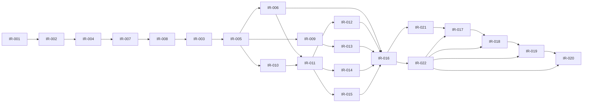

# Dependency Graph

## Wave dependency graph

## IR critical path and parallel lanes

Schema dependencies flow from IR-002 to lifecycle/product work; Auth flows from IR-004; Group lifecycle from IR-003/IR-005; security/trusted boundaries from IR-007/IR-008; Storage from IR-009; Realtime from IR-010; finance from IR-014; transforms from IR-016; and release authority from IR-022. Locked screen/component mapping is consumed by the owning IRs, not recreated here.

## Machine-readable dependency table

| IR item | Direct prerequisites | Blocking prerequisites | Permitted parallel work | Produces inputs for | Status |
|---|---|---|---|---|---|
| IR-001 | None | None | See accepted roadmap parallel-class rules; no unlisted parallelism | IR-002, IR-004, IR-022 | Draft |
| IR-002 | IR-001. | IR-001. | See accepted roadmap parallel-class rules; no unlisted parallelism | IR-003, IR-004, IR-007, IR-014, IR-022 | Draft |
| IR-003 | IR-002, IR-004, IR-007, IR-008. | IR-002, IR-004, IR-007, IR-008. | See accepted roadmap parallel-class rules; no unlisted parallelism | IR-005, IR-006, IR-011, IR-012, IR-015, IR-016, IR-021, IR-022 | Draft |
| IR-004 | IR-001, IR-002. | IR-001, IR-002. | See accepted roadmap parallel-class rules; no unlisted parallelism | IR-003, IR-005, IR-007, IR-021, IR-022 | Draft |
| IR-005 | IR-003, IR-004, IR-007, IR-008. | IR-003, IR-004, IR-007, IR-008. | See accepted roadmap parallel-class rules; no unlisted parallelism | IR-006, IR-009, IR-010, IR-011, IR-021, IR-022 | Draft |
| IR-006 | IR-003, IR-005, IR-008. | IR-003, IR-005, IR-008. | See accepted roadmap parallel-class rules; no unlisted parallelism | IR-016, IR-021, IR-022 | Draft |
| IR-007 | IR-002, IR-004. | IR-002, IR-004. | See accepted roadmap parallel-class rules; no unlisted parallelism | IR-003, IR-005, IR-008, IR-009, IR-010, IR-011, IR-021, IR-022 | Draft |
| IR-008 | IR-007. | IR-007. | See accepted roadmap parallel-class rules; no unlisted parallelism | IR-003, IR-005, IR-006, IR-009, IR-010, IR-012, IR-013, IR-014, IR-016, IR-021, IR-022 | Draft |
| IR-009 | IR-005, IR-007, IR-008. | IR-005, IR-007, IR-008. | See accepted roadmap parallel-class rules; no unlisted parallelism | IR-013, IR-021, IR-022 | Draft |
| IR-010 | IR-005, IR-007, IR-008. | IR-005, IR-007, IR-008. | See accepted roadmap parallel-class rules; no unlisted parallelism | IR-011, IR-021, IR-022 | Draft |
| IR-011 | IR-003, IR-005, IR-007, IR-010. | IR-003, IR-005, IR-007, IR-010. | See accepted roadmap parallel-class rules; no unlisted parallelism | IR-012, IR-013, IR-014, IR-015, IR-021, IR-022 | Draft |
| IR-012 | IR-003, IR-008, IR-011. | IR-003, IR-008, IR-011. | See accepted roadmap parallel-class rules; no unlisted parallelism | IR-016, IR-021, IR-022 | Draft |
| IR-013 | IR-008, IR-009, IR-011. | IR-008, IR-009, IR-011. | See accepted roadmap parallel-class rules; no unlisted parallelism | IR-016, IR-021, IR-022 | Draft |
| IR-014 | IR-002, IR-008, IR-011. | IR-002, IR-008, IR-011. | See accepted roadmap parallel-class rules; no unlisted parallelism | IR-016, IR-021, IR-022 | Draft |
| IR-015 | IR-003, IR-011. | IR-003, IR-011. | See accepted roadmap parallel-class rules; no unlisted parallelism | IR-016, IR-021, IR-022 | Draft |
| IR-016 | IR-003, IR-006, IR-008, IR-012, IR-013, IR-014, IR-015. | IR-003, IR-006, IR-008, IR-012, IR-013, IR-014, IR-015. | See accepted roadmap parallel-class rules; no unlisted parallelism | IR-017, IR-021, IR-022 | Draft |
| IR-017 | IR-016, IR-021, IR-022. | IR-016, IR-021, IR-022. | See accepted roadmap parallel-class rules; no unlisted parallelism | IR-018 | Draft |
| IR-018 | IR-017, IR-022. | IR-017, IR-022. | See accepted roadmap parallel-class rules; no unlisted parallelism | IR-019 | Draft |
| IR-019 | IR-018, IR-022. | IR-018, IR-022. | See accepted roadmap parallel-class rules; no unlisted parallelism | IR-020 | Draft |
| IR-020 | IR-019, IR-022. | IR-019, IR-022. | See accepted roadmap parallel-class rules; no unlisted parallelism | Final operations evidence | Draft |
| IR-021 | IR-003, IR-004, IR-005, IR-006, IR-007, IR-008, IR-009, IR-010, IR-011, IR-012, IR-013, IR-014, IR-015, IR-016. | IR-003, IR-004, IR-005, IR-006, IR-007, IR-008, IR-009, IR-010, IR-011, IR-012, IR-013, IR-014, IR-015, IR-016. | See accepted roadmap parallel-class rules; no unlisted parallelism | IR-017 | Draft |
| IR-022 | IR-001, IR-002, IR-003, IR-004, IR-005, IR-006, IR-007, IR-008, IR-009, IR-010, IR-011, IR-012, IR-013, IR-014, IR-015, IR-016. | IR-001, IR-002, IR-003, IR-004, IR-005, IR-006, IR-007, IR-008, IR-009, IR-010, IR-011, IR-012, IR-013, IR-014, IR-015, IR-016. | See accepted roadmap parallel-class rules; no unlisted parallelism | IR-017, IR-018, IR-019, IR-020 | Draft |

## Cycle review

No dependency cycle was found in the accepted roadmap graph. The table preserves IR-022's gate inputs from IR-001–IR-016; the diagram consolidates that already-serial upstream set at IR-016 rather than drawing sixteen redundant arrows. IR-022 joins IR-016/IR-021 at IR-017 and is not treated as a circular prerequisite for its own evidence.
